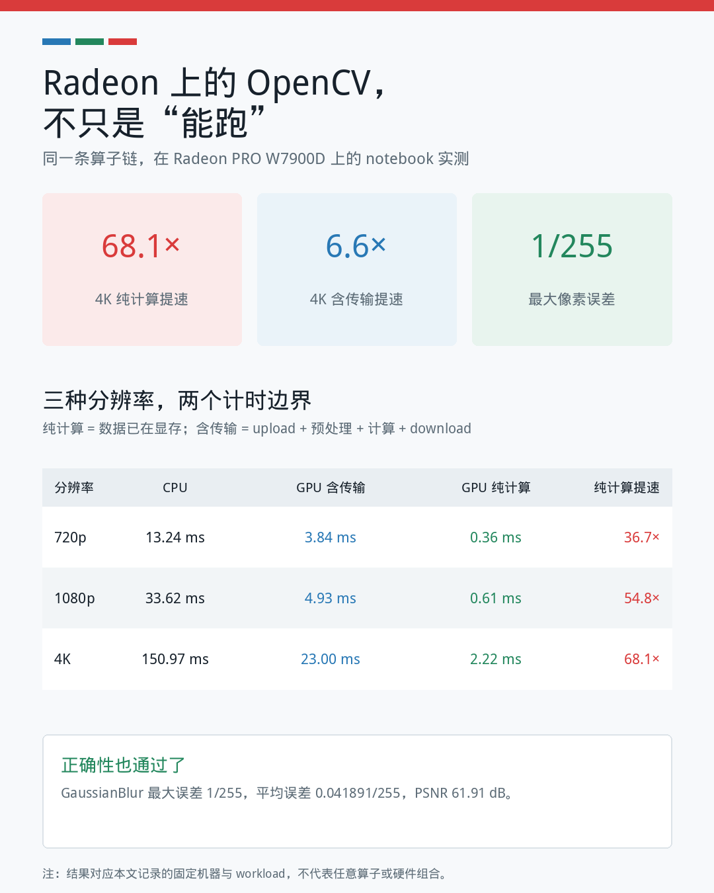
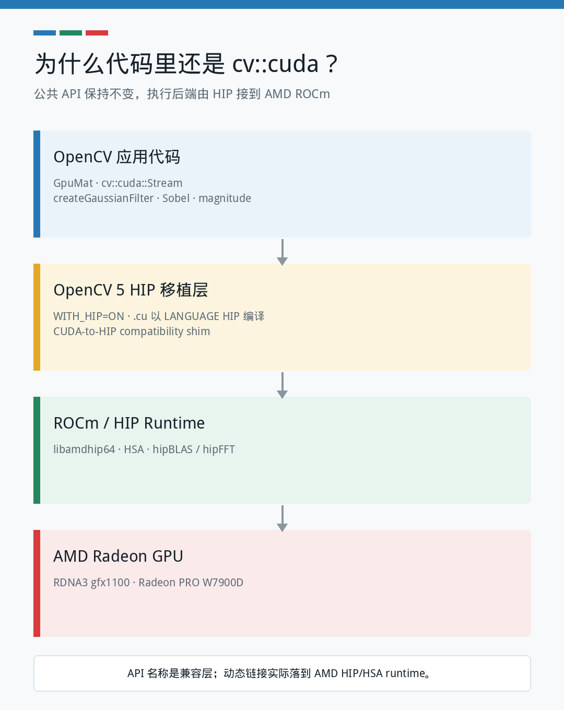

# OpenCV 用户，多一个 GPU 选择：`cv::cuda` 跑上 Radeon，还能免费复现

> **导语**
>
> 如果你已经会用 `cv::cuda::GpuMat`、`cv::cuda::Stream` 和 OpenCV 的 GPU filter，那么迁移到 AMD Radeon，应用层代码可能比想象中更熟悉。OpenCV 社区正在推进 ROCm/HIP 支持：保留 `cv::cuda` 公共 API，把底层执行切换到 AMD GPU。我们在 Radeon PRO W7900D 上完成了实测，不仅可以运行，而且在合适的 workload 下有很好的性能。
>
> 更重要的是，即使手边没有 Radeon GPU，也不必只看结果：**通过 OpenCV 社区专属链接注册 AMD 开发者后，即可领取本次活动提供的免费 48GB 显存 Radeon 云算力，直接启动同一本 notebook 复现实验。**


## 没有 Radeon GPU？先注册，再到云上把实验跑一遍

这次我们不仅为 OpenCV 带来了 Radeon 上的 HIP 实现与实测数据，也把运行实验所需的 GPU 算力开放给了社区。

在本次活动期间，AMD 为 OpenCV 用户提供**免费的 48GB 显存 Radeon GPU 云算力**。无需先购买本地 Radeon，也无需先在自己的机器上完成整套 ROCm/OpenCV 编译，就可以打开预配置的 notebook，亲自检查运行过程和输出。

首先通过 OpenCV 社区专属链接注册 AMD 开发者：

**[立即注册 AMD 开发者并领取免费 48GB 云算力](https://developer.amd.com.cn/login?source=mEi9fAoWW)**

注册完成并领取活动权益后，再进入 Radeon Cloud Gallery：

**[radeon.anruicloud.com](https://radeon.anruicloud.com/)**

完整流程共四步：

1. 使用上面的 **OpenCV 社区专属注册链接**注册 AMD 开发者，并按活动页面提示领取免费 48GB 显存云算力。
2. 打开 Radeon Cloud Gallery，找到 **`opencv_on_amd`**。
3. 点击 **Preview**，可直接查看完整 notebook、代码和本文使用的已保存结果；准备运行时点击 **Launch**。
4. 云实例就绪后点击 **Open Notebook**，执行 **Run All**，重新得到 CPU/GPU 性能表和 GaussianBlur 正确性结果。

也可以先打开 [`opencv_on_amd` 在线预览页](https://developer.amd.com.cn/radeon/templates/2298/preview)，确认内容后再启动实例。


云端模板对应的正是本文使用的 `opencv_amd_gpu/opencv_amd_gpu_demo.ipynb`。换句话说，你看到的不是为文章另做的一组静态截图，而是一份可以再次执行的实验。

> **活动说明：**请通过 OpenCV 社区专属链接完成 AMD 开发者注册并领取活动权益。免费算力面向本次活动提供；领取方式、使用额度、排队情况、实例时长和资源可用性可能随活动安排调整，请以注册页和 Radeon Cloud 页面显示的实时规则为准。

## 先看结论：不是“点亮了”，而是真的跑出了性能

我们使用带 HIP 支持的 OpenCV 5 分支，在一张 **AMD Radeon PRO W7900D（RDNA3，gfx1100）** 上运行下面这条图像处理链，并在每次迭代中重复四遍：

```text
GaussianBlur 31x31 -> Sobel X -> Sobel Y -> magnitude
```

4K 实测结果：

- CPU 算子链：**150.97 ms**
- GPU 纯计算：**2.22 ms，提速 68.1 倍**
- GPU 包含 upload、预处理和 download：**23.00 ms，提速 6.6 倍**
- CPU/GPU GaussianBlur 最大像素误差：**1/255**
- PSNR：**61.91 dB**



这里有两个同样重要的结论：

1. 当图像和中间结果留在显存中时，OpenCV 的计算密集型算子链可以充分发挥 Radeon 的并行能力。
2. 如果每轮都在主机内存和显存之间往返，数据传输会吃掉大量收益。所以 GPU pipeline 的设计，和单个 kernel 的速度同样重要。

## 对 OpenCV 用户来说，真正有价值的是什么？

不是多记一套 API，而是**多一个硬件选择，同时尽量保留已有的 OpenCV 编程经验**。

下面这段代码，对使用过 OpenCV GPU 模块的开发者不会陌生：

```cpp
cv::cuda::GpuMat input, gray, gray32;
cv::cuda::GpuMat a, blurred, grad_x, grad_y, magnitude;
cv::cuda::Stream stream;

input.upload(frame, stream);
cv::cuda::cvtColor(input, gray, cv::COLOR_BGR2GRAY, 0, stream);
gray.convertTo(gray32, CV_32F, 1.0 / 255.0, 0.0, stream);

auto gaussian = cv::cuda::createGaussianFilter(
    CV_32F, CV_32F, cv::Size(31, 31), 0);
auto sobel_x = cv::cuda::createSobelFilter(
    CV_32F, CV_32F, 1, 0, 3);
auto sobel_y = cv::cuda::createSobelFilter(
    CV_32F, CV_32F, 0, 1, 3);

gaussian->apply(gray32, blurred, stream);
sobel_x->apply(blurred, grad_x, stream);
sobel_y->apply(blurred, grad_y, stream);
cv::cuda::magnitude(grad_x, grad_y, magnitude, stream);
```

在 HIP 构建中，公共 namespace 仍然是 `cv::cuda`。但动态链接和实际执行已经落到：

```text
libamdhip64.so
libhsa-runtime64.so
```

也就是说，**API 名称承担兼容性，AMD ROCm/HIP 负责执行。**

## 为什么在 AMD GPU 上仍然叫 `cv::cuda`？

当前 OpenCV 5 HIP 移植复用了成熟的 `cv::cuda` 模块边界，主要做了三件事：

1. 增加 `WITH_HIP=ON` 构建入口，并让它与 `WITH_CUDA` 互斥。
2. 保留原有 `.cu` 设备源码，通过 CMake `LANGUAGE HIP` 交给 ROCm 编译器。
3. 通过 CUDA-to-HIP compatibility layer 映射 runtime、texture、constant memory 等底层调用，host 侧链接 HIP runtime。



这条路线的现实意义很直接：OpenCV 已经积累多年的 GPU 算子和用户代码，不必从零重写，便可以较快验证第二种 GPU 后端。

从长期架构看，OpenCV 5 还在讨论更独立的 non-CPU HAL/UMat 后端，让 HIP 与 CUDA 各自演进。因此，当前移植既是可工作的实现，也是多 GPU vendor 支持的重要工程验证。

## 三种分辨率，收益随 workload 增长

| 分辨率 | CPU | GPU 含传输 | GPU 纯计算 | 含传输提速 | 纯计算提速 |
|---|---:|---:|---:|---:|---:|
| 720p | 13.24 ms | 3.84 ms | 0.36 ms | 3.5x | 36.7x |
| 1080p | 33.62 ms | 4.93 ms | 0.61 ms | 6.8x | 54.8x |
| 4K | 150.97 ms | 23.00 ms | 2.22 ms | 6.6x | 68.1x |


纯计算提速从 720p 的 36.7 倍上升到 4K 的 68.1 倍。图像越大，可并行处理的像素越多，固定提交开销越容易被摊薄。

但“68.1 倍”不能脱离测量边界单独传播。这个数字代表**输入已经在显存中的算子吞吐**；包含数据传输后的 4K 提速是 6.6 倍。两者分别回答不同问题：

- **纯计算时间**：这些 OpenCV GPU 算子在 Radeon 上能跑多快？
- **含传输时间**：如果应用每轮都 upload/download，实际还能剩下多少收益？

对生产系统而言，正确答案通常是把 decode、预处理、推理和后处理尽量连接成 GPU 常驻 pipeline，而不是围绕单个 API 反复搬运整帧数据。

## 快还不够，输出也必须可信

我们还用一张 2250×1500 的真实图片，比较了 CPU `cv::GaussianBlur` 与 GPU `cv::cuda::createGaussianFilter`。

两条路径都使用：

- `CV_8UC4` BGRA 输入
- 31×31 Gaussian kernel
- 相同 sigma 规则
- `BORDER_DEFAULT`

验证结果：

| 指标 | 结果 |
|---|---:|
| 最大绝对误差 | 1 / 255 |
| 平均绝对误差 | 0.0418911 / 255 |
| PSNR | 61.9096 dB |
| 验证 | PASS |


误差热图为了可见性做了归一化放大。虽然 15.2% 的像素至少有一个 RGB 通道发生变化，但所有变化通道最多只相差一个 8-bit level，平均误差只有 0.0419 level。

性能数字可以吸引注意力，正确性验证才决定一条新 backend 能不能进入真实项目。

## 云端复现之后，如何在本地 Radeon 上继续？

Radeon Cloud 适合先验证结果、熟悉 notebook；如果要把 HIP backend 接入自己的视觉 pipeline，再在本地构建 OpenCV 5 HIP 移植分支。最短路径如下：

```bash
git clone --branch 5.x-hip \
    https://github.com/zhangnju/opencv.git

git clone --branch 5.x-hip-zerocopy \
    https://github.com/zhangnju/opencv_contrib.git

cmake -S opencv -B build \
    -DCMAKE_BUILD_TYPE=Release \
    -DWITH_HIP=ON \
    -DWITH_CUDA=OFF \
    -DCMAKE_HIP_COMPILER=/opt/rocm/llvm/bin/amdclang++ \
    -DCMAKE_HIP_ARCHITECTURES=gfx1100 \
    -DCMAKE_PREFIX_PATH=/opt/rocm \
    -DOPENCV_EXTRA_MODULES_PATH="$PWD/opencv_contrib/modules"

cmake --build build -j"$(nproc)"
```

请将 `gfx1100` 替换为你的 GPU 架构。运行后先做两个检查：

```python
import cv2

print(cv2.__version__)
print(cv2.cuda.getCudaEnabledDeviceCount())
assert cv2.cuda.getCudaEnabledDeviceCount() > 0
```

再对编译出的程序执行 `ldd`，确认依赖中出现 `libamdhip64` 和 OpenCV 的 `cuda*` 模块。

## 当前状态：已经可用，仍在走向上游

这部分需要说清楚：

- 本文使用的是 **OpenCV 5 HIP 开发分支**，不是当前 stock release 中默认提供的 Radeon binary。
- OpenCV 5 对应的 core PR [opencv#29527](https://github.com/opencv/opencv/pull/29527) 和 modules PR [opencv_contrib#4178](https://github.com/opencv/opencv_contrib/pull/4178) 截至本文发布准备时仍处于 **Open / review** 状态。
- PR 描述记录了 `gfx1100`（RDNA3）和 `gfx1201`（RDNA4）上的构建与模块测试；本文补充了 W7900D 上的应用级性能和正确性实测。
- 少量 NVIDIA 专属能力没有 ROCm 对等实现，例如 NVIDIA hardware optical flow；这类入口会明确返回 `StsNotImplemented`，而不是静默产生错误结果。

把这些边界讲清楚，并不会削弱成果。恰恰相反，它说明这不是一张“概念演示”截图，而是一条已经能编译、能测试、能跑 workload，也知道剩余工作在哪里的工程路径。

## OpenCV 用户现在可以做什么？

即使手上没有兼容 ROCm 的 Radeon 或 Instinct GPU，也可以先从云端开始：

1. 通过 OpenCV 社区专属链接注册 AMD 开发者，并领取本次活动的免费 48GB 显存云算力。
2. 在 Radeon Cloud 中运行 `opencv_on_amd`，确认 notebook 和结果能够复现。
3. 记录云实例实际得到的 compute-only 与 transfer-inclusive 数据，并与文章结果比较。
4. 有本地 AMD GPU 的用户，再按自己的 gfx 架构编译上述分支。
5. 先跑 OpenCV 模块测试，再跑自己的真实 pipeline。
6. 把 GPU 型号、gfx 架构、ROCm 版本和测试结果反馈到相关 PR。
7. 特别报告当前测试矩阵没有覆盖的算法、数据类型和边界条件。

OpenCV 的价值一直不只在某个 kernel，而在于稳定的 API、丰富的算法和庞大的开发者社区。Radeon 能够进入这套生态，意味着 OpenCV 用户在工作站、边缘设备和视觉 AI pipeline 中，开始拥有更丰富的 GPU 选择。

## 结语

这次实测想传递的重点，不只是一个“68.1 倍”的数字。

更重要的是：

> **OpenCV 用户熟悉的 `GpuMat`、filter 和 stream 编程方式，已经能够通过 HIP 在 AMD Radeon 上有效运行；在 GPU 常驻的计算密集型 workload 中，它不仅能跑，而且跑得很好。**

而这一次，没有本地 Radeon 也不再是参与门槛。通过 OpenCV 社区专属链接注册 AMD 开发者后，即可领取活动提供的免费 48GB 显存云算力，先把 notebook 跑起来、核对数据，再决定是否把 HIP 路径带入自己的项目。

接下来决定这条路径能走多远的，是更多用户的复现、更多硬件上的测试、更多真实应用的反馈，以及社区共同完成的上游工作。

---

**立即复现**

- 第一步：使用 [OpenCV 社区专属链接注册 AMD 开发者](https://developer.amd.com.cn/login?source=mEi9fAoWW) 并领取免费 48GB 云算力
- 第二步：进入 Radeon Cloud Gallery：[radeon.anruicloud.com](https://radeon.anruicloud.com/)
- `opencv_on_amd` 在线预览：[Preview notebook](https://developer.amd.com.cn/radeon/templates/2298/preview)

**延伸阅读**

- OpenCV 5 HIP core PR：[opencv/opencv#29527](https://github.com/opencv/opencv/pull/29527)
- OpenCV 5 HIP modules PR：[opencv/opencv_contrib#4178](https://github.com/opencv/opencv_contrib/pull/4178)
- 可直接构建的 core 分支：[zhangnju/opencv `5.x-hip`](https://github.com/zhangnju/opencv/tree/5.x-hip)
- 可直接构建的 contrib 分支：[zhangnju/opencv_contrib `5.x-hip-zerocopy`](https://github.com/zhangnju/opencv_contrib/tree/5.x-hip-zerocopy)
- 最终配套项目：`/home/zihaomu/bigssd/notebook/opencv_amd_gpu`
- 可执行 notebook：`opencv_amd_gpu_demo.ipynb`
- benchmark 源码：`bench_cv_gpu.cpp`；正确性源码：`gaussian_correctness.cpp`
