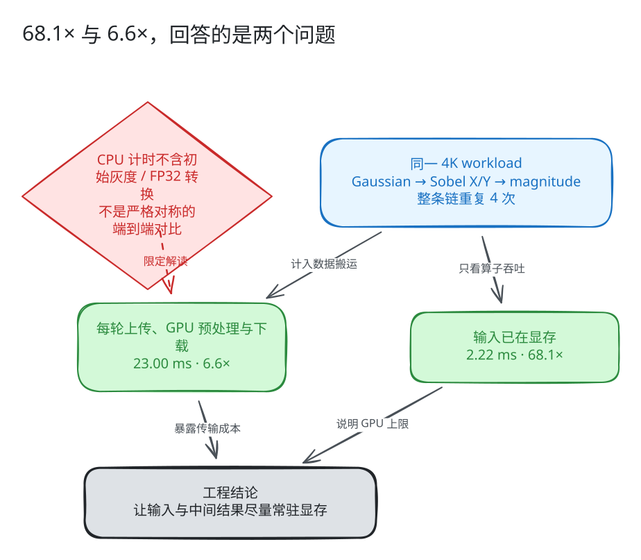
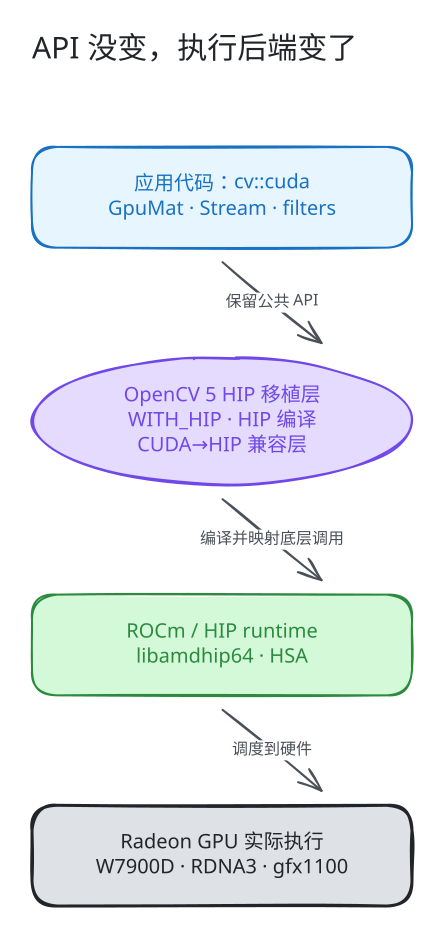
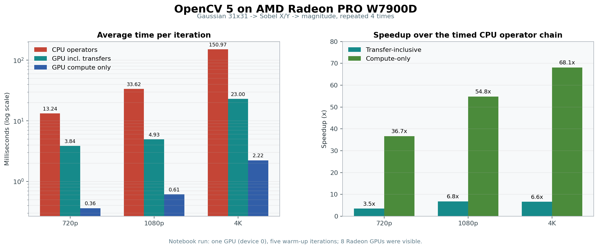
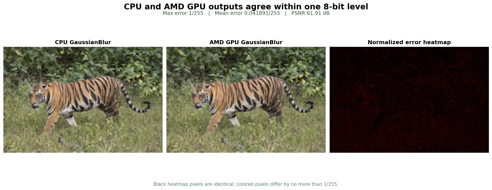

# OpenCV 用户，多一个 GPU 选择：`cv::cuda` 跑上 Radeon，还能免费复现

> 如果你已经会用 `cv::cuda::GpuMat`、`cv::cuda::Stream` 和 OpenCV 的 GPU filters，那么迁移到 AMD Radeon 时，应用层代码可能比想象中熟悉。
>
> OpenCV 社区正在推进 ROCm/HIP 支持：公共 API 仍是 `cv::cuda`，底层则由 AMD ROCm/HIP 编译和执行。我们在 Radeon PRO W7900D 上跑通了完整 workload，也验证了性能与输出正确性。


## 先把最容易误读的两个数字说清楚

测试使用带 HIP 支持的 OpenCV 5 开发分支，在 **AMD Radeon PRO W7900D（RDNA3，gfx1100）** 上运行下面的图像处理链；每次迭代重复整条算子链 4 次：

```text
GaussianBlur 31×31 → Sobel X → Sobel Y → magnitude
```

4K 结果如下：

| 计时口径 | 耗时 | 相对 CPU |
|---|---:|---:|
| CPU 算子链 | 150.97 ms | 1.0× |
| GPU 纯计算 | 2.22 ms | 68.1× |
| GPU 含上传、GPU 预处理和下载 | 23.00 ms | 6.6× |

**68.1× 和 6.6× 都是真的，但回答的是两个不同的问题。**



GPU 纯计算计时开始时，输入已经完成上传、灰度转换和 FP32 转换；它衡量的是算子链在 Radeon 上的吞吐上限。含传输计时则在每轮加入 upload、GPU 预处理和 download，更接近“每帧都要在主机与设备之间往返”的使用方式。

还有一个必须交代的限制：CPU 计时从已经转换好的灰度 FP32 图像开始，并不包含最初的灰度与 FP32 转换。因此，23.00 ms 比纯计算口径更接近实际数据搬运成本，但它仍不是严格对称的端到端比较。

真正值得带走的工程结论不是某个孤立的倍数，而是：

> **尽量让输入和中间结果常驻显存，把 decode、预处理、推理和后处理连接成连续的 GPU pipeline。**

## 为什么在 AMD GPU 上仍然叫 `cv::cuda`？

对 OpenCV 用户来说，这条路线最直接的价值是：**多一个硬件选择，同时尽量保留已有的 GPU 编程经验。**

下面的写法与现有 OpenCV GPU 代码一致：

```cpp
cv::cuda::GpuMat input, gray, gray32, blurred, grad_x, grad_y, magnitude;
cv::cuda::Stream stream;

input.upload(frame, stream);
cv::cuda::cvtColor(input, gray, cv::COLOR_BGR2GRAY, 0, stream);
gray.convertTo(gray32, CV_32F, 1.0 / 255.0, 0.0, stream);

auto gaussian = cv::cuda::createGaussianFilter(
    CV_32F, CV_32F, cv::Size(31, 31), 0);
auto sobel_x = cv::cuda::createSobelFilter(
    CV_32F, CV_32F, 1, 0, 3);
auto sobel_y = cv::cuda::createSobelFilter(
    CV_32F, CV_32F, 0, 1, 3);

gaussian->apply(gray32, blurred, stream);
sobel_x->apply(blurred, grad_x, stream);
sobel_y->apply(blurred, grad_y, stream);
cv::cuda::magnitude(grad_x, grad_y, magnitude, stream);
```

在 HIP 构建中，公共 namespace 仍然是 `cv::cuda`；但程序的动态依赖和实际执行已经落到 `libamdhip64.so` 与 `libhsa-runtime64.so`。



当前移植主要完成了三件事：

1. 增加 `WITH_HIP=ON` 构建入口，并与 `WITH_CUDA` 互斥。
2. 将原有 `.cu` 设备源码以 CMake `LANGUAGE HIP` 交给 ROCm 编译器。
3. 通过 CUDA-to-HIP compatibility layer 映射 runtime、texture、constant memory 等底层调用，并在 host 侧链接 HIP runtime。

所以，`cv::cuda` 在这里代表的是**兼容的公共 API 边界**，并不意味着程序仍由 NVIDIA CUDA runtime 执行。

## 三种分辨率：workload 越大，纯计算收益越明显

| 分辨率 | CPU | GPU 含传输 | GPU 纯计算 | 含传输提速 | 纯计算提速 |
|---|---:|---:|---:|---:|---:|
| 720p | 13.24 ms | 3.84 ms | 0.36 ms | 3.5× | 36.7× |
| 1080p | 33.62 ms | 4.93 ms | 0.61 ms | 6.8× | 54.8× |
| 4K | 150.97 ms | 23.00 ms | 2.22 ms | 6.6× | 68.1× |



纯计算提速从 720p 的 36.7× 上升到 4K 的 68.1×。图像越大，可并行处理的像素越多，固定的提交与同步开销越容易被摊薄。

但含传输提速没有沿同一曲线增长，因为数据搬运、显存分配复用方式和同步边界都会进入最终延迟。对真实应用而言，pipeline 的组织方式往往与单个 kernel 的速度同样重要。

## 快还不够，输出也必须可信

我们还用一张 2250×1500 的真实图片，对比了 CPU `cv::GaussianBlur` 与 GPU `cv::cuda::createGaussianFilter`。两条路径都使用：

- `CV_8UC4` BGRA 输入
- 31×31 Gaussian kernel
- 相同的 sigma 规则
- `BORDER_DEFAULT`

验证结果：

| 指标 | 结果 |
|---|---:|
| 最大绝对误差 | 1 / 255 |
| 平均绝对误差 | 0.0418911 / 255 |
| PSNR | 61.9096 dB |
| 验证 | PASS |



误差热图为便于观察做了归一化放大。虽然 15.2% 的像素至少有一个 RGB 通道发生变化，但变化通道最多只相差 1 个 8-bit level，平均误差约为 0.0419 level。

性能决定这条 backend 值不值得关注，正确性才决定它能不能进入真实项目。

## 没有本地 Radeon？到云上把同一本 notebook 跑一遍

即使手边没有兼容 ROCm 的 Radeon，也不必只看文章里的静态结果。本次活动为 OpenCV 用户提供**免费的 48GB 显存 Radeon GPU 云算力**，可以直接打开预配置 notebook 复现实验。

首先通过 OpenCV 社区专属链接注册 AMD 开发者，并按活动页面提示领取权益：

**[注册 AMD 开发者并领取本次活动的免费 48GB 云算力](https://developer.amd.com.cn/login?source=mEi9fAoWW)**

完成注册后，进入 Radeon Cloud Gallery：

**[radeon.anruicloud.com](https://radeon.anruicloud.com/)**

完整流程共四步：

1. 通过上面的 OpenCV 社区专属链接注册，并按页面提示领取活动权益。
2. 在 Radeon Cloud Gallery 中找到 **`opencv_on_amd`**。
3. 点击 **Preview** 查看 notebook、代码和已保存结果；准备运行时点击 **Launch**。
4. 实例就绪后点击 **Open Notebook**，执行 **Run All**，重新生成性能表与正确性结果。

也可以先打开 [`opencv_on_amd` 在线预览页](https://developer.amd.com.cn/radeon/templates/2298/preview)，确认内容后再启动实例。


云端模板对应的正是本文配套项目中的 `opencv_amd_gpu_demo.ipynb`，不是为文章另做的一组静态截图。云实例负载可能让实测数字略有波动，但运行代码、计时口径和正确性检查保持一致。

> **活动说明：**免费算力是本次活动提供的权益。领取方式、额度、排队情况、实例时长和资源可用性可能调整，请以注册页与 Radeon Cloud 页面显示的实时规则为准。

## 想接入自己的项目？再在本地构建

Radeon Cloud 适合先验证结果、熟悉 notebook；如果准备把 HIP backend 接入自己的视觉 pipeline，可以按目标 GPU 架构在本地构建 OpenCV 5 HIP 开发分支：

```bash
git clone --branch 5.x-hip \
    https://github.com/zhangnju/opencv.git

git clone --branch 5.x-hip \
    https://github.com/zhangnju/opencv_contrib.git

cmake -S opencv -B build \
    -DCMAKE_BUILD_TYPE=Release \
    -DWITH_HIP=ON \
    -DWITH_CUDA=OFF \
    -DCMAKE_HIP_COMPILER=/opt/rocm/llvm/bin/amdclang++ \
    -DCMAKE_HIP_ARCHITECTURES=gfx1100 \
    -DCMAKE_PREFIX_PATH=/opt/rocm \
    -DOPENCV_EXTRA_MODULES_PATH="$PWD/opencv_contrib/modules"

cmake --build build -j"$(nproc)"
```

请将 `gfx1100` 替换为目标 GPU 的实际架构。构建后先检查设备是否可见：

```python
import cv2

print(cv2.__version__)
print(cv2.cuda.getCudaEnabledDeviceCount())
assert cv2.cuda.getCudaEnabledDeviceCount() > 0
```

再对编译出的程序执行 `ldd`，确认依赖中同时出现 `libamdhip64` 和 OpenCV 的 `cuda*` 模块。API 名称只能说明你调用了哪个模块，动态依赖才能进一步确认实际后端。

## 当前状态：能编译、能测试、能跑 workload，但仍是开发分支

截至 **2026 年 8 月 9 日**：

- 本文使用的是 OpenCV 5 HIP 开发分支，不是 stock OpenCV release 默认提供的 Radeon binary。
- OpenCV 5 的 [core PR #29527](https://github.com/opencv/opencv/pull/29527) 与 [modules PR #4178](https://github.com/opencv/opencv_contrib/pull/4178) 仍处于 **Open / review** 状态。
- PR 记录的测试覆盖包括 `gfx90a`、`gfx1100` 与 `gfx1201`；本文补充的是 W7900D 上的应用级性能与正确性验证。
- 少量依赖 NVIDIA 专属能力、在 ROCm 中没有对等实现的入口仍会明确返回 `StsNotImplemented`，例如 NVIDIA hardware optical flow；不会静默给出错误结果。

这些边界不削弱结果，反而说明它目前处在什么位置：这已经不是一张概念演示截图，而是一条可以构建、验证和运行真实 workload 的工程路径；距离上游默认可用，还需要更多 review、测试与硬件覆盖。

## OpenCV 用户现在可以做什么？

1. 在 Radeon Cloud 中运行 `opencv_on_amd`，先确认 notebook 与保存结果能够复现。
2. 记录实例上的 compute-only 与 transfer-inclusive 数据，避免只传播一个脱离口径的倍数。
3. 有本地 AMD GPU 的用户，按自己的 gfx 架构构建分支，先跑模块测试，再跑真实 pipeline。
4. 把 GPU 型号、gfx 架构、ROCm 版本、算法和数据类型反馈到相关 PR，尤其关注当前测试矩阵尚未覆盖的边界条件。

## 结语

这次实测真正值得关注的，不只是 68.1×。

> **OpenCV 用户熟悉的 `GpuMat`、filters 和 stream 编程方式，已经可以通过 HIP 在 AMD Radeon 上有效运行；当 workload 足够大、数据尽量常驻显存时，它不仅能跑，也能跑出有意义的性能。**

更重要的是，这次没有本地 Radeon 也能参与。先在云端运行同一本 notebook，核对代码、数据和计时边界，再决定是否把 HIP 路径带入自己的项目。

一条新的 GPU backend 能走多远，最终取决于更多硬件上的复现、更多真实应用的反馈，以及社区共同完成的上游工作。

---

**立即复现**

- [OpenCV 社区专属 AMD 开发者注册链接](https://developer.amd.com.cn/login?source=mEi9fAoWW)
- Radeon Cloud Gallery：[radeon.anruicloud.com](https://radeon.anruicloud.com/)
- [`opencv_on_amd` 在线预览](https://developer.amd.com.cn/radeon/templates/2298/preview)
- [配套项目与可执行 notebook](https://github.com/zihaomu/notebook/tree/main/opencv_amd_gpu)

**延伸阅读**

- OpenCV 5 HIP core PR：[opencv/opencv#29527](https://github.com/opencv/opencv/pull/29527)
- OpenCV 5 HIP modules PR：[opencv/opencv_contrib#4178](https://github.com/opencv/opencv_contrib/pull/4178)
- 可直接构建的 core 分支：[zhangnju/opencv `5.x-hip`](https://github.com/zhangnju/opencv/tree/5.x-hip)
- 可直接构建的 contrib 分支：[zhangnju/opencv_contrib `5.x-hip`](https://github.com/zhangnju/opencv_contrib/tree/5.x-hip)

**致谢**

- Jeff Daily：OpenCV 4.x ROCm/HIP 原始移植
- zhangnju：OpenCV 5.x 移植、兼容性修复及测试与应用验证
- AMD Radeon Cloud：本次活动的 48GB 显存云算力与 notebook 运行环境
- OpenCV 与 AMD ROCm 社区：review、测试与持续集成工作
