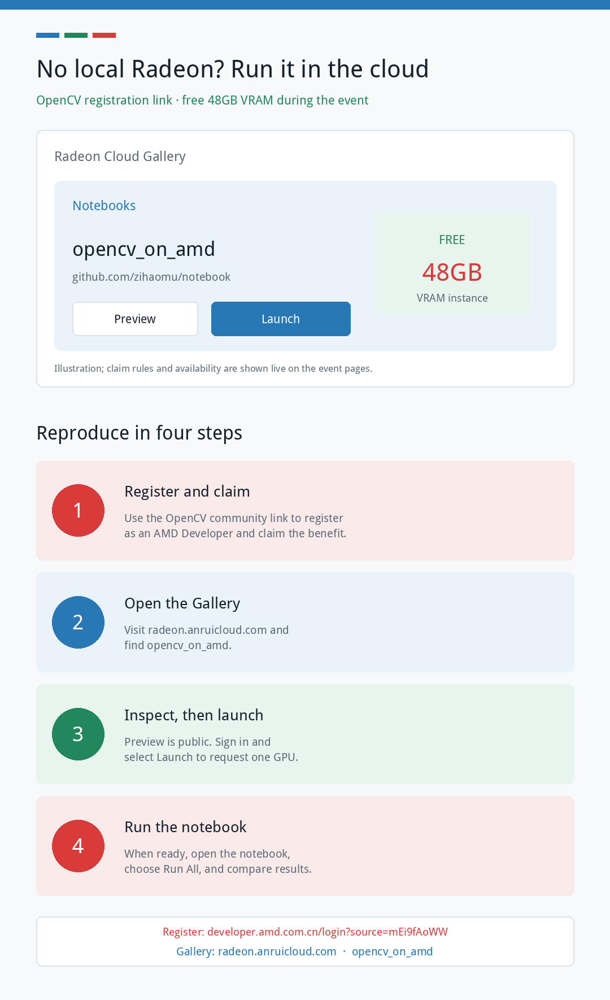
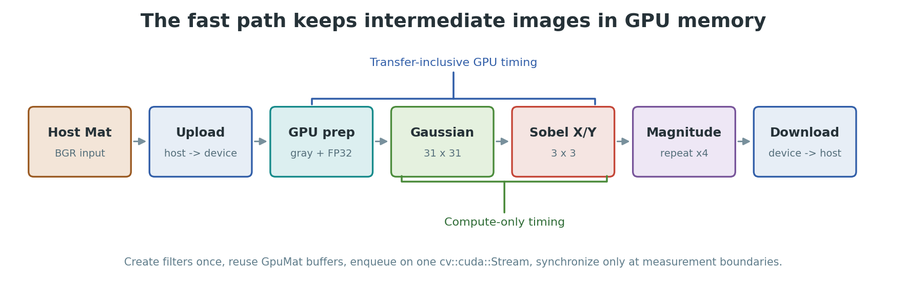

# OpenCV on Radeon, Reproducible for Free: `cv::cuda` Runs Well and a 48GB Cloud GPU Is Ready

> If you already know `cv::cuda::GpuMat`, `cv::cuda::Stream`, and OpenCV's GPU filters, using an AMD Radeon GPU may feel more familiar than expected. Work under review in the OpenCV community keeps the public `cv::cuda` API while compiling and executing its modules through ROCm/HIP. We tested that path on a Radeon PRO W7900D: it does not merely initialize; it delivers useful performance on a real image-processing workload.
>
> You do not need to own a Radeon to verify the result. Register as an AMD Developer through the **OpenCV community dedicated registration link**, then claim this event's **free Radeon cloud compute backed by 48GB of VRAM** and launch the same notebook.

## No local Radeon? Reproduce the experiment in the cloud

This work contributes more than a HIP implementation and benchmark data. It also makes the required GPU compute available to the OpenCV community.

During the event, AMD is offering **free Radeon cloud compute with 48GB VRAM**. Users can inspect and execute the prepared notebook without first buying local hardware or building the full ROCm/OpenCV stack themselves.

First, use the OpenCV community's dedicated link to register as an AMD Developer and claim the event benefit:

**[Register as an AMD Developer and claim the free 48GB cloud GPU](https://developer.amd.com.cn/login?source=mEi9fAoWW)**

After registration, open **[radeon.anruicloud.com](https://radeon.anruicloud.com/)**. The address redirects to the AMD Radeon Cloud Gallery.

1. Register through the **OpenCV community dedicated registration link** and claim the event's free 48GB VRAM cloud compute.
2. Find **`opencv_on_amd`** in the Gallery.
3. Select **Preview** to inspect the complete notebook, source, and saved outputs; select **Launch** when ready to execute it.
4. When the instance is ready, select **Open Notebook**, choose **Run All**, and compare the performance table and GaussianBlur correctness metrics.

The public [`opencv_on_amd` preview](https://developer.amd.com.cn/radeon/templates/2298/preview) can also be opened directly before launching an instance.



The cloud template points to the same `opencv_amd_gpu/opencv_amd_gpu_demo.ipynb` used for this article. It is an executable experiment, not a separate set of promotional screenshots.

> **Event note:** Use the OpenCV community dedicated link to complete AMD Developer registration and claim the event benefit. Free compute is provided for this event; claim rules, quota, queueing, session duration, and instance availability may change. Consult the live registration and Radeon Cloud pages for current terms.


## The headline result

Using a HIP-enabled OpenCV 5 branch, we ran this operator chain four times per iteration on one **AMD Radeon PRO W7900D (RDNA3, gfx1100)**:

```text
GaussianBlur 31x31 -> Sobel X -> Sobel Y -> magnitude
```

At 4K:

- Timed CPU operator chain: **150.97 ms**
- GPU compute only: **2.22 ms, a 68.1x speedup**
- GPU including upload, preparation, and download: **23.00 ms, a 6.6x speedup**
- Maximum CPU/GPU GaussianBlur error: **1/255**
- PSNR: **61.91 dB**

These results make two points at once. Radeon can execute a substantial OpenCV GPU workload very effectively, and transfer strategy still determines how much of that acceleration reaches the complete application.

## Why this matters to OpenCV developers

The opportunity is not just another backend. It is another hardware choice while preserving much of the programming model OpenCV users already know.

This code looks like ordinary OpenCV GPU code:

```cpp
cv::cuda::GpuMat input, gray, gray32;
cv::cuda::GpuMat a, blurred, grad_x, grad_y, magnitude;
cv::cuda::Stream stream;

input.upload(frame, stream);
cv::cuda::cvtColor(input, gray, cv::COLOR_BGR2GRAY, 0, stream);
gray.convertTo(gray32, CV_32F, 1.0 / 255.0, 0.0, stream);

auto gaussian = cv::cuda::createGaussianFilter(
    CV_32F, CV_32F, cv::Size(31, 31), 0);
auto sobel_x = cv::cuda::createSobelFilter(
    CV_32F, CV_32F, 1, 0, 3);
auto sobel_y = cv::cuda::createSobelFilter(
    CV_32F, CV_32F, 0, 1, 3);

gaussian->apply(gray32, blurred, stream);
sobel_x->apply(blurred, grad_x, stream);
sobel_y->apply(blurred, grad_y, stream);
cv::cuda::magnitude(grad_x, grad_y, magnitude, stream);
```

In the HIP build, the namespace remains `cv::cuda`, but the resulting executable resolves AMD's runtime:

```text
libamdhip64.so
libhsa-runtime64.so
```

The API name provides compatibility; ROCm/HIP performs the execution.

## How the HIP path works

The current OpenCV 5 port takes a pragmatic route:

1. A new `WITH_HIP=ON` build path is mutually exclusive with `WITH_CUDA`.
2. Existing `.cu` device sources are marked as CMake `LANGUAGE HIP` and compiled by the ROCm compiler.
3. A CUDA-to-HIP compatibility layer maps runtime, texture, constant-memory, and related low-level spellings, while host code links the HIP runtime.



This design reuses years of OpenCV GPU implementation and user experience instead of requiring a new application API before AMD hardware can be evaluated.

The long-term OpenCV 5 architecture is still being discussed. A more independent non-CPU HAL/UMat backend would let HIP and CUDA evolve separately. The current port is therefore both a working implementation and valuable evidence for a broader multi-vendor design.

## Performance across three resolutions

| Resolution | CPU | GPU with transfers | GPU compute only | Full speedup | Compute speedup |
|---|---:|---:|---:|---:|---:|
| 720p | 13.24 ms | 3.84 ms | 0.36 ms | 3.5x | 36.7x |
| 1080p | 33.62 ms | 4.93 ms | 0.61 ms | 6.8x | 54.8x |
| 4K | 150.97 ms | 23.00 ms | 2.22 ms | 6.6x | 68.1x |

The compute-only speedup rises from 36.7x at 720p to 68.1x at 4K. Larger images expose more independent work and amortize fixed submission overhead.

The 68.1x result must not be separated from its measurement boundary: it is operator throughput with data already resident in GPU memory. The transfer-inclusive 4K speedup is 6.6x. Both numbers are useful:

- **Compute-only time** asks how fast these OpenCV operators execute on Radeon.
- **Transfer-inclusive time** asks what remains when an application uploads and downloads every iteration.

A production design should usually connect decode, preprocessing, inference, and postprocessing in a GPU-resident graph rather than transfer complete frames around each individual API call.

## Performance is incomplete without correctness

We also compared CPU `cv::GaussianBlur` with GPU `cv::cuda::createGaussianFilter` on the same 2250x1500 real image.

Both paths used:

- `CV_8UC4` BGRA input
- a 31x31 Gaussian kernel
- the same sigma rule
- `BORDER_DEFAULT`


| Metric | Result |
|---|---:|
| Maximum absolute error | 1 / 255 |
| Mean absolute error | 0.0418911 / 255 |
| PSNR | 61.9096 dB |
| Validation | PASS |

The heatmap is normalized to expose tiny differences. Although 15.2% of pixels have at least one changed RGB channel, every changed channel differs by at most one 8-bit level and the mean error is only 0.0419 levels.

A fast backend attracts attention. A validated backend earns a place in an application.

## After the cloud run: build it on a local Radeon

Radeon Cloud is the fastest way to verify the notebook and learn the workflow. To integrate the HIP backend into an application pipeline, build the OpenCV 5 HIP development branches locally:

```bash
git clone --branch 5.x-hip \
    https://github.com/zhangnju/opencv.git

git clone --branch 5.x-hip-zerocopy \
    https://github.com/zhangnju/opencv_contrib.git

cmake -S opencv -B build \
    -DCMAKE_BUILD_TYPE=Release \
    -DWITH_HIP=ON \
    -DWITH_CUDA=OFF \
    -DCMAKE_HIP_COMPILER=/opt/rocm/llvm/bin/amdclang++ \
    -DCMAKE_HIP_ARCHITECTURES=gfx1100 \
    -DCMAKE_PREFIX_PATH=/opt/rocm \
    -DOPENCV_EXTRA_MODULES_PATH="$PWD/opencv_contrib/modules"

cmake --build build -j"$(nproc)"
```

Replace `gfx1100` with the architecture reported for your GPU. After installation, verify device discovery:

```python
import cv2

print(cv2.__version__)
print(cv2.cuda.getCudaEnabledDeviceCount())
assert cv2.cuda.getCudaEnabledDeviceCount() > 0
```

Then use `ldd` on a compiled application to confirm that it resolves OpenCV's `cuda*` modules and `libamdhip64`.

## Current status: working code, upstream work in progress

The boundary is important:

- This article uses **OpenCV 5 HIP development branches**, not a Radeon binary shipped by the current stock release.
- The OpenCV 5 core PR [opencv#29527](https://github.com/opencv/opencv/pull/29527) and modules PR [opencv_contrib#4178](https://github.com/opencv/opencv_contrib/pull/4178) remain **open and under review** as this publication is prepared.
- Their descriptions report build and module-test validation on `gfx1100` (RDNA3) and `gfx1201` (RDNA4). This article adds application-level performance and correctness data from a W7900D.
- A few NVIDIA-specific facilities have no ROCm equivalent, including NVIDIA hardware optical flow. Such entry points report `StsNotImplemented` instead of silently producing a bad result.

Stating these limits does not weaken the result. It shows that this is an engineering path that compiles, runs tests, executes real workloads, and identifies its remaining work.

## How the OpenCV community can help

Developers can contribute useful evidence even without local ROCm hardware:

1. Register as an AMD Developer through the OpenCV community dedicated link and claim the event's free 48GB VRAM cloud compute.
2. Run `opencv_on_amd` in Radeon Cloud and confirm that the notebook reproduces.
3. Record the cloud instance's compute-only and transfer-inclusive results and compare them with this article.
4. With local Radeon or Instinct hardware, build the branches for another gfx architecture.
5. Run the OpenCV module tests before testing an application pipeline.
6. Include GPU model, gfx architecture, ROCm version, and exact OpenCV commits.
7. Test algorithms, data types, and boundary conditions not yet covered by the current matrix.
8. Share findings on the related PRs.

OpenCV's value comes from more than an individual kernel. It comes from a stable programming model, broad algorithm coverage, and a large community. Bringing Radeon into that ecosystem gives developers more options for workstations, edge systems, and vision AI pipelines.

## Takeaway

The most important result is not simply "68.1x."

> **The familiar OpenCV model built around `GpuMat`, filters, and streams can now execute effectively on AMD Radeon through HIP. For compute-heavy, GPU-resident workloads, it does not just run; it runs well.**

And local Radeon ownership is no longer required to participate in this event. After registering as an AMD Developer through the OpenCV community's dedicated link, users can claim the free 48GB VRAM cloud compute, run the notebook, inspect the data, and decide whether to bring the HIP path into their own projects.

How far this path goes will be determined by more reproductions, testing on more hardware, feedback from real applications, and continued upstream collaboration.

---

**Reproduce now**

- Step 1: [Register as an AMD Developer through the OpenCV community link](https://developer.amd.com.cn/login?source=mEi9fAoWW) and claim the free 48GB cloud GPU
- Step 2: Open the Radeon Cloud Gallery: [radeon.anruicloud.com](https://radeon.anruicloud.com/)
- `opencv_on_amd` public preview: [Preview notebook](https://developer.amd.com.cn/radeon/templates/2298/preview)

**Further reading**

- OpenCV 5 HIP core PR: [opencv/opencv#29527](https://github.com/opencv/opencv/pull/29527)
- OpenCV 5 HIP modules PR: [opencv/opencv_contrib#4178](https://github.com/opencv/opencv_contrib/pull/4178)
- Buildable core branch: [zhangnju/opencv `5.x-hip`](https://github.com/zhangnju/opencv/tree/5.x-hip)
- Buildable contrib branch: [zhangnju/opencv_contrib `5.x-hip-zerocopy`](https://github.com/zhangnju/opencv_contrib/tree/5.x-hip-zerocopy)
- Final companion project: `/home/zihaomu/bigssd/notebook/opencv_amd_gpu`
- Executable notebook: `opencv_amd_gpu_demo.ipynb`
- Benchmark source: `bench_cv_gpu.cpp`; correctness source: `gaussian_correctness.cpp`
