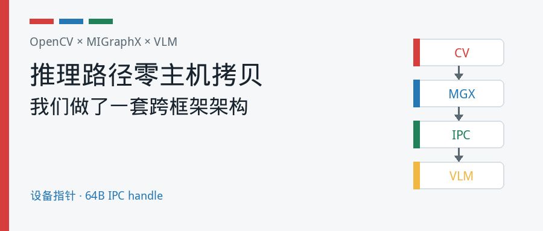
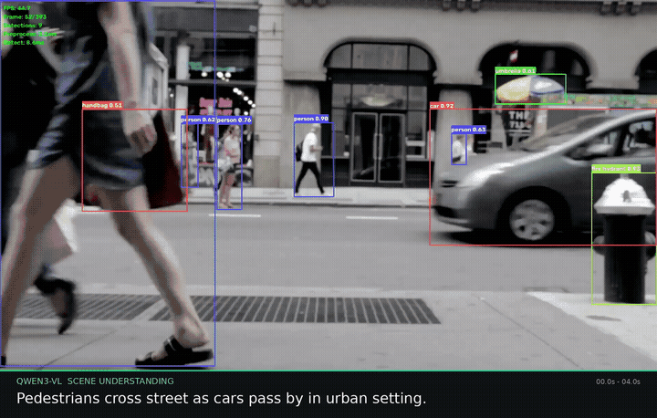
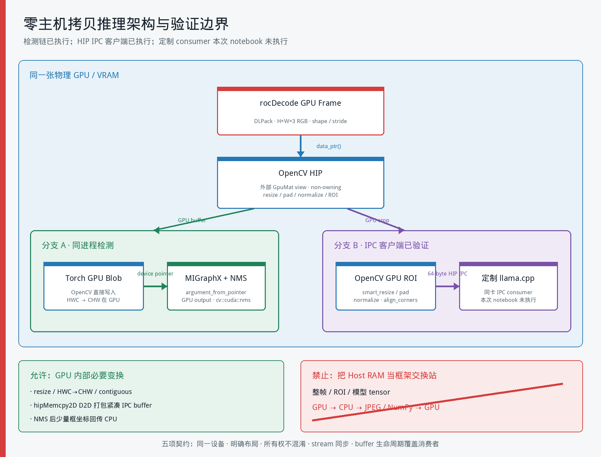
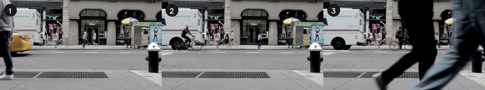
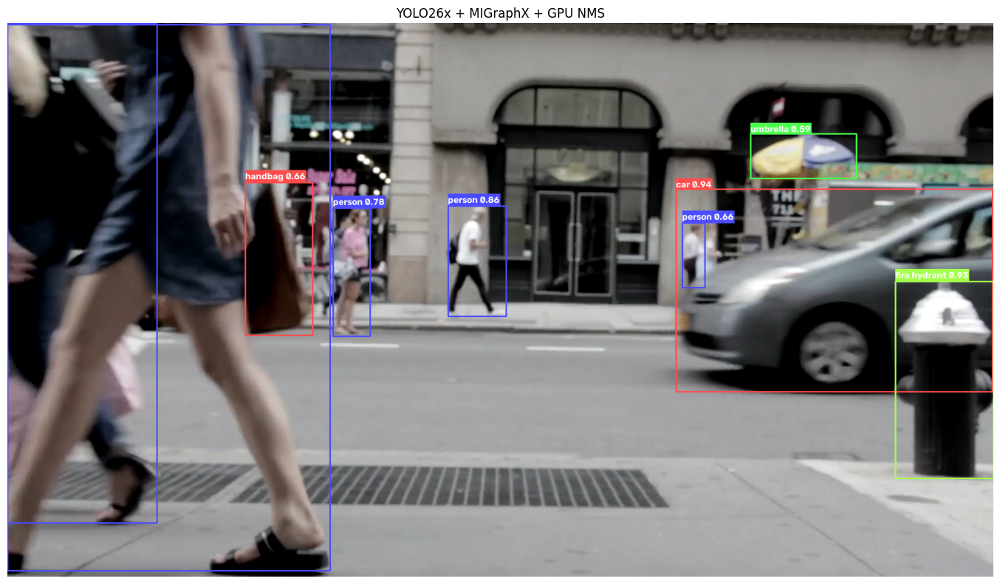

# OpenCV、MIGraphX、VLM：我们提出了一套跨框架零主机拷贝推理架构

> **导语**
>
> 上一篇，我们验证了 OpenCV 5 的 HIP 移植可以让熟悉的 `cv::cuda` API 在 AMD Radeon 上执行。
>
> 但真实应用不会停在一个算子上。视频要解码，图像要预处理，检测模型要推理，场景还可能交给视觉大模型理解，最后再编码成视频。任何一次不必要的数据搬运，都可能吃掉 GPU 算子带来的收益。
>
> 所以这一次，我们把问题推进到整条链路：**rocDecode 硬件解码、OpenCV 5 HIP 预处理、MIGraphX 运行 YOLO26x、llama.cpp 运行 Qwen3-VL-8B，以及 VA-API 硬件编码**。本文真正要介绍的，是**我们独立提出并实现的一套 OpenCV–MIGraphX–VLM 全 GPU 零主机拷贝推理架构**：让图像像素停留在同一张 Radeon GPU 上，框架之间只交换设备指针、内存描述和 HIP IPC handle。


## 没有 Radeon GPU？先注册，再到云上把实验跑一遍

这次我们不仅为 OpenCV 带来了 Radeon 上的 HIP 实现与实测数据，也把运行实验所需的 GPU 算力开放给了社区。

在本次活动期间，AMD 为 OpenCV 用户提供**免费的 48GB 显存 Radeon GPU 云算力**。无需先购买本地 Radeon，也无需先在自己的机器上完成整套 ROCm/OpenCV 编译，就可以打开预配置的 notebook，亲自检查运行过程和输出。

首先通过 OpenCV 社区专属链接注册 AMD 开发者：

**[立即注册 AMD 开发者并领取免费 48GB 云算力](https://developer.amd.com.cn/login?source=mEi9fAoWW)**

注册完成并领取活动权益后，再进入 Radeon Cloud Gallery：

**[radeon.anruicloud.com](https://radeon.anruicloud.com/)**

完整流程共四步：

1. 使用上面的 **OpenCV 社区专属注册链接**注册 AMD 开发者，并按活动页面提示领取免费 48GB 显存云算力。
2. 打开 Radeon Cloud Gallery，找到 **`opencv_on_end2end`**。
3. 点击 **Preview**，可直接查看完整 notebook、代码和本文使用的已保存结果；准备运行时点击 **Launch**。
4. 云实例就绪后点击 **Open Notebook**，执行 **Run All**，重新得到 CPU/GPU 性能表和 GaussianBlur 正确性结果。

也可以先打开 [`opencv_on_end2end` 在线预览页](TODO)，确认内容后再启动实例。


云端模板对应的正是本文使用的 `opencv_amd_gpu/opencv_amd_gpu_demo.ipynb`。换句话说，你看到的不是为文章另做的一组静态截图，而是一份可以再次执行的实验。

> **活动说明：**请通过 OpenCV 社区专属链接完成 AMD 开发者注册并领取活动权益。免费算力面向本次活动提供；领取方式、使用额度、排队情况、实例时长和资源可用性可能随活动安排调整，请以注册页和 Radeon Cloud 页面显示的实时规则为准。



## 先看结论：重点不是又一个 FPS，而是图像不再落回 CPU

本文以最终配套项目 `/home/zihaomu/bigssd/notebook/opencv_amd_end2end` 为唯一事实源。两本 notebook 都已在 Radeon PRO W7900D（RDNA3，`gfx1100`，48 GB）上执行并保存输出，所有代码单元无错误。

项目中保存的完整运行结果为：

- 输入：393 帧，1920×1080，25 FPS，时长 15.72 秒
- 基础视觉链路：**50.8 FPS**，总耗时 7.74 秒
- OpenCV HIP 预处理：1.69 ms/frame
- MIGraphX FP16 检测：9.00 ms/frame
- 后处理：0.56 ms/frame
- 输出：393 帧，1920×1220，时长 15.72 秒
- VLM：llama.cpp `b9766` + Qwen3-VL-8B-Instruct `Q8_0`
- 场景理解：4 个片段，单片段 1.67–1.90 秒

本文的核心成果不是把几个组件都配置成 GPU backend，而是提出一套让 **OpenCV→MIGraphX** 与 **OpenCV→VLM** 不再以 CPU 内存交换大块图像的数据契约。最终 notebook 完整执行了检测链，并验证了 HIP-IPC 客户端出口；定制 consumer 保留为明确的未执行边界。

这里必须提前划清证据边界：最终 step-by-step notebook 实际验证了 rocDecode→Torch、Torch→OpenCV、OpenCV→MIGraphX/NMS，以及 HIP-IPC 客户端的 64 字节 handle 导出；定制 llama.cpp IPC consumer 在这次 notebook 中标记为 **not exercised**。最终语义结果使用标准 JPEG VLM 基线，不能冒充 HIP-IPC 服务端实测。


<!-- 公众号编辑：此处上传 /home/zihaomu/bigssd/notebook/opencv_amd_end2end/output/pipeline/03_final_llamacpp_q8.mp4 -->




## 从第一篇到第二篇：问题变了

第一篇关注的是一个基础问题：OpenCV 的 GPU API 能不能在 Radeon 上执行，性能和正确性怎样？

第二篇关注的是系统问题：

> 当解码器、OpenCV、推理引擎、视觉大模型和编码器来自不同项目时，怎样避免一帧图像在 CPU 和 GPU 之间来回搬运？

一帧视频至少要经过下面这些阶段：

```text
H.264 bitstream
    ↓
rocDecode / VCN hardware decode
    ↓
OpenCV 5 HIP preprocess
    ↓
MIGraphX FP16 YOLO26x
    ↓
cv::cuda::nms + ROI preparation
    ↓
llama.cpp + Qwen3-VL Q8_0
    ↓
overlay + VA-API H.264 encode
```

单算子 benchmark 回答“kernel 本身有多快”。端到端实验回答“这些能力组合起来之后，应用还能剩下多少性能”。

## 重点：这是我们独立提出并实现的跨框架零主机拷贝方案

先界定这里所说的“独立提出”。DLPack、HIP IPC、MIGraphX 和 OpenCV 都是已有技术；我们不把这些基础机制本身说成原创。**我们独立提出并实现的是一套以 OpenCV HIP 为设备图像中枢的系统方案**：为 OpenCV 补上外部显存视图、GPU NMS 与一致性 resize，为 llama.cpp 补上预处理后图像的 HIP-IPC 输入，再用明确的内存所有权、布局、同步和生命周期契约，把 OpenCV、MIGraphX 与 VLM 的图像推理热路径连成一个整体。

它不是“分别打开三个 GPU 开关”，而是要满足一个可验证的约束：

> 从硬件解码产生 GPU 图像开始，到 YOLO 检测完成、VLM 视觉编码器开始读取图像为止，大块图像像素和模型 tensor 不经过 Host RAM；框架之间传递设备地址、shape、stride、stream 和 IPC handle。

为了避免概念含混，本文把这种方案称为 **zero-host-copy inference path（零主机拷贝推理路径）**。它允许 resize、HWC→CHW、连续化和 IPC 打包所必需的 GPU→GPU 拷贝；允许把 NMS 后的少量框坐标下载到 CPU；但不允许把整帧、ROI 或模型输入 tensor 下载到 CPU，再重新上传 GPU。

### 一张图看懂：同一张 GPU 上的两条分支

```text
rocDecode / VRAM surface
          │
          │ DLPack（设备地址 + shape + stride）
          ▼
PyTorch GPU tensor（只充当显存所有者和互操作载体）
          │
          ├──────────── 检测分支 ─────────────────────────────┐
          │                                                   │
          │ data_ptr()                                        │
          ▼                                                   │
OpenCV HIP：外部 GpuMat view                                  │
letterbox / normalize                                         │
          │                                                   │
          │ 写入 Torch 分配的 GPU blob                        │
          ▼                                                   │
MIGraphX：argument_from_pointer()                             │
FP16 YOLO → 预分配 GPU 输出 → cv::cuda::nms                  │
          │                                                   │
          └── 只下载 NMS 后少量坐标，不下载图像和完整 tensor ─┘

          └──────────── VLM 分支 ──────────────────────────────┐
                                                              │
GPU crop ROI → OpenCV HIP smart_resize / pad / normalize      │
          │                                                   │
          │ hipMemcpy2D D2D：打包为紧凑 IPC buffer            │
          ▼                                                   │
独立 hipMalloc 显存 → 64-byte HIP IPC handle → HTTP          │
                                                              ▼
同卡 llama.cpp 映射同一块 VRAM → Qwen3-VL vision encoder
```



### 分支一：OpenCV → MIGraphX，图像和模型输入不落 CPU

这条分支首先解决“OpenCV 怎样直接处理解码器的显存”。rocDecode 通过 DLPack 给出 GPU tensor；`GpuMat.fromDevicePointer` 再把这段外部显存包装成一个**不拥有内存的 OpenCV view**：

```python
gpu_rgb = cv2.cuda_GpuMat.fromDevicePointer(
    rgb_gpu.data_ptr(), height, width, cv2.CV_8UC3, width * 3
)
```

OpenCV HIP 直接在这个 view 上完成 letterbox 和归一化。输出端同样不经过 NumPy：先由 PyTorch 分配目标 GPU buffer，再让 OpenCV 把它包装为另一个外部 `GpuMat` 并写入。完成 HWC→CHW 后，MIGraphX 用 `argument_from_pointer()` 读取该 GPU blob：
```python
# Torch owns the destination VRAM; OpenCV writes into it through a non-owning view.
hwc = torch.empty((640, 640, 3), dtype=torch.float32, device="cuda")
dst = cv2.cuda_GpuMat.fromDevicePointer(
    hwc.data_ptr(), 640, 640, cv2.CV_32FC3, 640 * 3 * 4
)
gpu_float.copyTo(dst)
blob_gpu = hwc.permute(2, 0, 1).unsqueeze(0).contiguous()
```


```python
mgx_input = migraphx.argument_from_pointer(
    input_shape,
    blob_gpu.data_ptr(),
)
model.run_async({input_name: mgx_input, output_name: output_arg}, stream.cuda_stream, "ihipStream_t")
```

MIGraphX 的输出也预先放在 GPU buffer 中。置信度过滤、letterbox 坐标反算和类别处理先在 GPU 上完成；boxes、scores 和 classes 再通过外部 `GpuMat` view 交给 `cv::cuda::nms`。最后只把幸存目标的索引与坐标下载到 CPU，供当前 overlay 使用。

所以这里的“零主机拷贝”不是说一字节都不移动，而是：**1080p 整帧、640×640 模型输入和完整 `[1,300,6]` 检测 tensor 不再成为 CPU 中转站的乘客。**

### 分支二：OpenCV → VLM，跨进程也不传 JPEG

VLM 边界更难，因为 llama.cpp 是另一个进程。标准 OpenAI 风格图像接口通常需要：

```text
GPU ROI → CPU → JPEG → base64 → HTTP
        → JPEG decode → CPU resize/normalize → GPU vision encoder
```

我们为此设计并实现了预处理后图像的 HIP-IPC 路径：

1. 主循环为异步任务保留一份 GPU frame clone，保证解码 surface 被复用后 ROI 仍有效；这是 D2D，不经过 Host RAM。
2. 在 GPU 上裁剪 Top-K ROI，并用 OpenCV HIP 完成 Qwen3-VL 的 `smart_resize → bilinear → center pad → normalize`。
3. 使用我们加入的 `align_corners=True` 路径，使 GPU 采样语义与 llama.cpp CPU 参考预处理对齐。
4. 将可能带 row padding 的 `GpuMat` 通过一次 `hipMemcpy2D` D2D 打包到独立、紧凑、offset=0 的 `hipMalloc` buffer。
5. 调用 `hipIpcGetMemHandle` 导出 64 字节 handle。HTTP 中只发送 handle、width、height 和 `preprocessed: true`，不发送图像像素。
6. 同一张物理 GPU 上的定制 llama.cpp 服务映射该 buffer，跳过 JPEG 解码和 CPU 图像预处理，直接交给 Qwen3-VL 视觉编码器。
7. 客户端让 `IpcBuffer` 一直存活到 HTTP 请求返回；服务端读取结束后才 `hipFree`，避免悬空指针。

请求中的多模态数据实际缩成了下面这类描述：

```json
{
  "ipc_handle": "<base64 of 64-byte HIP handle>",
  "width": 672,
  "height": 448,
  "preprocessed": true
}
```

在代码层，实时客户端必须显式选择 IPC backend：

```python
vlm = AsyncVLMClient(
    backend="llamacpp-ipc",
    base_url="http://zihao_llamacpp_q8:8199/v1",
)
```

当前正式 `pipeline.py` 为了固定 Q8_0 基线，仍硬编码 `backend="llamacpp"`。因此复现零主机拷贝 VLM 路径时，需要切换到上面的 `llamacpp-ipc` backend，并使用带 `preprocessed-IPC` 支持、与 pipeline 位于同一张物理 GPU 的 llama.cpp 服务。

这一步不是 llama.cpp 原生 HTTP 图片接口的简单配置，而是我们在 [`zhangnju/llama.cpp` 的 `vlm_zerocopy` 分支](https://github.com/zhangnju/llama.cpp/tree/vlm_zerocopy)中加入的同卡 HIP-IPC 多模态输入能力。

### 真正决定方案能否成立的，是五项数据契约

“拿到一个 `data_ptr()`”远远不够。跨框架零主机拷贝必须同时回答下面五个问题：

| 契约 | 我们的处理方式 | 不处理会怎样 |
|---|---|---|
| **设备一致性** | pipeline 与 llama.cpp 必须位于同一张物理 Radeon GPU | IPC handle 无法映射到正确设备 |
| **布局一致性** | 显式携带 shape/stride；HWC→CHW 在 GPU 完成；IPC 前打包 row padding | 颜色错位、越界或模型输入错误 |
| **所有权** | OpenCV `GpuMat` 只借用外部指针；Torch/独立 `hipMalloc` 保持真正所有权 | view 仍在使用时底层显存被回收 |
| **同步** | MIGraphX 使用当前 HIP stream，完成后同步；IPC 导出前执行 `hipDeviceSynchronize` | 下游读取尚未写完的数据 |
| **生命周期** | 异步 VLM 持有 GPU frame clone；IPC buffer 保活到 HTTP 返回后再释放 | 解码 surface 复用或 IPC buffer 提前释放 |

数值语义也是契约的一部分。VLM 服务端跳过原预处理后，GPU resize/normalize 必须与参考实现一致，否则“零拷贝”只是更快地送入错误像素。因此我们把 `align_corners` 加入 OpenCV GPU resize，并保存逐元素验证结果。

### OpenCV 为什么是这套方案的中心，而不是某个胶水脚本？

MIGraphX 需要规范的模型 tensor，Qwen3-VL 需要严格一致的视觉预处理，rocDecode 给出的是媒体 surface。三者都不应该各自下载图像再处理一遍。

OpenCV HIP 在中间提供了统一的设备图像语义：外部内存 view、颜色与几何变换、ROI、padding、归一化和 NMS。我们新增或推进上游的 `GpuMat.fromDevicePointer`、`cv::cuda::nms` 与 `resize(align_corners)`，正好分别解决**输入显存接入、检测输出处理、VLM 输入一致性**三个缺口。

因此这套独立方案的核心不是某一个 API，而是一条完整原则：

> **显存由最合适的组件拥有，OpenCV 以非 owning view 处理图像，推理引擎直接消费设备指针，跨进程只共享 handle；大块像素不以 CPU 作为框架之间的公共交换格式。**

需要再次强调：这里描述的是实时检测与 ROI-VLM 的推理热路径。后文用于最终成片的三帧 storyboard 字幕模式走常规 JPEG 接口，是独立的展示工作流，不是 HIP-IPC 零主机拷贝路径的性能证明。
## 为了让方案成立，我们实际补了哪些能力？

这套架构不是只在应用层拼接现成接口。围绕三个框架边界，我们实现或推进了四项关键能力：

| 方案缺口 | 我们的实现 | 作用 |
|---|---|---|
| 解码显存无法被 OpenCV 直接接管 | `GpuMat.fromDevicePointer` · [opencv#29527](https://github.com/opencv/opencv/pull/29527) | 以 non-owning view 包装外部 GPU 内存 |
| YOLO 后处理回落 CPU | `cv::cuda::nms` · [opencv_contrib#4178](https://github.com/opencv/opencv_contrib/pull/4178) | 完整候选集留在 GPU，只回传幸存框 |
| GPU VLM 预处理与 llama.cpp 采样语义不一致 | `cv::cuda::resize(..., align_corners)` · [opencv_contrib#4181](https://github.com/opencv/opencv_contrib/pull/4181) | 让服务端可以安全跳过 CPU 预处理 |
| llama.cpp HTTP 接口只能接收 JPEG/像素 | 预处理图像 HIP-IPC 输入 · [`vlm_zerocopy`](https://github.com/zhangnju/llama.cpp/tree/vlm_zerocopy) | 同卡跨进程只传 64 字节 handle |

公共 namespace 仍然是 `cv::cuda`，本文实际使用 OpenCV 5 HIP 开发分支，由 ROCm/HIP 在 Radeon 上执行。这里的贡献不是发明 DLPack 或 HIP IPC，而是把这些机制落实为 OpenCV、MIGraphX 与 VLM 可以共同遵守、可验证的端到端数据契约。

## 最终项目实际保存的性能与产物

最终项目的 `output/pipeline/01_yolo_base.log` 记录了同一次完整运行：

| 指标 | 保存结果 |
|---|---:|
| 输入 | 393 帧，1920×1080，25 FPS |
| 总耗时 | 7.74 s |
| 平均吞吐 | **50.8 FPS** |
| OpenCV HIP 预处理 | 1.69 ms/frame |
| MIGraphX FP16 检测 | 9.00 ms/frame |
| 后处理 | 0.56 ms/frame |
| 解码 / 编码 | rocDecode / VA-API |

这条视觉链路快于输入视频的 25 FPS 实时速度。该数字绑定最终项目中的固定视频、W7900D、OpenCV 5.1.0-dev、MIGraphX 编译模型和保存日志，不外推到其他硬件或 workload。

## 零主机拷贝架构：最终 notebook 实际证明了什么？

`opencv_amd_end2end_step_by_step.ipynb` 没有只画架构图，而是保存了一张 copy audit：

| 检查点 | 大数据位置与传输 | 最终 notebook 的证据 |
|---|---|---|
| A. rocDecode → Torch | GPU；DLPack / 修复后的 GPU tensor | 解码 tensor 位于 GPU，stride 为 `(5760, 3, 1)` |
| B. Torch → OpenCV HIP | GPU；non-owning pointer view | Torch owner 与 OpenCV view 指针相等 |
| C. OpenCV → MIGraphX → NMS | GPU device pointer；仅幸存框 D2H | 输入与输出均在 `cuda:0`；300 candidates → 9 survivors |
| D. OpenCV → HIP IPC | `hipMemcpy2D` D2D + 64-byte handle | 客户端导出 8,110,080-byte packed buffer 与 64-byte handle |
| 定制 llama.cpp IPC consumer | 同卡映射同一 VRAM | **本次 notebook 未执行，需要定制服务端** |
| Q8_0 语义基线 | CPU ROI → JPEG → HTTP → llama.cpp | 已执行 3 次响应；不是零主机拷贝证据 |
| Overlay / VA-API | GPU → Host → GPU | 已知展示边界，不属于零主机拷贝主张 |

换句话说，最终项目验证了设备指针互操作和 IPC 客户端导出，但没有把尚未执行的定制服务端写成已经完成的性能跑分。这比单纯写“全链路零拷贝”更准确，也更容易复查。

## VLM 成片基线：按片段生成稳定字幕

最终成片采用两遍式流程：

1. 第一遍逐帧生成 YOLO/MIGraphX 基础视频。
2. 第二遍每 4 秒抽取 3 张时序帧组成 storyboard，经标准 JPEG 接口交给 Qwen3-VL Q8_0。
3. 保存 timeline 和 SRT，再从第 0 帧统一渲染字幕。



最终 timeline 的四段延迟为 **1.8966、1.6721、1.7111、1.7093 秒**，范围为 **1.67–1.90 秒**。例如 8–12 秒片段生成：

> Pedestrians and cyclists move through urban street scene with delivery truck and storefronts.

这组结果证明标准 Q8_0 语义基线与成片流程可复现；它不用于证明 HIP-IPC 服务端收益。

## 快还不够：每个框架边界都要验证

端到端 GPU pipeline 最容易出错的地方，不一定是模型，而是 stride、颜色、坐标、同步和生命周期。最终 step-by-step notebook 把这些边界拆开验证。

### 解码：先确认设备和布局

rocDecode 通过 DLPack 输出 GPU tensor。当前 rocPyDecode 0.8.0 的 RGB view 需要修复 channel stride 与最后一行存储，项目在 GPU 上重建 tensor，并关闭 H.264 强制 zero-latency，保证显示顺序。用于验证的 CPU/GPU 解码 MAE 为 **0.5658/255**；它只属于 validation D2H，不进入推理热路径。

### OpenCV 预处理：指针相等，数值也要对

最终 notebook 保存的输出显示，Torch owner pointer 与 OpenCV non-owning view pointer 完全相同；OpenCV HIP 直接处理外部显存。GPU 输出为连续的 `(1, 3, 640, 640)` tensor，validation-only CPU/GPU 最大误差为 **5.96×10⁻⁸**。

### MIGraphX 与 GPU NMS：完整 tensor 留在设备侧

MIGraphX 直接消费 OpenCV 写入的 GPU blob，输出 `[1, 300, 6]` resident tensor。置信度过滤、坐标反算与 `cv::cuda::nms` 留在 GPU，最终只下载 9 个幸存目标。



### HIP IPC：客户端已验证，服务端需单独启用

最终 notebook 在 GPU 上完成 ROI resize、padding 和 normalize，随后用一次 D2D 打包生成紧凑 IPC buffer，并导出 64 字节 handle。copy audit 明确记录 `ipc_server_exercised: False`：定制 llama.cpp consumer 是方案的一部分，但不属于这次标准 Q8_0 notebook 已执行的结果。

## 当前实现并非“整帧绝对零拷贝”

这一点需要主动说清楚。

最终项目中，**rocDecode → OpenCV HIP → MIGraphX → GPU NMS** 的检测热路径避免了大块像素和完整模型 tensor 的主机往返；**OpenCV → HIP IPC handle** 的客户端路径也已执行。定制 llama.cpp IPC consumer 未在本次 notebook 中启用，因此不能把标准 JPEG 语义基线写成跨进程零主机拷贝实测。

为了使用 CPU OpenCV 绘制目标框和统计面板，完整 RGB 帧仍会下载一次；`VaapiWriter` 接收 BGR NumPy 帧后，通过 ffmpeg 的 `hwupload` 重新上传到 VA-API surface，再由 VCN 编码。

因此更准确的表述是：

> 已验证的检测推理热路径与 IPC 客户端导出不以 Host RAM 交换大块图像；当前标准 VLM baseline、可视化与编码仍包含明确的 Host 边界。

这不是文字上的小修饰，而是下一轮优化的明确方向：GPU overlay，以及可以直接接收设备 surface 的编码接口。

## 唯一配套项目与复现入口

本文最终参考项目位于：

```text
/home/zihaomu/bigssd/notebook/opencv_amd_end2end
```

项目提供两本已经执行并保存输出的 notebook：

```text
opencv_amd_end2end_step_by_step.ipynb  # 指针、copy audit 与逐阶段验证
opencv_amd_end2end.ipynb               # 393 帧完整视频 workflow
```

启动项目容器：

```bash
cd /home/zihaomu/bigssd/notebook/opencv_amd_end2end
bash scripts/start_notebook_container.sh
```

浏览器打开：

```text
http://127.0.0.1:8891/?token=opencv-amd-end2end
```

默认 notebook 会验证并展示 `output/pipeline/` 中的最终产物。要重新生成完整流程，可在启动 kernel 前设置 `RUN_PIPELINE=1`，或在项目容器中执行：

```bash
python3 scripts/run_pipeline.py --force
```

最终产物统一位于：

```text
output/pipeline/01_yolo_base.log
output/pipeline/01_yolo_base.mp4
output/pipeline/02_llamacpp_q8_timeline.json
output/pipeline/02_llamacpp_q8_subtitles.srt
output/pipeline/03_final_llamacpp_q8.mp4
output/pipeline/manifest.json
```

两个 YOLO 文件随项目提供；Qwen3-VL Q8_0 与 F16 mmproj 缺失时，notebook 会从配置的 Hugging Face mirror 下载到相对 `models/`，并检查大小、GGUF 文件头和 SHA-256。

实验环境：

- AMD Radeon PRO W7900D，RDNA3 / `gfx1100`
- ROCm 7.2.1
- OpenCV 5.1.0-dev HIP 分支
- MIGraphX 2.15.0
- rocDecode 1.7.0 / rocPyDecode 0.8.0
- llama.cpp `b9766`
- Qwen3-VL-8B-Instruct Q8_0
- Python 3.10

## 没有本地 Radeon，也可以先进入开发者平台

AMD AI 开发者计划中文站提供 Radeon 云端开发环境。可以通过 OpenCV 社区专属链接注册，再按活动页面查看可领取的算力、实例规格和可用模板：

**[注册 AMD 开发者并查看 Radeon 云算力](https://developer.amd.com.cn/login?source=mEi9fAoWW)**

完成注册后可进入 Radeon Cloud Gallery：

**[radeon.anruicloud.com](https://radeon.anruicloud.com/)**

> 活动权益、免费额度、排队、实例时长和资源可用性以页面实时规则为准。本文完整 pipeline 依赖定制 OpenCV、rocDecode、MIGraphX 与 llama.cpp 环境，不应把任意基础云实例理解为已经预装同一套实验。

## 这条链路对 OpenCV 意味着什么？

第一篇证明了 `cv::cuda` 可以在 Radeon 上执行。第二篇更进一步：当视频系统进入多框架、多模型时代，OpenCV 仍然可以是最稳定的公共层。

它提供的不只是 resize 和颜色转换，还包括：

- 对外部 GPU 内存的统一视图
- 对 stream 和异步执行的衔接
- 模型前后的确定性视觉操作
- NMS、ROI、坐标与结果验证
- 从单算子到完整应用的熟悉编程接口

还有工作要做：把 overlay 留在 GPU，让编码器直接接收设备 surface，减少框架间显式同步，并在更多 codec、Radeon 型号和真实视频上验证。

但最关键的一步已经发生。OpenCV 的 Radeon 支持不再只是一张 benchmark 表，而开始进入一条真正工作的端到端视频 AI pipeline。

## 结语

这次实验最值得复用的，不是“把 YOLO 和 VLM 放在一张卡上”，而是我们独立提出并实现的这套数据通路：

- OpenCV 用 non-owning `GpuMat` 处理其他组件拥有的显存
- MIGraphX 直接消费 OpenCV 写入的 GPU tensor 指针
- llama.cpp 通过 HIP IPC 映射 OpenCV 预处理后的同卡 VRAM
- 设备、布局、所有权、同步和生命周期由五项契约共同约束

它把“都在 GPU 上运行”推进为“框架之间也不再用 CPU 交换图像”。这才是第二篇相对单算子 GPU 加速真正向前走的一步。

---

## 项目与致谢

- OpenCV core HIP 与 `GpuMat.fromDevicePointer`：[opencv#29527](https://github.com/opencv/opencv/pull/29527)
- opencv_contrib HIP 与 `cv::cuda::nms`：[opencv_contrib#4178](https://github.com/opencv/opencv_contrib/pull/4178)
- `cv::cuda::resize` 的 `align_corners`：[opencv_contrib#4181](https://github.com/opencv/opencv_contrib/pull/4181)
- HIP IPC 多模态服务：[zhangnju/llama.cpp `vlm_zerocopy`](https://github.com/zhangnju/llama.cpp/tree/vlm_zerocopy)
- 视频与推理组件：AMD ROCm、rocDecode、MIGraphX、llama.cpp、Qwen3-VL、VA-API

> **技术边界：**本文使用 OpenCV 5 HIP 开发分支，并非 stock OpenCV release 默认提供的 Radeon binary。50.8 FPS 与字幕延迟来自最终项目保存产物；HIP-IPC 客户端已验证，但定制 llama.cpp IPC consumer 未在标准 Q8_0 notebook 中执行。
