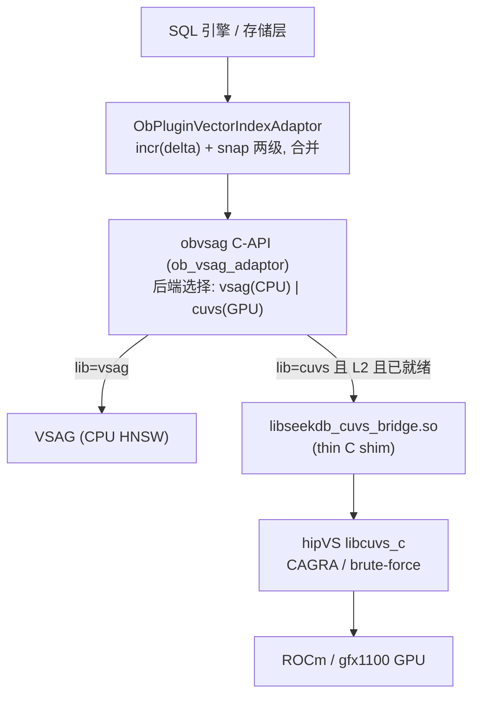

# seekdb × hipVS:AMD GPU 向量检索加速 —— 技术分享

> **核心技术文档(PPT 底稿)** · 2026-08 · 分支 `feature/hipvs-cuvs`(实验 / RFC)
> **一句话定位**:让 seekdb 的向量索引可**可选地**跑在 **AMD GPU(gfx1100 / RDNA3)** 上,
> 后端为 **hipVS**(AMD 对 NVIDIA cuVS 的移植);**默认构建零影响,GPU 按索引 opt-in**。
> **核心结论(诚实口径)**:单条查询 GPU ≈ CPU(无收益);**批量向量检索**才是 GPU 决定性胜出的场景。

---

## 分享脉络(每节 ≈ 一组幻灯片)
1. 背景:为什么要 GPU 向量检索
2. 技术栈:seekdb / hipVS / cuVS / ROCm
3. 整体架构与集成缝
4. 两种用法:声明式 `lib=cuvs` + 批量算子 `dbms_vector.batch_knn`
5. 关键发现:单查无收益、**批量**决定性胜出(研究历程)
6. 性能数据(可直接上图上表)
7. 正确性与安全回退
8. 发布硬化:可选、受支持构建、零默认影响
9. 镜像固化 + Notebook 一键演示
10. 现状与路线图(Definition of Done)
11. 结论与 Q&A 锚点

---

## 1. 背景:为什么要 GPU 向量检索

- 向量检索(ANN)是 RAG / 语义搜索 / 推荐 / 去重的基础算子;数据库把它做进 SQL,才能"存算一体"。
- seekdb(OceanBase 血统)自带向量索引,默认后端是 **VSAG(CPU HNSW)** —— 单查已亚毫秒,很强。
- GPU 的诱惑:海量向量的**批量**相似度计算(相似度 JOIN、批量打分、离线召回评测)是天然的并行负载。
- 但 AMD 生态缺一环:NVIDIA 有 cuVS,AMD 侧需要 **hipVS**(ROCm 上的 cuVS 移植)。本工作把二者**接起来**并**如实测量**收益边界。

**要回答的问题**:在 seekdb 里接入 AMD GPU 向量检索,**到底在哪种负载下真正更快?** 代价与工程风险是什么?

---

## 2. 技术栈

| 层 | 组件 | 角色 |
|---|---|---|
| SQL / 存储 | **seekdb**(OceanBase 分支) | 向量列 `VECTOR(N)`、`VECTOR INDEX`、`APPROXIMATE` 查询 |
| 向量抽象 | **obvsag C-API**(`ob_vsag_adaptor`) | 后端选择缝:`vsag`(CPU) / `cuvs`(GPU) |
| GPU 桥接 | **`libseekdb_cuvs_bridge.so`** | 纯 C shim,隐藏所有 ROCm/cuVS 头 |
| GPU 算法库 | **hipVS = cuVS 移植**(libcuvs / libcuvs_c) | CAGRA 图索引 + 暴力 KNN |
| 运行时 | **ROCm 7.2.4** | AMD GPU 驱动/运行时(gfx1100 = RDNA3,Radeon PRO W7900) |

> **硬件**:AMD Radeon PRO W7900(gfx1100,RDNA3)。官方 cuVS 只支持 CDNA(gfx90a/942/950),
> gfx1100 需**源码编译 hipVS**(dynamic-only、CK 后端关);编译 + 全量测试已通过,自包含 runtime 镜像已推 ACR。

---

## 3. 整体架构与集成缝



**集成缝的地面实况(Phase 0 插桩得到的真实调用链)**:

| SQL 操作 | obvsag 调用 | 说明 |
|---|---|---|
| `CREATE ... VECTOR INDEX` | `create_index` | 建 delta 索引句柄 |
| `INSERT`(每行) | `add_index`(dense, size=1) | 流式进 delta(同一 handle) |
| `... APPROXIMATE LIMIT k` | `knn_search`(simple 重载) | 无过滤;带过滤走 iter_ctx 重载 |
| 压缩建快照 | `create_index` + N×`add_index` + `fdeserialize` | 快照也**增量** add 构建,落盘重载 |

> **关键洞察**:普通 HNSW **永不调 `build_index`**;GPU 钩子必须挂在 **`add_index`(缓存向量)+ `knn_search`(惰性建 CAGRA 并服务)**。
> 查询会同时查 delta(VSAG,始终新)与 snapshot(可 cuVS)**再合并**。

---

## 4. 两种用法(用户面)

### A. 声明式 per-index GPU 加速 —— 只需加 `lib=cuvs`
```sql
ALTER SYSTEM SET ob_vector_memory_limit_percentage = 30;

CREATE TABLE t (
  c1 INT PRIMARY KEY,
  c2 VECTOR(128),
  VECTOR INDEX idx(c2) WITH (distance=l2, type=hnsw, lib=cuvs,
                             m=16, ef_construction=200, ef_search=64)
);
-- 该索引的 INSERT + APPROXIMATE 查询走 GPU;同一 server 里其它索引仍走 VSAG。
-- 不需要任何环境变量。
SELECT c1 FROM t ORDER BY l2_distance(c2, '[...]') APPROXIMATE LIMIT 10;
```

### B. 批量 ANN 算子 —— 多探针一次 GPU 调用(GPU 的杀手锏)
```sql
-- index_tbl / probe_tbl 均为 (id INT, vec VECTOR(dim));out_tbl 预建:
CREATE TABLE bk_out(probe_id BIGINT, neighbor_id BIGINT, distance FLOAT, rk INT);

CALL dbms_vector.batch_knn('index_tbl', 'probe_tbl', 10, 'bk_out');
SELECT * FROM bk_out ORDER BY probe_id, rk;
```

> 设计原则:**后端选择走 DDL/配置,不走全局环境变量**;租户/系统开关可控是否允许 GPU 后端。

---

## 5. 关键发现:单查无收益,**批量**决定性胜出(研究历程)

这是本次分享**最重要**的一页 —— 一个诚实的、被数据反复修正的结论。


- **为什么单查没戏**:cuVS 每次调用有固定开销(RMM 显存分配 + PCIe 传输 + kernel 启动 + 同步),
  而 VSAG 的 HNSW 在正常快照上已 **~0.4ms/查**。单查 GPU ≈ 甚至慢于 CPU。
- **为什么批量赢**:N 条探针**喂一次** GPU 调用,固定开销被摊薄到近乎为零 —— 每探针成本随 N 迅速下降,GPU 算力在 nq≈500+ 饱和。

---

## 6. 性能数据(AMD Radeon PRO W7900,gfx1100,ROCm 7.2.4)

### 6.1 单查 vs 批量 —— 一张表讲完整个故事
| 路径 | 吞吐 | recall@10 | 说明 |
|---|---|---|---|
| 单查 100k CAGRA | 2,148 q/s(0.466ms) | — | ≈ VSAG 快照 0.41ms → **无收益** |
| VSAG-CPU 逐条(10k) | 4,598 q/s | 0.926 | 最优单查基线 |
| cuVS-GPU 逐条(10k) | 470 q/s | 0.873 | 更慢(每调用开销) |
| **cuVS-GPU 批量(10k, nq=100)** | **54,777 q/s** | 0.873 | **比逐条 116.7×;比最优 CPU 12×** |
| 桥接批量扫描 nq=5000 | 634,930 q/s | — | **263×**,GPU 饱和 |

### 6.2 批量规模扫描(桥接层,批量红利来源 = 摊薄每调用固定开销)
| nq | 探针/s | 相对 nq=1 |
|---|---|---|
| 1 | 2,414 | 1× |
| 10 | 24,145 | ≈同总时(固定开销主导) |
| 100 | 154,706 | 64× |
| 1000 | 448,868 | 186× |
| 5000 | **634,930** | **263×** |

### 6.3 端到端 SQL 演示(Notebook,10k 索引,`dbms_vector.batch_knn` vs CPU 逐条 JOIN)
| N(批量) | CPU 墙钟 ms | GPU 墙钟 ms | 加速比 |
|---|---|---|---|
| 100 | 373 | 551 | 0.68× |
| 500 | 1,545 | 544 | 2.84× |
| 1000 | 3,023 | 630 | 4.8× |
| 2000 | 5,923 | 757 | 7.82× |
| 4000 | 10,036 | 832 | **12.07×** |

> CPU 墙钟随 N **线性**增长;GPU 近乎持平 —— 交叉点约在 N≈300+,大批量下 GPU 决定性更快。


---

## 7. 正确性与安全回退(正确性 > 加速)

任何不确定场景 → **安全回退 VSAG**,绝不给错答案。已实现并验证:

| 场景 | 处理 | 验证 |
|---|---|---|
| 无过滤查询 | GPU 服务 | APPROX == EXACT;`cuvs_serve` 命中 |
| `WHERE` 过滤 | **后置过滤**:cuVS 返回 top-k 后逐个按 VSAG 语义校验,任一被排除即**回退** | `WHERE c1<100` → 回退、结果正确 |
| `DELETE` 后 | 回退(CAGRA 静态,删除不反映) | 删除行不再出现、结果正确 |
| 非 L2(IP/cosine) | 不缓存不服务、全回退 | cosine 表 `cuvs_build=0 cuvs_serve=0`、结果正确 |
| 新鲜度(两次重建之间) | **门控 `built_n_ == buffer`** 才 GPU 服务,否则回退(delta 始终新) | 交错 insert+query 四步 APPROX==EXACT 全 MATCH |
| 规模化召回(10k) | GPU 服务 | recall@10 = **0.89** vs 真值 |

> 天然落地了目标策略:**delta(流式)→ VSAG(始终新);snapshot(稳定)→ cuVS**。

---

## 8. 发布硬化:可选、受支持构建、零默认影响

- **编译开关** `OB_BUILD_CUVS`(+ `CUVS_BRIDGE_LIB` 路径 + 开发者专用 `OB_BUILD_CUVS_TRACE`)。
  ```bash
  ./build.sh release -DOB_BUILD_CUVS=ON \
    -DCUVS_BRIDGE_LIB=/path/to/libseekdb_cuvs_bridge.so --make -j64
  ```
- **`OB_BUILD_CUVS=OFF`(默认)**:桥接不链接、GPU 代码从不运行、行为与上游 VSAG **完全一致**。
- **DDL**:新增 `VIAL_CUVS` + 接受 `lib=cuvs`(dense L2 HNSW;IVF 拒绝)。
- **插件路由**:标记 `lib=cuvs` 的索引句柄走 GPU 路径(无环境变量)。
- **测试**:CI 安全的 DDL 契约测试 + 需 GPU 的 smoke 模板 + 设计/基准文档。
- **去 PoC 化**:去掉硬编码 `/work/bridge` 路径、移除全局 env 开关与调试 tracer(gate 到编译期)。

---

## 9. 镜像固化 + Notebook 一键演示

**自包含镜像**:用户拿到即在 Jupyter 里体验 seekdb + hipVS 批量提速。

- 镜像:`crpi-a7t9nblyxh55vyd2.cn-shanghai.personal.cr.aliyuncs.com/muzihao2/work:seekdb-hipvs-nb-demo`(已推 ACR)。
- 所有 seekdb+hipVS 资产固化到 **`/seekdb_workspace`**(`bin/seekdb`、`bridge/`、`datasets/`、`scripts/`),**不占用 `/workspace`**;`SEEKDB_HOME=/seekdb_workspace`。
- **`/workspace`** 只挂 notebook + 结果(k8s 挂 PVC)。observer 由 **notebook 单元**启动(教学分步可见),Jupyter 由 entrypoint 启动。
- 追加系统依赖:`libaio1t64`(seekdb 加载)+ `default-mysql-client`(演示)+ Jupyter/numpy/pandas/matplotlib。

```bash
docker run -d --name seekdb_nb \
  --device=/dev/kfd --device=/dev/dri/renderD135 \
  --group-add 44 --group-add 993 --security-opt seccomp=unconfined \
  -p 18890:8888 -v $PWD/notebook_workspace:/workspace \
  crpi-a7t9nblyxh55vyd2.cn-shanghai.personal.cr.aliyuncs.com/muzihao2/work:seekdb-hipvs-nb-demo
# 浏览器 http://<host>:18890/  token: seekdb-hipvs → 打开 seekdb_hipvs_batch_demo.ipynb 自上而下运行
```

> 演示脚本 `lib/seekdb_demo.py` 用 mysql CLI(非 pymysql),减少镜像 Python 依赖面。k8s:GPU 走 device/SecurityContext,`JUPYTER_TOKEN` 走 Secret。

---

## 10. 现状与路线图

### Definition of Done("完整支持"的 7 条)
用户可以:① DDL 显式开 GPU 加速;② 增删改查始终正确;③ 带/不带过滤 ANN 正确(或安全回退);
④ 重启后索引仍可用;⑤ 扩到百万级、显存有界、多租户不 OOM;⑥ recall/QPS/建图达标且有回归守护;⑦ 可选、受支持、有文档。

### 分阶段(当前完成度约 15–25% → happy path + 正确性 + 批量算子已打通)
| 阶段 | 内容 | 状态 |
|---|---|---|
| **M-A 正确性/安全回退** | 过滤、删除、非 L2、规模召回 | ✅ 完成(recall 0.89) |
| **M-B 持久化/新鲜度** | B2 新鲜度门控 ✅;B1 fdeserialize 重启重建 | B2 ✅ / **B1 暂缓**(单机 dev 无法可靠制造落盘快照;路径已定 `GetRawVectorByIds`) |
| **M-C 健壮性/性能** | C3 基准(关键负结果→翻盘)、**批量算子交付** | ✅ 批量 seam + `dbms_vector.batch_knn` |
| **M-D 产品化/上游** | CMake 集成、DDL 面、回归、文档、去 tracer | ✅ 大部分(本次硬化) |

### 后续(follow-ups)
- 快照持久化后重建 GPU 索引(B1);常驻 GPU worker + 复用设备缓冲(削单查开销)。
- 避免 GPU buffer 二次拷贝向量(大表内存翻倍);`batch_knn` 跨调用缓存索引。
- DDL 更严(非 L2 直接 DDL 拒绝)、全局 kill-switch;OFF 路径完全 `#ifdef` 掉。
- 扩 gfx1100 之外的 GPU;启用性能调优的 cuVS(CK 后端)—— 当前桥接 dynamic-only、correctness-validated、非 perf-tuned。

---

## 11. 结论与 Q&A 锚点

- **接通**:seekdb 向量索引可选跑在 AMD GPU(hipVS/cuVS),默认零影响、按索引 opt-in、有安全回退。
- **诚实的收益边界**:单条 SQL 查询 **GPU ≈ CPU 无收益**;**批量向量检索**(相似度 JOIN / 批量打分 / 离线召回)GPU **116×~263×**,端到端 SQL 演示 **~12× @ N=4000**。
- **又快又更准**:默认参数下 cuVS CAGRA recall(≈0.88)≥ VSAG(≈0.64);批量与单查结果一致(不降质)。
- **可交付**:声明式 `lib=cuvs` + `dbms_vector.batch_knn`,无需环境变量;自包含演示镜像已推 ACR。

**预设问答**:
- *为什么单查不快?* → CPU HNSW 已亚毫秒;GPU 每调用固定开销(分配/传输/启动)吃掉优势。
- *GPU 价值在哪?* → 批量 / 更高召回 / 超大索引 + 相似度 JOIN。
- *默认会变慢或不稳吗?* → 不会;`OB_BUILD_CUVS=OFF` 与上游完全一致。
- *正确性如何保证?* → 不确定即回退 VSAG,已对过滤/删除/非 L2/新鲜度逐一验证。

---

### 附:关键坐标(备查)
- 改动核心:`src/oblib/lib/vector/ob_vsag_adaptor.{cpp,h}`(obvsag C-API + cuVS 钩子 + 批量 seam)。
- 上层路由:`src/observer/vector_index/ob_plugin_vector_index_adaptor.cpp`(`lib=cuvs` 标记)。
- DDL:`ob_vector_index_util.{h,cpp}`(`VIAL_CUVS` + `lib=cuvs` 接受)。
- 批量 SQL:`dbms_vector.batch_knn`(PL 系统包)。
- 桥接:`docs/gpu-vector-index-hipvs-cuvs/`(源码 + 复现 + smoke)。
- 参考文档:`doc/seekdb_hipVS_PR_description.md`、`doc/seekdb_完整支持hipVS_设计与路线图.md`、`doc/seekdb_hipVS_发布硬化落地计划.md`、`doc/seekdb_hipVS_镜像固化与Notebook演示方案.md`。
