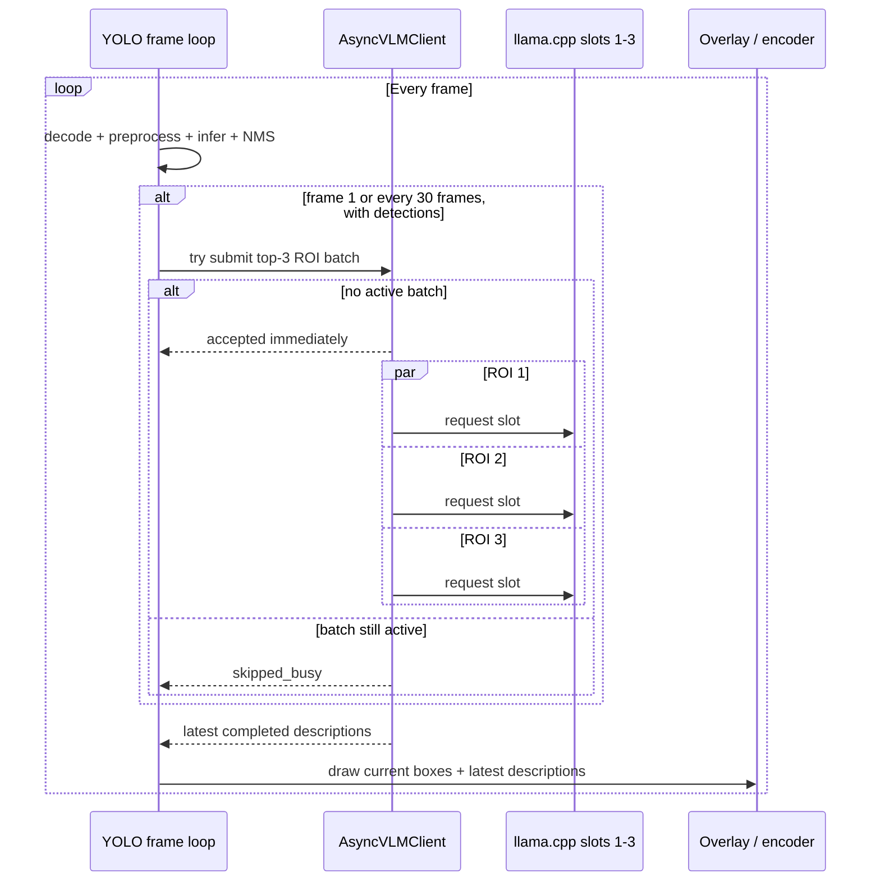

# YOLO26 + VLM End-to-end Notebook 设计

> 目标文件：`ultralytics_yolo26x_end_to_end.ipynb`
>
> 定位：固定参数、一键运行并验收 YOLO + 异步 ROI VLM
>
> 建议占用：60 分钟 Workshop 中的 12 分钟
>
> 状态：已实现并在 W7900D 上完成 393 帧 YOLO-only / async ROI A/B，8/8 code cells，0 error

## 1. 目标与边界

End-to-end Notebook 不再承担逐层教学或开放决策。它回答：

> 在固定、已解释的参数下，YOLO26 与 Qwen3-VL 能否在同一段视频上并行运行，并产生完整、可验证的视频与性能记录？

它必须做到：

- 一个入口运行完整流程；
- 使用统一固定参数；
- 显示 YOLO 持续处理、VLM 在后台运行；
- 输出检测框与最新 ROI 描述；
- 保存真实请求计数与 latency；
- 验证视频帧完整性；
- 清楚声明这是固定周期异步 ROI，不是 tracking/event 联动。

## 2. 锁定运行方案

```yaml
input: data/sidewalk.mp4
source_fps: 25
source_frames: 393
yolo_backend: Ultralytics ONNX + MIGraphX EP FP16
vlm_backend: llama.cpp + Qwen3-VL-8B-Instruct Q8_0
vlm_interval_frames: 30
vlm_top_k_rois: 3
client_batch_in_flight: 1
busy_policy: skip
llama_parallel_slots: 3
transport: JPEG + Base64 + HTTP
default_gpu_placement: single GPU
video_decode: rocDecode
video_encode: VA-API
```

以上是 End-to-end Notebook 的固定实验配置，不在这本 Notebook 中开放修改。

## 3. `30 帧 + top-3 + slot=3` 的准确含义

### 3.1 触发机会

触发条件：

```text
frame == 1
or frame % 30 == 0
```

并且当前帧必须存在 detection。

25 FPS 下，30 帧约为：

$$
30 / 25 = 1.2\ \text{seconds of video}
$$

393 帧视频的理论 trigger opportunities：

```text
1, 30, 60, ..., 390
```

共 14 个机会，但不等于 14 个实际 batch。

### 3.2 一次 accepted batch

```text
当前 detections
-> confidence 降序
-> 选择最多 top-3
-> 裁剪 1-3 个 ROI
-> 1-3 个 HTTP 请求并发提交
```

客户端使用 `ThreadPoolExecutor(max_workers=有效 ROI 数量)`；服务端 `--parallel 3` 提供最多 3 个 slot。

`slot=3` 表示服务容量，不表示系统每 30 帧自动发三次请求，也不保证存在三个有效 ROI。

### 3.3 Busy policy

当前 `AsyncVLMClient` 同时只允许一个 batch：

```text
若上一批仍在运行
-> 本次 trigger 直接 skip
-> YOLO 继续
```

这是有意保持低延迟的策略，但必须记录 skip，不能静默。

## 4. 实际并行时序



YOLO 与 VLM 在控制流上并行；若部署在同一 GPU，它们仍竞争 compute、memory bandwidth 和 VRAM。

## 5. 当前实现边界

当前 `pipeline.py` 的 direct-encode eligibility 要求 `--no-vlm`。因此启用 async ROI VLM 后，现有路径是：

```text
rocDecode GPU frame
-> GPU preprocess
-> MIGraphX inference
-> GPU NMS
-> full-frame D2H
-> CPU overlay / ROI crop
-> VA-API writer upload and encode
```

所以 End-to-end 结果不能声称“完整视频路径零 D2H”。

固定基线使用普通 `llamacpp` JPEG/HTTP transport。`llamacpp-ipc` 需要 patched companion 和同物理 GPU映射验证，不属于当前正式 release 的默认承诺。

## 6. Notebook Cell 设计

目标为 18 个 cell，其中 8 个 code cell。

| Cell | 类型 | 内容 | 主要输出 |
|---:|---|---|---|
| 1 | Markdown | 标题、固定配置、诚实边界 | 一页运行契约 |
| 2 | Markdown | Release preflight | 模型和双服务要求 |
| 3 | Python | pipeline + llama health | PASS/FAIL、GPU placement |
| 4 | Markdown | 输入视频 | 393 帧、25 FPS |
| 5 | Python | 播放输入 | 原视频 |
| 6 | Markdown | 固定并行策略 | interval/top-K/slot/busy policy |
| 7 | Python | 打印配置与完整命令 | 可复制命令 |
| 8 | Markdown | 运行说明 | live/reuse 开关 |
| 9 | Python | 执行完整 async pipeline | 日志与输出路径 |
| 10 | Markdown | 输出视频 | boxes + ROI descriptions |
| 11 | Python | 播放结果 | 完整视频 |
| 12 | Markdown | 并行证据 | 不能只看平均 FPS |
| 13 | Python | 展示 counters/timeline | trigger/submitted/skipped/completed |
| 14 | Markdown | 速度账本 | YOLO-only vs async VLM |
| 15 | Python | A/B 与 active-window latency | contention 结果 |
| 16 | Markdown | Frame/copy audit | 当前 full-frame D2H 边界 |
| 17 | Python | ffprobe + manifest gate | frame/packet/sample 一致性 |
| 18 | Markdown | Takeaways 与思考题入口 | 并行不等于联动 |

## 7. 建议运行命令

目标命令：

```bash
python src/pipeline.py \
  --input data/sidewalk.mp4 \
  --output output/async_roi_e2e/final.mp4 \
  --vlm-backend llamacpp \
  --vlm-url http://ultralytics_yolo26_llamacpp:8199/v1 \
  --vlm-interval 30 \
  --video-decode rocdecode \
  --video-encode vaapi \
  --gpu-direct-encode off
```

不得加入 `--no-vlm`。由于当前实现限制，`--gpu-direct-encode on` 与 VLM 同时开启会失败。

## 8. 最小可观测性改造

不改变调度语义，只增加真实计数：

```json
{
  "frames": 393,
  "trigger_opportunities": 14,
  "trigger_with_detections": 0,
  "submitted_batches": 0,
  "skipped_busy": 0,
  "submitted_rois": 0,
  "completed_batches": 0,
  "completed_rois": 0,
  "failed_rois": 0,
  "batch_latency_p50_ms": 0.0,
  "batch_latency_p95_ms": 0.0
}
```

`AsyncVLMClient.submit_rois()` 应返回 `accepted: bool`，并维护线程安全 counters。程序结束时等待当前 batch 到有限 deadline，以便最终指标确定；超时必须记录，不能无限等待。

这是 observability 和 shutdown correctness，不改变“30 帧触发、忙时 skip”的方案。

## 9. 性能账本

必须运行并比较：

| Mode | 配置 | 目的 |
|---|---|---|
| `YOLO_ONLY` | `--no-vlm` | 无 VLM 竞争基线 |
| `VLM_ONLY` | 固定 3 个 ROI | 单批 VLM latency |
| `PARALLEL_SINGLE_GPU` | interval 30、top-3、slot 3 | 真实同卡竞争 |

可选：

| Mode | 配置 | 目的 |
|---|---|---|
| `PARALLEL_SPLIT_GPU` | pipeline GPU 0、llama GPU 1 | 隔离 GPU contention |

报告：

```text
YOLO-only wall FPS
parallel wall FPS
detection P50/P95
VLM idle frame latency P50/P95
VLM active frame latency P50/P95
VLM batch latency P50/P95
trigger/submitted/skipped/completed
full-frame D2H ms/frame
frame integrity
```

不能使用异步 submit 时间代替真实 VLM inference latency。

## 10. 结果关联

当前 description 与触发帧 detection tuple 关联，没有 Track ID。最新完成的一批描述持续显示，直到下一批完成。

因此画面文案应写：

```text
Latest VLM ROI descriptions
```

不要写：

```text
Current tracked object descriptions
```

对象移动后，旧 bbox 和当前 bbox 不保证是同一实体。这是联动思考题的入口。

## 11. 输出目录

```text
output/async_roi_e2e/
├── final.mp4
├── run.log
├── vlm_metrics.json
├── speed_ledger.json
└── manifest.json
```

不要覆盖历史四秒 scene-caption 产物所在的 `output/pipeline/`。

## 12. 完成门

### 12.1 Runtime

- pipeline 与 llama.cpp health 通过；
- Qwen3-VL Q8_0 和 mmproj identity 正确；
- llama.cpp 启动参数包含 `--parallel 3`；
- 明确记录 single-GPU 或 split-GPU。

### 12.2 Video

- 输入、输出 frame count、packet count、decoded count 一致；
- 无截断、黑帧和时间戳错误；
- detection boxes 与 VLM panel 可见且不遮挡主体。

### 12.3 VLM

- `vlm_interval_frames == 30`；
- `vlm_top_k == 3`；
- 每批最多 3 个并发 ROI request；
- 一批在途，忙时 skip；
- submitted/completed/skipped 使用真实 counters；
- 至少一个 batch 完成并出现在输出视频中。

### 12.4 Notebook

- 合法 JSON，所有 cell 有 `metadata.language`；
- clean kernel 8/8 code cells，0 error；
- `RUN_END_TO_END=0` 可复用 verified artifacts；
- `RUN_END_TO_END=1` 可从头生成输出；
- 不修改 Step-by-step 的 export/benchmark 产物。

## 13. 与当前两遍流程的关系

现有四秒 scene-caption 流程保留为 release reference，不删除代码或历史产物。新版 End-to-end Notebook 的课堂路径切换为 async ROI pipeline：

| 项目 | 历史正式路径 | 新课堂 End-to-end |
|---|---|---|
| VLM 输入 | 3 张全景 storyboard | top-3 detection ROI |
| 调度 | YOLO 后顺序执行 | YOLO 期间后台执行 |
| 周期 | 每 4 秒视频 | 每 30 帧 |
| 输出 | scene subtitle | latest ROI descriptions |
| direct encode | YOLO pass 支持 | 当前 VLM path 不支持 |
| 目的 | 稳定成品 | 展示并行与 contention |

## 14. 联动思考题

End-to-end 最后只提出问题，不实现答案：

> 固定每 30 帧选择置信度最高的 3 个框会重复、过时，也无法保持对象身份。如何加入 tracking、事件触发和 pre/post evidence，使 VLM 从定时描述升级为按价值理解？

参与者带着 Hands-on 中的答卷离场。参考架构可以课后阅读，但不在一小时内现场实现。

## 15. Takeaways

1. **YOLO 与 VLM 可以控制流异步，但同卡硬件资源仍会竞争。**
2. **30 帧是触发周期，slot 3 是服务容量，top-3 是一次 batch 的请求宽度。**
3. **理论 trigger opportunity 不等于真实 submitted/completed batch。**
4. **当前 VLM 模式以语义能力换取 full-frame host boundary 和较低 YOLO throughput。**
5. **并行是可运行基线；如何选择有价值的调用时机，是联动设计题。**
