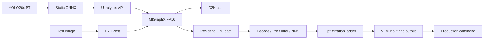

# YOLO26 + VLM Step-by-step Notebook 设计

> 目标文件：`ultralytics_yolo26x_step_by_step.ipynb`
>
> 定位：讲师引导的性能原理与优化过程
>
> 建议占用：60 分钟 Workshop 中的 22 分钟
>
> 状态：新版结构已实现并在 W7900D 上完整执行；本文是后续维护规范

## 1. 目标与边界

Step-by-step Notebook 回答一个问题：

> 一个熟悉的 YOLO26 PyTorch 模型，如何逐步变成 Radeon 上的 GPU-resident 视频 pipeline，时间又花在哪里？

它负责解释：

- `.pt -> ONNX` 的真实导出过程；
- Ultralytics 如何选择 ONNX Runtime MIGraphX EP；
- cold compile、warm inference 与高层 `predict()` 的区别；
- H2D、D2H 的方向、数据量与同步测量方法；
- GPU buffer residency、I/O Binding 与 pointer reuse；
- decode、preprocess、inference、NMS、overlay、encode 的边界；
- VLM 的输入、输出和 latency 为什么必须与 YOLO FPS 分开；
- 优化为什么必须同时通过正确性 gate。

它不负责开放式参数探索、联动策略设计或运行最终异步 ROI Demo。这些分别属于 Hands-on 和 End-to-end Notebook。

## 2. 三本 Notebook 的职责

| Notebook | 核心动作 | 参与方式 | 输出 |
|---|---|---|---|
| Step-by-step | 拆解并测量每个阶段 | 跟随讲师观察 | 性能事实与优化阶梯 |
| Hands-on | 选择参数并解释权衡 | 参与者决策 | A/B 结果与设计答卷 |
| End-to-end | 固定配置运行完整系统 | 一键执行与验收 | 检测 + 异步 ROI VLM 视频 |

Step-by-step 只展示 VLM 的输入和单次 latency，不在这里做并行压力实验。

## 3. 教学主线



教学顺序：

```text
建立可运行基线
-> 暴露数据搬运
-> 去掉重复搬运
-> 测量完整阶段
-> 总结优化策略
```

不要先给出“零拷贝”答案，再让参与者倒推问题。

## 4. Cell 设计

Notebook 共 22 个 cell，其中 10 个 code cell。编号按用户看到的顺序计算。

| Cell | 类型 | 内容 | 必须看到的结果 |
|---:|---|---|---|
| 1 | Markdown | 标题与学习路径 | `.pt -> ONNX -> MIGraphX -> transfer -> resident pipeline` |
| 2 | Markdown | 固定环境说明 | 模型与 runtime 来自已发布镜像 |
| 3 | Python | 环境、模型、provider gate | W7900D、ROCm、ORT provider、模型路径 |
| 4 | Markdown | 静态 ONNX 导出 | batch、shape、end-to-end 输出契约 |
| 5 | Python | 真实 `.pt -> ONNX` | 导出时间、SHA-256、输入输出 shape |
| 6 | Markdown | Ultralytics MIGraphX | cold 与 warm 测量边界 |
| 7 | Python | 高层 `YOLO.predict()` | provider、FP16、I/O Binding、first/P50/P95 |
| 8 | Markdown | H2D/D2H 概念 | 数据方向、同步与 payload 关系 |
| 9 | Python | 独立 transfer lab | pageable/pinned、H2D/D2H 表格 |
| 10 | Markdown | Resident buffers | 为什么复用比重复搬运重要 |
| 11 | Python | resident inference | GPU pointer、inference P50/P95、detections |
| 12 | Markdown | 正确性优先 | 为什么优化后必须做 parity |
| 13 | Python | parity gate | box count、class、minimum IoU |
| 14 | Markdown | 分阶段 benchmark | 测量范围与排除项 |
| 15 | Python | GPU stage benchmark | decode/preprocess/inference/NMS P50/P95 |
| 16 | Markdown | 优化阶梯 | 八个优化动作及作用边界 |
| 17 | Python | 速度账本 | 高层 predict、copy、resident、GPU path |
| 18 | Markdown | VLM 独立测量 | storyboard、HTTP、真实 latency |
| 19 | Python | VLM 输入/输出 | 三帧 storyboard、caption、latency |
| 20 | Markdown | 回到 production | 哪些优化进入正式 pipeline |
| 21 | Python | 生产命令与 manifest | `rocdecode`、`vaapi-direct`、历史实测 |
| 22 | Markdown | Copy audit | 明确仍存在的 host boundary |

## 5. 模型与路径契约

模型权威路径来自容器环境，不假设 Notebook 位于 `/workspace`：

```text
ULTRALYTICS_BAKED_MODEL_DIR=/opt/ultralytics-yolo26/models
ULTRALYTICS_YOLO26_MODEL_DIR=/opt/ultralytics-yolo26/models
```

Notebook 应优先保留外部配置：

```python
model_dir = Path(
    os.environ.get(
        "ULTRALYTICS_YOLO26_MODEL_DIR",
        os.environ.get("ULTRALYTICS_BAKED_MODEL_DIR", ROOT / "models"),
    )
)
```

不要无条件将 `ULTRALYTICS_YOLO26_MODEL_DIR` 覆盖为 `ROOT / "models"`。`/workspace/models` 只能作为镜像便利别名，不能作为 K8s 部署契约。

课堂导出写入：

```text
output/export/yolo26x.pt
output/export/yolo26x.onnx
output/export/ort-migraphx-cache/<identity>/
```

不得覆盖 `/opt/ultralytics-yolo26/models` 中的 immutable release 模型。

## 6. 导出与 MIGraphX 实验

### 6.1 默认行为

```text
RUN_EXPORT=1
USE_FRESH_EXPORT=1
```

参与者看到完整链路：

```text
真实 PT
-> 真实 ONNX
-> fresh model identity
-> fresh MIGraphX compile/cache
-> steady inference
```

### 6.2 课堂降级行为

时间不足时：

```text
RUN_EXPORT=0
USE_FRESH_EXPORT=0
```

复用 release ONNX 和 baked cache。输出必须标明 `fresh_export_selected=false`，不能把 cache hit 当作 cold compile。

### 6.3 必须分开的时间

| 指标 | 含义 |
|---|---|
| `export_seconds` | PyTorch checkpoint 转 ONNX |
| `construct_ms` | 创建 Ultralytics wrapper |
| `first_predict_ms` | session 初始化、MIGraphX 编译/cache load、首轮运行 |
| `steady_predict_p50/p95_ms` | 高层 API warm latency |
| `resident_inference_p50/p95_ms` | 仅 GPU input 到 GPU output |

不得用 `1000 / resident_inference_ms` 宣称完整视频 FPS。

## 7. H2D/D2H 实验规范

| Payload | 数据量约值 | 代表边界 |
|---|---:|---|
| 1080p RGB uint8 | 5.93 MiB | 完整视频帧 |
| `1x3x640x640` FP32 | 4.69 MiB | 模型输入 tensor |
| `1x300x6` FP32 | 0.007 MiB | 紧凑模型输出 |

每种 payload 测量：

```text
pageable H2D
pinned H2D
pageable D2H
pinned D2H
```

计时纪律：

- buffer 在计时区外预分配；
- 先 warmup；
- 每次 copy 前后 `torch.cuda.synchronize()`；
- 报告 P50/P95、有效 GB/s 和占 25 FPS 单帧 40 ms budget 的比例；
- 不把 asynchronous enqueue time 当作 copy completion time。

W7900D 已验证样例中，1080p 单向 copy P50 约为 `0.24-0.25 ms`。正确讲法不是“单次 copy 一定很慢”，而是：

> 重复完整帧往返会连带同步、CPU 处理、额外分配和后续上传；必须先测量，再决定删除、压缩或重叠。

## 8. 优化阶梯

| Level | 改动 | 消除或隐藏的成本 | 证明方式 |
|---:|---|---|---|
| 0 | 高层 `YOLO.predict()` | 无，作为正确性基线 | 可视结果 |
| 1 | Static ONNX | 动态 shape 与重复图转换 | shape/metadata |
| 2 | MIGraphX FP16 + cache | 通用执行与重复编译 | provider、cold/warm timing |
| 3 | Pinned host buffers | 不必要的 pageable staging | transfer A/B |
| 4 | rocDecode + DLPack | decode 后 full-frame H2D | GPU pointer |
| 5 | OpenCV HIP preprocess | GPU frame D2H + model input H2D | stable pointers |
| 6 | ORT I/O Binding | inference input/output round trip | GPU pointers |
| 7 | GPU filtering/NMS | 全部模型输出回传 | 仅 survivor metadata D2H |
| 8 | HIP overlay + direct VA-API | 完整帧 D2H 和 `hwupload` | frame accounting |

每升一级都重新检查 parity。优化对象是边界和数据流，不只是单个 kernel。

## 9. VLM 在本 Notebook 中的范围

Step-by-step 只展示：

- 输入是一张三个时序全景组成的 storyboard；
- 输出是一段 caption；
- 当前正式流程每 4 秒视频内容调用一次；
- VLM latency 单独记录，不计入 YOLO FPS。

默认复用 verified timeline。`RUN_VLM_LIVE=1` 时只重跑第一个 storyboard，不在这里做并行压力测试。

## 10. 已验证参考结果

以下结果来自 2026-09-09 W7900D 隔离容器执行，仅用于课堂参考，不是跨机器承诺：

| 指标 | 结果 |
|---|---:|
| `.pt -> ONNX` | 13.042 s |
| fresh first predict/compile | 47.760 s |
| high-level `predict()` P50 | 8.728 ms |
| resident inference P50 | 6.947 ms |
| 1080p pageable H2D P50 | 0.2536 ms |
| 1080p pageable D2H P50 | 0.2430 ms |
| GPU resident stage path | 10.070 ms / 99.3 FPS |
| minimum class-matched IoU | 0.9275 |
| verified first VLM segment | 0.487 s |

结果必须连同 GPU、ROCm、模型 hash、cache 状态和系统负载解释。

## 11. 课堂讲法

建议 22 分钟：

| 时间 | 内容 |
|---:|---|
| 0-3 min | 为什么从 PT 导出 ONNX |
| 3-7 min | cold compile 与 warm inference |
| 7-12 min | H2D/D2H 实验和同步陷阱 |
| 12-16 min | resident buffers、I/O Binding、pointer reuse |
| 16-19 min | stage benchmark 与 parity |
| 19-22 min | 优化阶梯和 VLM 边界 |

讲师强调：

1. **Measure the boundary you claim to optimize.**
2. **Pinned transfer is better; no repeated transfer is better still.**
3. **Faster is valid only after parity passes.**

## 12. 验收标准

- Notebook 是合法 nbformat JSON。
- 每个 cell 有 `metadata.language`，已有 cell 有稳定 `metadata.id`。
- 生成器与 Notebook source/metadata 完全一致。
- clean kernel 10/10 code cells 执行，0 error。
- 导出模型位于 `output/`，不修改 baked models。
- fresh ONNX 实际被 MIGraphX 加载，cache identity 包含其 SHA-256。
- transfer 测试显式同步并输出 P50/P95。
- parity、stable pointers 和 GPU provider 断言通过。
- End-to-end Notebook 与 pipeline/VLM 调度逻辑不因本 Notebook 改造而变化。

## 13. 向后续 Notebook 交接

交给 Hands-on 的知识：

```text
高层 API、resident inference、数据搬运、stage timing 的区别
```

交给 End-to-end 的产物：

```text
verified release model/cache
YOLO-only baseline metrics
VLM-only input/output 与 latency 认识
```
