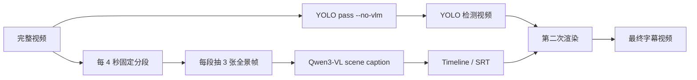
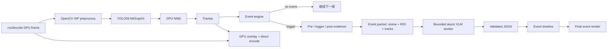
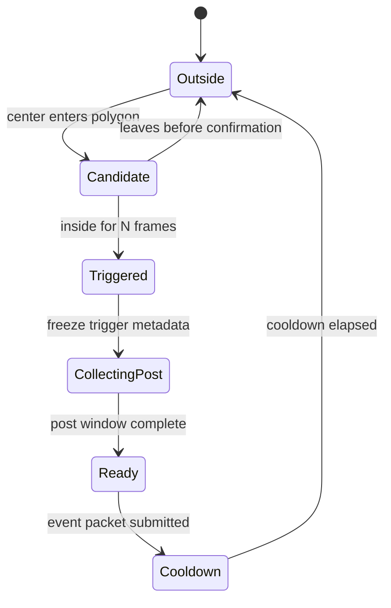

# YOLO26 + VLM 一小时 End-to-End Workshop Demo 设计

> 文档状态：新 Demo 的权威设计，尚未实施 tracking/event 代码与新镜像
>
> 制定日期：2026-09-08
>
> 时长：单场 60 分钟
>
> 目标项目：`ultralytics_yolo26`
>
> 本方案是当前一小时 Workshop 的课程安排。
>
> 架构前置：[YOLO26 + VLM 联合运行模式设计](YOLO26_VLM_联合运行模式设计.md)。本文选择具体视频与课堂叙事，联合运行的状态、契约和调度以该文档为准。

## 1. 重新定义这一个小时

这不是两场课的压缩版，也不是逐项介绍 ROCm、Ultralytics、OpenCV 和 llama.cpp。它是一条由浅入深、始终围绕同一段视频和同一个问题推进的 End-to-End Demo：

> 如何让 YOLO26 持续、快速地提供视觉事实，又让 VLM 只在真正值得理解的时刻介入，并且不拖住视频主循环？

完整故事只有四层：

```text
Level 0  单图 YOLO：这一帧里有什么、在哪里？
Level 1  视频 YOLO：如何持续运行，并证明速度与正确性？
Level 2  Tracking + Event：哪个对象在什么时候做了值得关注的动作？
Level 3  Event-driven VLM：围绕该事件，画面上下文说明了什么？
```

最终不是得到一句与检测无关的泛化字幕，而是得到一个可审计的事件结果：

```text
事件 ID + 触发规则 + Track IDs + 前/中/后证据
    + 全景/ROI + 结构化检测元数据 + VLM JSON
```

### 1.1 一个小时的完成标准

参与者离场时应能回答五个问题：

1. 为什么 `YOLO.predict()` 是正确性起点，却不是生产视频热循环的终点？
2. 74.7 FPS、25 FPS 输入和约 0.45 秒 VLM latency 分别代表什么，为什么不能直接相加？
3. Tracking 和 event rule 在 YOLO 与 VLM 中间解决了什么问题？
4. 为什么 VLM 需要全景、ROI 和结构化轨迹，而不是只看一个裁剪框？
5. VLM 超时或返回非法 JSON 时，为什么 YOLO 视频仍应继续运行？

### 1.2 授课形式

采用 instructor-led、live-demo-first 形式：

- 讲师控制一套经过验证的 GPU 环境。
- 参与者通过浏览器查看同一本 Notebook，可运行轻量观察单元。
- 现场只修改一个事件参数，不做开放式 live coding。
- 所有长步骤都可切换到 verified artifacts，保证一小时内完成闭环。
- 技术问题围绕当前画面解释，不临时展开安装、编译或环境排障。

### 1.3 明确不做的事情

60 分钟内不做以下内容：

- 现场安装 ROCm、构建镜像或下载模型。
- 现场导出 ONNX 或 cold compile MIGraphX。
- 逐行讲解 HIP/VA-API bridge、ORT I/O Binding 或 tracker 数学推导。
- 让 VLM 分析每一帧或为每个框生成自然语言。
- 把安全判断、身份判断、意图判断交给 VLM。
- 用多个视频、多个模型或多个业务故事分散注意力。

## 2. Demo 的唯一业务故事

### 2.1 视频与事件

继续使用已发布的 `data/sidewalk.mp4`：

- 1920 × 1080；
- 25 FPS；
- 393 帧；
- 15.72 秒；
- 画面包含行人、车辆和城市道路环境。

Demo 只实现一个清晰事件：

> **Pedestrian enters roadway zone**：一个稳定的 `person` track 从道路区域外进入预先配置的道路 polygon，并持续存在足够帧数。

选择这个事件的原因：

- 当前 COCO 类别能够识别 `person` 和附近车辆，不需要现场训练新模型。
- 事件可以由 track + polygon 确定性触发，不依赖 VLM 猜测。
- VLM 有明确增量价值：说明行人运动方向、附近可见道路使用者和场景上下文。
- 事件不要求 VLM 判断违法、危险、身份或主观意图。

道路 polygon、触发帧和 track ID 必须在实施阶段由真实运行标定。本文 JSON 中的数值仅用于解释数据契约，不是预先声称的实测事件结果。

### 2.2 责任边界

| 组件 | 回答的问题 | 不负责什么 |
|---|---|---|
| YOLO26 | 当前帧中有哪些对象，框和置信度是什么 | 对象是否是上一帧的同一个人 |
| Tracker | 跨帧是否为同一对象，轨迹如何变化 | 事件是否值得业务关注 |
| Event engine | 是否满足进入道路区域的确定性规则 | 自由描述复杂上下文 |
| Evidence composer | VLM 应看到哪些全景、ROI 和轨迹元数据 | 生成语义结论 |
| VLM | 可见上下文如何简洁表述，证据是否不足 | 改写检测事实或控制主循环 |
| Policy/application | 是否提醒、记录或交给人工 | 把未经校验的 VLM 文本当作事实 |

贯穿全场的一句话：

> YOLO 决定“看哪里、何时值得看”，VLM 负责“在受约束的证据里解释上下文”。

## 3. 从当前方案到目标方案

### 3.1 当前正式路径

当前 release 的正式路径是：



它稳定、可复现，但 YOLO boxes 没有控制 VLM：

- VLM 固定每四秒调用一次；
- 每次只看三张全景帧；
- 四段字幕内容相近；
- 不知道 track ID、轨迹、事件规则或关键 ROI；
- “YOLO + VLM”更多是输出合成，不是信息协作。

代码中还有一个可选 ROI 路径：有 detection 时在第一帧或每隔固定帧数提交 top-K ROI。它仍然是定时触发，缺少 tracking、event、pre/post buffer 和事件级去重，不能作为新 Demo 的主设计。

### 3.2 目标路径



目标架构的关键不是把 VLM 塞进每帧循环，而是：

1. **语义紧密耦合**：YOLO/track/event 决定 VLM 的时机、对象和证据。
2. **调度松耦合**：VLM 在有界异步 worker 中运行，不能阻塞 detector。
3. **稀疏昂贵路径**：每帧执行便宜、确定的视觉路径；只对少数事件执行昂贵语义路径。
4. **可失败设计**：VLM 失败只令事件语义状态变为 `timeout` 或 `invalid`，不丢视频帧和检测结果。

这是本 Workshop 最重要的系统设计 takeaway：**更紧密的协作不等于更同步的执行。**

## 4. 事件链路设计

### 4.1 Tracker 接入方式

不在 production loop 中调用高层 `YOLO.track()`。现有 pipeline 已经完成 GPU preprocess、MIGraphX inference 和 GPU NMS，再调用高层 track API 可能重复前后处理并破坏现有性能边界。

推荐新增一个薄 adapter：

```text
现有 detections: [x1, y1, x2, y2, confidence, class_id]
    -> ByteTrack adapter.update(...)
    -> tracks: [track_id, class_id, bbox, confidence, age, state]
```

项目 checkout 中包含 Ultralytics ByteTrack 源码，但 tracker 的实际运行依赖尚未在正式 release 容器中验证。宿主 Python 环境没有 `lap` 或 `filterpy` 不能代表镜像结论；实施第一步必须在 digest-pinned pipeline 镜像内完成 import + synthetic update gate。

### 4.2 事件规则

Canonical event 使用配置化规则，而不是写死在 Notebook：

```yaml
event_type: pedestrian_enters_roadway
class_names: [person]
zone: roadway_polygon
min_track_age_frames: 8
min_confidence_ema: 0.45
inside_confirm_frames: 3
per_track_once: true
scene_merge_window_seconds: 1.5
cooldown_seconds: 4.0
pre_seconds: 1.0
post_seconds: 1.2
```

状态机保持简单：



事件规则输出的是确定性事实，例如：

```text
Track 7 entered configured roadway zone at 6.40 s.
```

VLM 不负责重新决定 polygon crossing 是否发生。

### 4.3 双层 buffer

不要保存每一帧完整 RGB 图像到 host，也不要为了 pre-event evidence 每帧 D2H。

使用两层 buffer：

1. **Metadata ring**：保存每帧时间、track bbox、confidence、轨迹点和 event state，体积很小。
2. **Visual evidence ring**：以 2-4 FPS 保存缩小后的候选全景；触发后只保留 pre、trigger、post 三张关键帧。

对离线 Workshop 视频，可以记录 frame index 后从源视频精确重读三帧；对未来实时摄像头版本，使用固定深度的采样 ring。二者生成同一个 `EventPacket`，避免把课堂 Demo 写成只能处理文件的特例。

1920 × 1080 RGB 单帧约为 5.93 MiB。三张事件全景约 17.8 MiB，而 393 帧全部下载约 2.28 GiB。三张稀疏证据只相当于完整逐帧传输量的约 0.76%。这不是“整条链路零拷贝”，而是有边界、可计量的稀疏 copy。

### 4.4 Evidence storyboard

llama.cpp companion 当前接受单张图像，因此不需要为了多帧证据重建 companion。Pipeline 将证据组合成一张 2 × 2 storyboard：

```text
┌──────────────────────┬──────────────────────┐
│ PRE                   │ TRIGGER              │
│ t = event - 1.0 s     │ zone + boxes + IDs   │
├──────────────────────┼──────────────────────┤
│ POST                  │ FOCUS                │
│ t = event + 1.2 s     │ subject ROI + nearby │
└──────────────────────┴──────────────────────┘
```

设计要求：

- PRE/TRIGGER/POST 保留完整场景，不能只给 crop。
- TRIGGER 显示道路 polygon、track ID 和短轨迹，不显示 VLM 自己生成的文本。
- FOCUS 放触发 person ROI 与最近的相关 vehicle/cyclist ROI；找不到时明确显示 `none selected`。
- 每个 panel 标明相对时间，不使用真实姓名、身份或人脸识别。
- ROI 从已经选中的三张 host evidence frame 生成，不增加完整帧 D2H。

### 4.5 结构化 EventPacket

以下为契约示例，不是当前视频的已测结果：

```json
{
  "schema_version": 1,
  "event_id": "road-entry-0001",
  "event_type": "pedestrian_enters_roadway",
  "source": {
    "fps": 25.0,
    "trigger_frame": 160,
    "trigger_time_s": 6.4
  },
  "rule": {
    "zone_id": "roadway_polygon",
    "inside_confirm_frames": 3
  },
  "subject": {
    "track_id": 7,
    "class_name": "person",
    "confidence_ema": 0.91,
    "trajectory_normalized": [[0.42, 0.71], [0.45, 0.68], [0.48, 0.64]]
  },
  "nearby_tracks": [
    {
      "track_id": 12,
      "class_name": "car",
      "confidence_ema": 0.94,
      "relative_position": "right"
    }
  ],
  "evidence": {
    "storyboard": "events/road-entry-0001/storyboard.jpg",
    "sample_offsets_s": [-1.0, 0.0, 1.2]
  }
}
```

坐标使用归一化值；metadata 不包含姓名、身份、车牌 OCR 或无法由检测结果支持的关系。

### 4.6 VLM 输入与输出契约

System prompt：

```text
You summarize visual evidence for a detector-triggered event.
Use only the storyboard and supplied metadata.
Do not infer identity, intent, legality, or unseen motion.
Do not alter track IDs or the deterministic trigger fact.
Return JSON only and follow the schema exactly.
```

User question：

```text
Describe the visible context when the tracked pedestrian enters the configured
roadway zone. Mention motion direction and nearby visible road users when clear.
If evidence is insufficient, say so explicitly.
```

Response schema：

```json
{
  "event_id": "road-entry-0001",
  "evidence_support": "supported",
  "summary": "A pedestrian moves into the roadway while a car is visible to the right.",
  "visible_facts": [
    "The tracked person moves from the sidewalk side toward the roadway zone.",
    "A car is visible to the right of the person."
  ],
  "uncertainty": "Relative speed and collision risk cannot be determined from these frames."
}
```

允许的 `evidence_support` 为 `supported`、`uncertain`、`not_supported`。返回结果必须经过 JSON parse、schema、event ID 和枚举校验，原始响应单独保存以便审计。

## 5. 调度与失败隔离

### 5.1 Detector 永不等待 VLM

主线程只做：

```text
detect -> track -> evaluate event -> enqueue EventPacket -> continue
```

VLM worker：

- 同时最多 1 个 active request；
- pending queue 深度最多 2；
- 同一 track/event 在 cooldown 内去重；
- 相邻 1.5 秒内同类型触发可合并为一个 scene event；
- queue 满时记录 `skipped_backpressure`，不阻塞或丢弃视频帧；
- timeout 或非法 JSON 最多重试一次，然后写入明确状态。

当前 `AsyncVLMClient` 是“已有线程忙时直接跳过新请求”的 fire-and-forget 模式，新 Demo 必须改成有界队列和可观测状态，才能解释事件是否被处理、合并或因 backpressure 跳过。

### 5.2 保留 GPU direct encode

当前 `pipeline.py` 只有在 `--no-vlm` 时才允许 direct encode，因为旧 VLM 路径需要每帧 CPU frame。新 event 模式只在稀疏证据点取图，因此应拆分这两个条件：

```text
legacy per-frame/interval ROI VLM -> 不进入 direct path
new sparse event VLM            -> 保留 direct path，仅证据帧做显式 copy
```

这项改造必须通过 393/393 帧完整性和 copy audit，不能只看 FPS。

### 5.3 为什么最终渲染仍可做第二遍

紧密协作指的是 detector 产生事件和证据，不要求 VLM 文本必须在触发帧当场写进已经编码的视频。

推荐产物流程：

```text
Pass A: decode -> YOLO -> track -> event packets -> async VLM -> event timeline
Pass B: source/YOLO video + validated event timeline -> final event-aware video
```

这样既保留在线事件完成 latency，也能生成从事件前一刻开始显示字幕的完整成品。强行单遍回写过去的帧会增加缓存和同步复杂度，却没有教学价值。

### 5.4 课堂故障演示

在最后 2 分钟使用预置开关模拟 `VLM_TIMEOUT=1`：

- 视频仍为 393/393 帧；
- tracking/event JSON 仍存在；
- semantic status 变为 `timeout`；
- 最终画面显示 `Context unavailable`，而不是伪造结果；
- queue、timeout 和 fallback 计数进入 speed ledger/manifest。

## 6. 速度账本：Workshop 必须讲清的数字

### 6.1 当前已验证事实

以下数字来自当前发布产物，不是新 event pipeline 的结果。

#### 正式 YOLO workflow

| 指标 | 已测结果 |
|---|---:|
| 输入 | 393 帧，15.72 秒，25 FPS |
| 处理时间 | 5.26 秒 |
| 端到端 throughput | 74.7 FPS |
| 相对输入实时倍数 | 2.99× |
| GPU preprocess | 0.59 ms/frame |
| detection | 10.44 ms/frame |
| full-frame D2H | 0.00 ms/frame |
| direct encode feed | 0.15 ms/frame |
| async overlay + encode worker | 7.85 ms/frame |
| 队列完整性 | submitted 393，encoded 393 |

`7.85 ms worker` 与主线程异步，不能把表中所有毫秒简单相加后声称那就是 74.7 FPS 的倒数。这正是课堂要解释的 latency、throughput 和 overlap 区别。

这次 74.7 FPS 运行的 host load average 为 218.12。数字必须连同环境和测量边界展示，不能描述成所有机器上的固定性能。

#### 独立 GPU stage benchmark

另一次 120 帧 stage benchmark 测得：

| 阶段 | Mean |
|---|---:|
| decode | 2.656 ms |
| preprocess | 0.317 ms |
| inference | 14.214 ms |
| GPU NMS | 2.606 ms |
| 合计 GPU path | 19.793 ms / 50.5 FPS |

它和 74.7 FPS 来自不同运行、不同测量边界和系统负载，只能分别解释，不能选择更好看的数字混为同一次结果。

#### 当前四段 scene VLM

| 指标 | 已测结果 |
|---|---:|
| 调用次数 | 4 |
| 单次 latency 范围 | 0.429-0.487 秒 |
| 单次平均 latency | 0.446 秒 |
| VLM 总推理时间 | 约 1.786 秒 |

以这个平均值做量级说明：25 FPS 下若每帧调用一次，需要约 11.15 秒 VLM 计算才能消费 1 秒视频，单 worker 必然积压。这个估算只是解释为什么不能 per-frame VLM，不是新 storyboard 的性能承诺。

### 6.2 新 Demo 必须新增的指标

```json
{
  "vision": {
    "frames": 393,
    "fps": 0.0,
    "real_time_factor": 0.0,
    "track_event_mean_ms": 0.0,
    "track_event_p95_ms": 0.0
  },
  "events": {
    "triggered": 0,
    "merged": 0,
    "submitted_to_vlm": 0,
    "duplicate_suppressed": 0
  },
  "vlm": {
    "latency_p50_ms": 0.0,
    "latency_p95_ms": 0.0,
    "busy_ratio": 0.0,
    "queue_max_depth": 0,
    "skipped_backpressure": 0,
    "invalid_responses": 0
  },
  "event_latency": {
    "trigger_to_packet_ready_ms": 0.0,
    "packet_ready_to_vlm_result_ms": 0.0,
    "trigger_to_result_ms": 0.0
  }
}
```

### 6.3 新 Demo 性能门

以下是待实测的验收目标，不得提前写成结果：

| Gate | 最低要求 | 目标 |
|---|---:|---:|
| Tracking/event 开启、VLM 关闭 | >= 同次 YOLO-only FPS 的 95% | >= 70 FPS，以现有 74.7 为参考 |
| 同卡 event VLM 开启 | >= 25 FPS，393/393 帧完整 | >= 30 FPS |
| Track + event 开销 | P95 <= 2.0 ms/frame | P95 <= 1.0 ms/frame |
| VLM queue | canonical clip 无 backpressure skip | 最大深度 <= 1 |
| Event JSON | 100% schema valid | 一次生成成功，无 retry |
| Post window 完成后到 VLM 结果 | P95 <= 1.2 秒 | <= 0.8 秒 |
| 触发到完整语义结果 | P95 <= 2.5 秒 | <= 2.0 秒 |

必须做三种 A/B 模式：

1. `YOLO_ONLY`：现有主路径。
2. `YOLO_TRACK_EVENT`：VLM 关闭，隔离 tracking/event 开销。
3. `YOLO_TRACK_EVENT_VLM`：同一 GPU 上异步运行 VLM，测真实 contention。

三种模式使用同一视频、模型、阈值和 GPU，并随机化连续运行顺序。报告每次原始结果，不只报告最好的一次。

### 6.4 课堂上的速度图只保留四个答案

1. **帧路径有多快？** `vision FPS` 与 25 FPS 输入比较。
2. **事件逻辑有多贵？** `track_event P95 ms/frame`。
3. **VLM 被叫了几次？** `requests / 393 frames`，而不是只报 latency。
4. **事件多久得到语义？** `trigger -> post window -> result` 分段 latency。

## 7. 60 分钟 Run of Show

| 时间 | 层级与动作 | 屏幕上必须出现 | Takeaway |
|---:|---|---|---|
| 0-4 min | **Hook**：先播放最终 event-aware 视频，再展示 event packet | 同一事件的 box、track、storyboard 和 VLM summary | 最终产物不是泛化字幕，而是一条可追溯事件 |
| 4-10 min | **Level 0**：一张帧运行 `YOLO.predict()` | boxes、class、confidence | 先建立“模型看对”的 reference，再谈优化 |
| 10-18 min | **Level 1**：运行或复用 393 帧 production YOLO | 74.7 FPS baseline、393/393、provider、copy boundary | 吞吐量、单帧 latency 和输入 FPS 是三个不同概念 |
| 18-26 min | **Level 2A**：把逐帧 boxes 变成 track | 同一人的稳定 ID、短轨迹、age | Box 是瞬时事实；track 才能描述时间连续性 |
| 26-33 min | **Level 2B**：道路 polygon 触发事件 | trigger frame、pre/post 时间窗、去重状态 | 规则决定何时值得调用昂贵模型 |
| 33-40 min | **Level 3A**：组装 evidence | 2 × 2 storyboard + EventPacket JSON | 全景防止失去上下文，ROI 提供细节，metadata 提供精确事实 |
| 40-47 min | **Level 3B**：提交 VLM 并校验 JSON | constrained response、raw response、schema status | VLM 是受约束的 evidence summarizer，不是真相来源 |
| 47-53 min | **End-to-End**：播放最终结果并沿 event ID 反查证据 | final video、timeline、event directory | 紧密协作来自数据契约，不来自把所有模型串成同步调用 |
| 53-57 min | **Speed ledger**：比较三种模式 | YOLO-only / +event / +VLM A/B 表 | 优化高频路径，测量稀疏路径，给队列设上限 |
| 57-59 min | **Failure switch**：模拟 VLM timeout | 视频继续、event 保留、semantic status timeout | 辅助模型故障不能拖垮确定性主路径 |
| 59-60 min | **Five takeaways** | 一页总结 | 带走可复用的设计原则 |

### 7.1 课堂节奏规则

- 讲师连续解释不超过 6 分钟，随后必须出现运行结果、可视证据或一个判断题。
- 所有耗时单元提供 `RUN_LIVE`/`REUSE_VERIFIED`，默认可在 10 秒内回到已验证结果。
- 不让参与者现场输入长 prompt；prompt 和 schema 固定，课堂只修改一个 event 参数。
- 唯一互动参数是 `inside_confirm_frames` 或 `cooldown_seconds`，先预测，再运行，再解释事件数变化。
- 问答集中在最后或单元运行期间，不打断主线去排查个人环境。

### 7.2 三个现场判断题

1. 输入是 25 FPS，pipeline 是 74.7 FPS，画面会播放快三倍吗？
   - 答案：不会；74.7 是处理吞吐能力，输出时间戳仍保持 25 FPS。
2. VLM 平均 0.446 秒，是否意味着最终系统只能运行 2.24 FPS？
   - 答案：不会；事件 VLM 是稀疏异步支路，detector 不等待它。
3. 只把 person ROI 发给 VLM 是否更高效？
   - 答案：像素更少，但会丢失道路、车辆和运动上下文；应使用有限全景 + ROI + metadata。

## 8. 专用 Demo Notebook 设计

新增独立 Notebook：

```text
ultralytics_yolo26x_event_vlm_end_to_end.ipynb
```

不要继续向当前 step-by-step Notebook 塞入 tracking/event 内容。新 Notebook 只服务这一小时，共 9 个可执行 code cell：

| Cell | 内容 | 默认耗时 | 主要输出 |
|---:|---|---:|---|
| 1 | 环境、release、模型、VLM health gate | < 5 s | 一页 PASS/FAIL 表 |
| 2 | 读取并显示最终 Demo preview | < 2 s | 最终视频 |
| 3 | 单帧 `YOLO.predict()` reference | < 3 s | baseline image/result |
| 4 | 运行或读取 YOLO-only baseline | live 约 6 s | speed ledger baseline |
| 5 | 在缓存 detections 上运行 tracker | < 2 s | track table + trajectory frame |
| 6 | 运行 event rule 和 pre/post selection | < 2 s | event timeline |
| 7 | 生成 storyboard 与 EventPacket | < 2 s | storyboard + JSON |
| 8 | 调用 VLM、校验 schema 或复用结果 | 约 1 s | validated response |
| 9 | A/B speed ledger、final video、failure state | < 3 s | 对比表与 takeaway |

Notebook 设计约束：

- 由 `scripts/build_notebooks.py` 生成，不能只手改 `.ipynb`。
- Notebook 必须是有效 JSON；所有 cell 都有正确的 `metadata.language`。
- 已有 cell 保留稳定 `metadata.id`；新增 cell 在生成后获得稳定 ID。
- 保存一份完整执行输出，clean kernel 必须 9/9 code cells、0 error。
- Cell 5-8 可以读取 Pass A 保存的 detection/event cache，以便讲师逐层展示，不必重复解码视频。
- 每个 cell 只展示教学所需的 5-12 行高信号结果；完整日志写文件并提供链接。

## 9. 产物设计

```text
output/event_demo/
├── 01_yolo_only.mp4
├── 01_yolo_only_metrics.json
├── 02_yolo_tracks.mp4
├── 02_tracks.jsonl
├── 03_events.jsonl
├── events/
│   └── road-entry-0001/
│       ├── packet.json
│       ├── storyboard.jpg
│       ├── vlm_raw.txt
│       └── vlm_response.json
├── 04_event_vlm_timeline.json
├── 05_event_vlm_final.mp4
├── speed_ledger.json
└── manifest.json
```

最终画面只显示高价值信息：

- 普通时段：boxes、track IDs、FPS。
- 事件 pending：事件 ID 与 `collecting evidence`。
- 事件完成：一句 VLM summary、semantic status、event latency。
- VLM 失败：`Context unavailable`，不隐藏 deterministic event。

不要把完整 JSON、长 prompt 或每个 ROI 的描述叠在视频上。

## 10. 代码改造面

### 10.1 新增模块

```text
src/tracking.py
    ByteTrack adapter；输入现有 detections，输出稳定 Track 数据类

src/event_engine.py
    polygon crossing 状态机、scene merge、cooldown 和事件 ID

src/event_buffer.py
    metadata ring、稀疏 visual evidence、pre/trigger/post 选择

src/event_vlm.py
    EventPacket、storyboard、prompt、JSON schema 与 response validation
```

### 10.2 修改模块

```text
src/pipeline.py
    detect 后接 track/event；保持 direct encode；只在事件证据点做稀疏 copy

src/vlm_client.py
    增加 submit_event(packet)、bounded queue、状态与真实 request metrics

scripts/pipeline_workflow.py
    新增 event workflow、A/B modes、artifact/manifest 编排

scripts/build_notebooks.py
    生成专用 event VLM Notebook
```

### 10.3 不采用的实现

- 不在 Notebook cell 中维护正式 tracker/event 状态机。
- 不把 `frame_count % interval` 政名为 event trigger。
- 不为每个 detection 单独调用一次 VLM。
- 不让 VLM 自己从整段视频寻找事件。
- 不让无界线程或无界 queue 累积请求。
- 不因为 VLM 需要 JPEG 就让每一帧回到 host。

## 11. 测试与验收

### 11.1 单元测试

```text
tests/test_tracking.py
    连续 boxes 保持 ID；短遮挡恢复；类别不串线

tests/test_event_engine.py
    outside -> candidate -> triggered；去重、merge、cooldown

tests/test_event_buffer.py
    clip 开头/结尾边界；pre/trigger/post frame index 正确

tests/test_event_vlm.py
    packet schema；storyboard；合法/非法/timeout response
```

### 11.2 集成 gate

Canonical 393 帧视频必须满足：

- 393 帧 submitted、encoded、packet、sample、decoded 全部一致。
- YOLO parity gate 保持通过。
- event 数和 trigger frame 在锁定容差内；实施后将期望值写入 fixture。
- 每个 event 只有一个 event ID 和一个最终 semantic status。
- storyboard 可读，四个 panel 非空，track ID 与 packet 一致。
- VLM raw response、validated JSON 和 final render 可相互追溯。
- 三种 A/B 模式都有独立 metrics，不复用上一次数字冒充本次结果。
- timeout/invalid JSON 测试不影响视频完整性。

### 11.3 Notebook gate

- 生成器与 Notebook source parity 通过。
- clean kernel 9/9 code cells 执行，0 error。
- `RUN_LIVE=0` 可以完全使用 verified artifacts 讲完整场。
- `RUN_LIVE=1` 在课堂目标 GPU 上能从头生成所有产物。
- Notebook 中标明哪些数字是 current release baseline，哪些是新 event run。

## 12. 实施顺序与发布边界

### M0：可行性门

1. 在当前 digest-pinned pipeline 镜像内验证 ByteTrack 及依赖。
2. 用保存的 detection sequence 做 tracker update，不先改主循环。
3. 在 `sidewalk.mp4` 上锁定 roadway polygon 和 canonical event。

若 tracker import 需要新增依赖，将依赖固定到 pipeline 镜像；不能在课堂 Notebook 临时 `pip install`。

### M1：事件事实层

1. 实现 `tracking.py`、`event_engine.py`、`event_buffer.py`。
2. 先以 `VLM=off` 运行 393 帧，验证事件和 tracking 性能门。
3. 产出 tracks/events JSON 与 storyboard。

### M2：受约束 VLM

1. 实现 EventPacket 和 response schema。
2. 扩展现有 llama.cpp client，不改变模型和 API。
3. 加入 bounded queue、timeout、invalid response 和 metrics。

### M3：最终渲染与 Notebook

1. 生成 event timeline 和 final video。
2. 加入三模式 speed ledger。
3. 在 Notebook 中按 Level 0-3 逐层揭示，而不是一次打印全部结果。

### M4：正式发布

1. 跑单元、393 帧集成、A/B 性能和 Notebook clean-kernel gate。
2. 重建 **pipeline 镜像**，更新 release lock 和 manifest。
3. 继续复用现有 Qwen3-VL Q8_0 llama.cpp companion；模型、API 和 runtime 不变时无需重建 companion。
4. T-7 天冻结镜像与 Notebook，之后只修阻断问题。

正式 Workshop 不能只挂载宿主源码或现场复制文件到容器。开发阶段可以用 bind mount 快速验证，但交付必须使用新的 immutable pipeline image。

## 13. 讲师讲法

### 13.1 开场

不要从软件版本开始。先播放最终结果，然后说：

> 这 15 秒里，YOLO 看了 393 帧，但 VLM 不需要回答 393 次。今天我们要找出那一次真正值得问的问题。

### 13.2 讲速度

不要问“哪个 FPS 最大”，而要依次问：

1. 输入要求每秒处理多少帧？
2. 主路径最多每秒能处理多少帧？
3. 哪些阶段可以 overlap？
4. 每秒产生多少 VLM 请求？
5. 队列满时系统牺牲什么、不牺牲什么？

### 13.3 讲 VLM 价值

展示三种输入并让大家预测输出质量：

1. 只有 person crop：细节足，但道路上下文丢失。
2. 只有 full scene：上下文足，但目标不明确。
3. Full scene + ROI + track/event metadata：上下文、焦点和事实同时存在。

只实际运行第三种；前两种使用预生成对照，节省课堂时间。

### 13.4 结束

最后一分钟只保留五条：

1. **Correctness before optimization**：先有 `predict()` 和 parity reference。
2. **Track before reason**：没有时间连续性，就没有可靠事件。
3. **Trigger, do not poll**：让事件触发 VLM，不要按帧轮询 VLM。
4. **Context + focus + facts**：全景、ROI、结构化 metadata 缺一不可。
5. **Measure and isolate**：分别测 frame path、event path、VLM path；VLM 失败不拖垮视频。

## 14. 活动前检查

### T-7 天

- 冻结 canonical event、expected trigger 和所有阈值。
- 完成三次 A/B 性能运行并保存原始 JSON。
- 在目标 GPU 上完成一次 `RUN_LIVE=1` clean run。
- 决定哪些 cell 现场运行，哪些默认复用。

### T-1 天

- release lock、pipeline image 和 companion image identity 全部通过。
- Qwen health、models 和真实 event completion 通过。
- 两个 final video、storyboard、event JSON、speed ledger 离线可用。
- timeout fallback 已预生成并可一键展示。
- 清空 Notebook 临时状态后再次 9/9 执行。

### T-30 分钟

- 打开 Notebook、最终视频和 speed ledger。
- 运行 Cell 1 环境 gate。
- 预热 YOLO 和 Qwen，但不覆盖正式 A/B 结果。
- 保留一个只读 verified artifact 目录，防止现场误删。

## 15. 最终判断

这个 Workshop 的技术中心不再是“YOLO 后面再接一个 VLM”，而是一个明确的协作协议：

```text
YOLO 提供高频视觉事实
  -> Tracker 建立对象连续性
  -> Event engine 稀疏选择有意义时刻
  -> Evidence packet 保留上下文与精确事实
  -> VLM 生成受约束、可验证的语义补充
```

一小时内，参与者既能看到完整成品，也能逐层理解为什么这样设计、速度花在哪里、失败时系统如何继续工作。这比展示四段独立 scene caption 更能体现 YOLO26 + VLM 的真正 End-to-End 价值。

## 16. 相关材料

- [当前 Step-by-step Notebook](../ultralytics_yolo26x_step_by_step.ipynb)
- [当前 End-to-end Notebook](../ultralytics_yolo26x_end_to_end.ipynb)
- [Workshop 技术改造计划](ultralytics_yolo26_workshop_改造计划.md)
- [发布与 CI 就绪修正计划](release_readiness_remediation_plan_CN.md)
