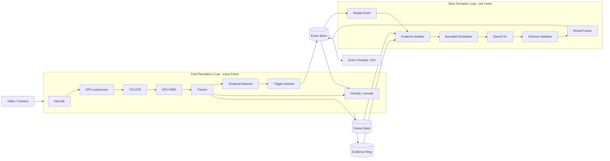
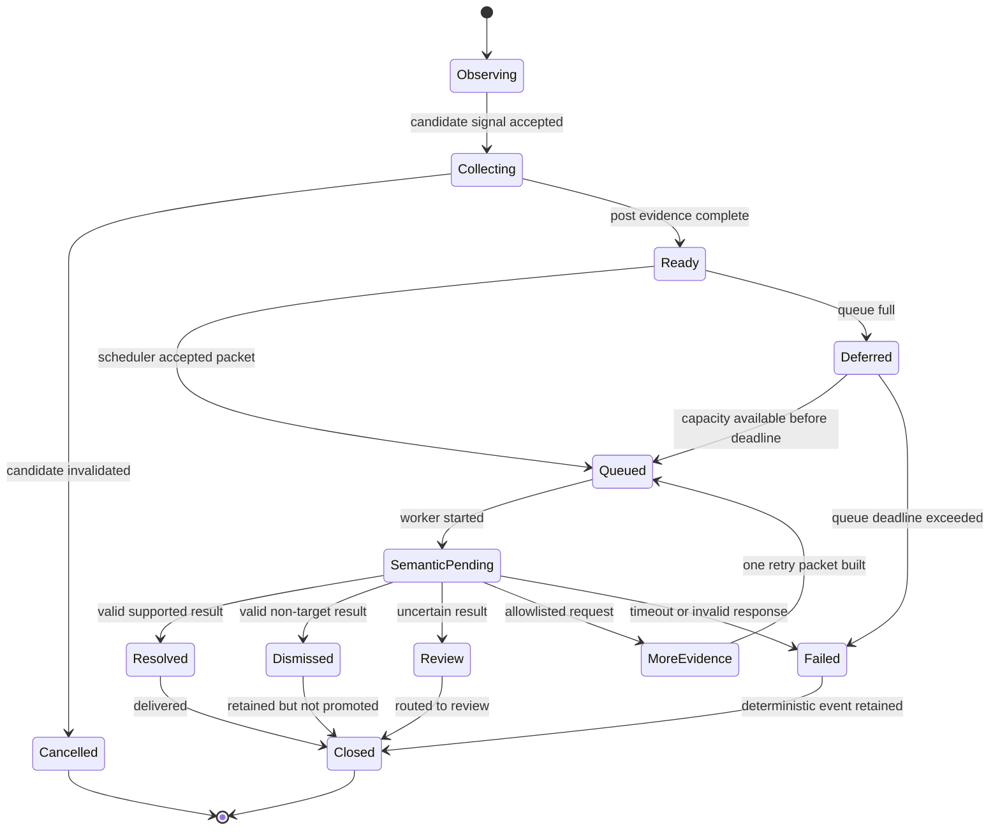
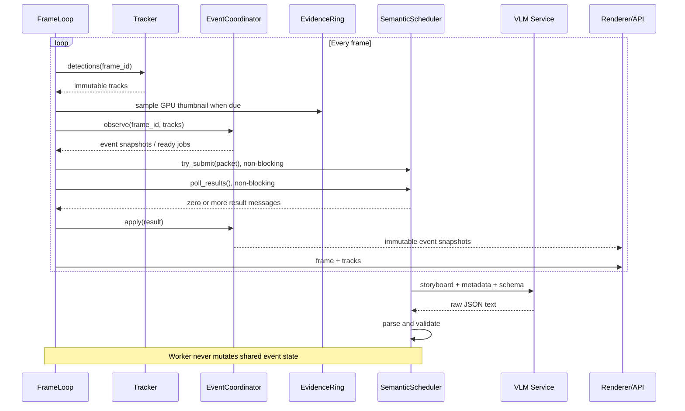

# YOLO26 + VLM 联合运行模式设计

> 文档定位：场景无关的运行时架构与数据契约
>
> 制定日期：2026-09-09
>
> 状态：设计冻结前草案，尚未实施
>
> 适用范围：预录视频 Workshop、实时摄像头和后续业务事件策略

## 1. 什么叫联合运行

YOLO 和 VLM 在同一个脚本、同一张 GPU 或同一段视频上运行，并不自动构成联合运行。

联合运行至少同时满足四个条件：

1. **共享场景状态**：VLM 读取 YOLO/Tracker 建立的同一对象、轨迹和事件上下文。
2. **联合调度**：YOLO 的时序结果决定是否调用 VLM、何时调用以及提交哪些证据。
3. **结果回写**：VLM 返回结果绑定原始 `event_id`，进入同一事件生命周期，而不是成为独立字幕。
4. **失败隔离**：VLM 慢、超时或输出非法内容时，YOLO 检测、跟踪和视频输出仍继续运行。

本项目的联合模式定义为：

> **单次视频输入、快慢双循环、共享事件状态、受控语义反馈。**

英文传播语句：

> **Detect continuously. Reason selectively. Share state, not frame-rate.**

## 2. 四个集成等级

| 等级 | 数据关系 | 运行关系 | 是否属于本设计的联合模式 |
|---|---|---|---|
| L0 独立输出 | YOLO 视频与 VLM 字幕最后合成 | 两条独立 pipeline | 否，当前正式 workflow 属于此级别 |
| L1 触发耦合 | 检测存在或固定间隔时调用 VLM | VLM 只收到临时图片 | 否，只是 trigger integration |
| L2 证据耦合 | YOLO/Tracker 选择对象、时间窗、ROI 和全景 | VLM 返回结构化结果 | 部分联合 |
| L3 状态耦合 | VLM 结果按 `event_id` 回写事件状态 | 应用消费统一事件记录 | **本项目最低目标** |
| L4 受控反馈 | VLM 可从白名单中请求一次额外证据 | 调度器决定是否执行 | 可选增强，不作为第一版阻断项 |

当前正式 Demo 是 L0；`pipeline.py` 中固定帧间隔的 ROI 请求接近 L1。新 Workshop 应实现 L3，L4 只在稳定性和时间允许时展示。

## 3. 核心架构：单输入、双循环、一个事件账本



### 3.1 快循环

快循环处理每一帧：

```text
decode
  -> preprocess
  -> YOLO
  -> NMS
  -> tracking
  -> temporal features
  -> event policy
  -> overlay / encode
```

硬约束：

- 快循环不得等待 HTTP、VLM、JSON parse 或字幕渲染。
- 快循环不得因 VLM 需要图片而下载每一张完整帧。
- Tracker 和 event policy 必须有独立耗时指标。
- 每帧最多进行一次非阻塞 `poll_results()` 和有限次 `try_submit()`。
- VLM 输出不能直接修改 YOLO confidence、NMS 或 Track ID。

### 3.2 慢循环

慢循环只处理已经形成的事件：

```text
event ready
  -> freeze immutable event snapshot
  -> choose evidence
  -> build one storyboard
  -> enqueue semantic job
  -> call VLM
  -> validate JSON
  -> return semantic result
```

慢循环可以比一帧慢很多，但必须满足：

- 请求数量受事件数量约束，而不是受帧数约束。
- 队列有界且每个请求状态可查询。
- 结果总能追溯到唯一 `event_id` 和 evidence hash。
- 程序结束前执行有 deadline 的 drain；未完成任务写成明确状态。

### 3.3 一个事件账本

YOLO、规则和 VLM 不分别维护三个答案。系统只维护一个 `EventRecord`：

```text
deterministic section   YOLO / Tracker / Rule 写入，写后不可被 VLM 改写
evidence section        Evidence Builder 写入，提交后冻结
semantic section        VLM Validator 写入，可为 resolved/uncertain/failed
delivery section        Renderer/API 写入，记录是否展示或交给人工
```

联合运行的本质不是模型之间互相调用，而是它们围绕同一条事件记录分工协作。

## 4. 三类数据流必须分开

### 4.1 Frame Data Plane

高带宽图像数据：

```text
decoded GPU frame -> YOLO path -> encoder
                       |
                       +-> sampled GPU evidence ring
```

原则：

- 完整帧留在 GPU 主路径。
- Evidence ring 使用预分配、缩小后的 GPU frame，例如 960 × 540 RGB。
- 只在事件选中 PRE/TRIGGER/POST 后，将有限证据下载到 host 并编码为 storyboard。
- llama.cpp 当前通过 HTTP/JPEG 接收图像，这个事件级 host boundary 是允许且必须计量的。

### 4.2 Metadata Plane

低带宽结构化数据：

```text
detections -> tracks -> temporal features -> candidate event -> event record
```

它包含：

- `frame_id`、视频时间和 monotonic 时间；
- bbox、class、confidence；
- Track ID、age、轨迹和区域关系；
- 触发原因、状态迁移和去重 key；
- 队列、VLM 和交付状态。

Metadata Plane 不等待图像编码或 VLM。

### 4.3 Control Plane

调度命令与反馈：

```text
SUBMIT(event_id)
CANCEL(event_id)
COALESCE(old_id, new_observation)
RESULT(event_id, semantic_result)
REQUEST_EVIDENCE(event_id, allowlisted_action)
TIMEOUT(event_id)
```

Control Plane 必须小、显式、可记录。不能让后台线程直接修改 tracker 或共享可变 frame。

## 5. 运行时组件和所有权

| 组件 | 所有数据 | 接收 | 产生 |
|---|---|---|---|
| `FrameLoop` | 当前 frame 与 GPU buffers | 视频输入 | detections、编码帧 |
| `TrackerAdapter` | tracker 内部状态 | detections | immutable tracks |
| `SceneState` | 最近轨迹与 temporal features | tracks | frame snapshot |
| `TriggerPolicy` | 场景配置 | scene snapshot | candidate signals |
| `EventCoordinator` | 唯一可变 EventRecord | signals、semantic result | lifecycle transitions |
| `EvidenceRing` | 固定深度 GPU thumbnails | sampled frames | evidence handles |
| `EvidenceBuilder` | 无长期可变状态 | frozen event + handles | immutable packet/storyboard |
| `SemanticScheduler` | queue、in-flight、retry budget | semantic job | result messages |
| `VLMClient` | HTTP transport only | prompt + image | raw response |
| `ResultValidator` | schema | raw response | typed semantic result |
| `Renderer/API` | presentation state | EventRecord snapshots | video、timeline、API |

关键所有权规则：

1. `EventCoordinator` 是唯一可以改变事件状态的组件。
2. VLM worker 只向 result queue 写消息，不直接修改 `EventRecord`。
3. FrameLoop 在帧边界非阻塞地消费 result queue，再由 coordinator 应用结果。
4. EvidencePacket 提交后不可变，避免 ring buffer 覆盖或 tracker 更新导致请求内容变化。
5. 渲染器只读取 event snapshot，不反向控制检测。

## 6. 五个核心契约

### 6.1 `FrameObservation`

每帧产生，不发给 VLM：

```json
{
  "frame_id": 160,
  "video_time_s": 6.4,
  "tracks": [
    {
      "track_id": 7,
      "class_name": "person",
      "bbox_xyxy": [820, 310, 1030, 940],
      "confidence": 0.91,
      "age_frames": 42
    }
  ]
}
```

### 6.2 `CandidateSignal`

Policy 只报告“值得观察”，不宣称最终语义：

```json
{
  "policy": "seat_interaction",
  "event_key": "seat_interaction:track-7:seat-A",
  "subject_track_id": 7,
  "trigger_frame": 160,
  "reason": "subject_entered_interaction_zone",
  "requested_semantics": "classify_visible_seat_interaction"
}
```

### 6.3 `EventRecord`

系统的权威状态：

```json
{
  "event_id": "seat-interaction-0002",
  "event_key": "seat_interaction:track-7:seat-A",
  "lifecycle": "semantic_pending",
  "deterministic": {
    "subject_track_id": 7,
    "trigger_frame": 160,
    "trigger_reason": "subject_entered_interaction_zone",
    "dwell_s": 1.6
  },
  "evidence": {
    "packet_id": "packet-0002-r0",
    "status": "submitted",
    "sha256": "..."
  },
  "semantic": {
    "status": "pending",
    "label": null
  },
  "delivery": {
    "status": "not_published"
  }
}
```

### 6.4 `EvidencePacket`

唯一发送给 VLM 的联合输入：

```json
{
  "packet_id": "packet-0002-r0",
  "event_id": "seat-interaction-0002",
  "question_type": "seat_interaction",
  "storyboard_path": "events/seat-interaction-0002/storyboard-r0.jpg",
  "samples": [
    {"role": "before", "offset_s": -1.0},
    {"role": "entry", "offset_s": 0.0},
    {"role": "after", "offset_s": 1.5}
  ],
  "facts": {
    "subject_track_id": 7,
    "zone_entered": true,
    "dwell_s": 1.6,
    "trajectory_trend": "approach_then_stable"
  },
  "allowed_labels": ["passed_by", "stood_near", "sat_down", "uncertain"],
  "retry_index": 0
}
```

`facts` 中不能提前出现希望 VLM 判断的答案，例如 `is_sitting: true`。

### 6.5 `SemanticResult`

```json
{
  "packet_id": "packet-0002-r0",
  "event_id": "seat-interaction-0002",
  "status": "resolved",
  "label": "sat_down",
  "evidence_support": "supported",
  "summary": "The tracked person approaches the chair and is seated in the final view.",
  "visible_facts": [
    "The person approaches the chair.",
    "The person is seated in the after panel."
  ],
  "uncertainty": "",
  "next_evidence": "none"
}
```

Validator 必须检查：

- JSON 可解析；
- schema version 与字段完整；
- `packet_id`、`event_id` 完全匹配；
- label 属于该任务的 allowlist；
- `next_evidence` 属于控制白名单；
- 文本长度和数组长度受限。

## 7. 统一事件生命周期

场景策略可以不同，但运行时生命周期必须统一：



需要区分两套概念：

- `Observing/Collecting/Ready/...` 是事件运行状态。
- `sat_down/passed_by/...` 是某个策略的语义 label。

不能用场景 label 代替系统状态，也不能让 VLM 返回的 label 改写确定性 trigger fact。

## 8. 一帧到一个结果的完整时序



FrameLoop 伪代码：

```python
while frame := reader.next():
    for result in semantic_scheduler.poll_results():
        event_coordinator.apply_semantic_result(result)

    detections = detector.infer(frame)
    tracks = tracker.update(detections)
    scene = scene_state.update(frame.id, tracks)
    evidence_ring.sample_if_due(frame, scene)

    event_coordinator.observe(scene)
    for event in event_coordinator.take_ready_events(limit=2):
        packet = evidence_builder.build(event, evidence_ring)
        accepted = semantic_scheduler.try_submit(packet)
        event_coordinator.record_submission(event.id, accepted)

    renderer.write(frame, tracks, event_coordinator.snapshot())

for result in semantic_scheduler.drain(deadline_s=5.0):
    event_coordinator.apply_semantic_result(result)
event_coordinator.close_unfinished_events()
```

## 9. 调度策略

### 9.1 队列参数

第一版固定为：

```yaml
max_in_flight: 1
max_pending: 2
max_retry_per_event: 1
queue_deadline_seconds: 3.0
request_timeout_seconds: 3.0
coalesce_window_seconds: 1.5
```

队列满时不能静默丢弃：

1. 相同 `event_key` 优先合并更新；还未提交的 evidence window 可延长。
2. 不同事件进入 `Deferred`，直到 queue deadline。
3. 超过 deadline 后标记 `skipped_backpressure`，保留确定性事件记录。
4. 不阻塞 FrameLoop，不删除视频帧，不伪装成成功。

### 9.2 结束处理

预录视频可能在 VLM 返回前已经处理完成，因此 EOF 不是立即退出：

```text
stop accepting new candidates
-> finish already collecting post windows
-> drain semantic queue with deadline
-> mark remaining work timeout
-> write timeline and manifest
```

没有 drain 的 fire-and-forget client 不适合正式联合模式。

## 10. 两种时钟模式

### 10.1 `throughput` 模式

用途：性能测试和生成产物。

- 视频按系统最大速度处理，例如当前 YOLO-only 约 74.7 FPS。
- VLM 与后续帧并发运行。
- 视频可能先结束，随后 drain VLM。
- 最终语义字幕通过第二遍 render 写回正确事件时间窗。

回答的问题：系统最多能处理多少视频工作量。

### 10.2 `realtime` 模式

用途：课堂现场展示和未来摄像头。

- 按源视频 25 FPS pacing，或摄像头自然节奏运行。
- VLM 结果在真实返回时更新 event panel。
- 不把 74.7 FPS 显示成实时播放速度。
- 如果单帧处理超过 40 ms，记录 deadline miss；摄像头模式丢弃陈旧输入，不积累延迟。

回答的问题：事件发生后，用户多久能看到语义结果。

同一套核心逻辑支持两种时钟；不能用 throughput run 冒充 live latency，也不能用 25 FPS pacing run 衡量最大吞吐量。

## 11. GPU 部署模式

当前 launcher 默认：

```text
LLAMA_GPU = PIPELINE_GPU
```

也支持显式把 llama.cpp 放到另一张卡。联合模式必须定义两种 profile：

### 11.1 `single-gpu`

```text
PIPELINE_GPU=0
LLAMA_GPU=0
```

- 最接近单卡产品部署。
- YOLO/MIGraphX 与 llama.cpp 是不同容器、共享物理 GPU，没有天然的硬实时优先级。
- 客户端必须限制一个 VLM in-flight request。
- 必须分别测量 VLM idle 和 active 窗口的 frame latency。
- 若 active 窗口不能维持 25 FPS，应减少证据分辨率、降低调用率或使用双卡，而不是隐藏 contention。

### 11.2 `split-gpu`

```text
PIPELINE_GPU=0
LLAMA_GPU=1
```

- 使用相同 EventPacket/HTTP 协议，代码不分叉。
- 隔离 VLM 对 detector 的 GPU contention。
- 适合多卡 Workshop 环境和高吞吐部署。
- 仍需测量 queue、网络/JPEG 和事件端到端 latency。

Workshop 应先展示 `single-gpu` 的真实速度账本，再说明 `split-gpu` 是部署扩展选项。不能用双卡结果宣传成单卡性能。

## 12. 受控反馈，而不是让 VLM 控制 YOLO

### 12.1 第一版反馈

第一版必须支持的反馈只有：

```text
resolved   -> 事件确认并展示语义
dismissed  -> 候选事件保留但不提升为目标事件
review     -> 证据不足，交给人工或离线复核
failed     -> 仅保留确定性事件事实
```

这已经构成状态耦合：VLM 结果改变同一 `EventRecord` 的 semantic/delivery 状态，但不改变感知事实。

### 12.2 可选的一轮证据反馈

若第一版稳定，可允许 VLM 返回一个白名单动作：

```text
none
later_post_frame
wider_scene
subject_roi
related_object_roi
```

执行条件：

- `status == need_more_evidence`；
- 当前事件 retry budget 尚未使用；
- 所需 frame 仍在 EvidenceRing；
- queue deadline 未过；
- 总请求数仍在事件预算内。

最多执行一轮，第二次仍不确定则进入 `Review`。禁止 VLM 请求任意代码、任意文件、修改 threshold、重置 tracker 或无限递归提问。

## 13. 场景策略如何插入

联合 runtime 不写死“过马路”“坐下”或“背包交接”。每个场景只提供一个 Policy Pack：

```text
policy config
trigger feature extractor
candidate rule
evidence plan
allowed semantic labels
prompt template
response schema
delivery mapping
```

### 13.1 座椅交互示例

```text
YOLO          person/chair detections
Tracker       person track and optional chair track
SceneState    distance to seat anchor, dwell, velocity trend
Policy        enters seat interaction zone -> candidate
Evidence      BEFORE / ENTRY / AFTER / FOCUS
VLM labels    passed_by / stood_near / sat_down / uncertain
Delivery      sat_down=resolved, passed_by=dismissed, uncertain=review
```

### 13.2 背包交接示例

```text
YOLO          person/backpack detections
Tracker       two person tracks and object proximity
Policy        persons converge + object association changes -> candidate
Evidence      approach / transfer / separation / object ROI
VLM labels    handoff / no_handoff / occluded / uncertain
```

底层队列、EventRecord、EvidencePacket、失败语义和指标完全不变。这样先设计联合模式，再选择视频，不会因为更换故事而重写 pipeline。

## 14. 失败语义

| 失败 | 确定性路径 | EventRecord | 用户输出 |
|---|---|---|---|
| YOLO 无检测 | 无法建立候选 | 不创建或记录 missed observation | 不调用 VLM |
| Track ID switch | policy 可取消候选 | `cancelled_tracking` | 不伪造连续事件 |
| 证据帧缺失 | 检测继续 | `failed_evidence` | 保留 trigger fact |
| Queue 满 | 检测继续 | `deferred` 或 `skipped_backpressure` | 不阻塞视频 |
| VLM timeout | 检测继续 | `failed_timeout` | `Context unavailable` |
| 非法 JSON | 检测继续 | 一次 retry 后 `failed_invalid` | 不展示原始文本为事实 |
| Event ID 不匹配 | 拒绝结果 | `failed_contract` | 记录审计错误 |
| 程序 EOF | drain 有 deadline | 未完成任务明确关闭 | timeline 总能落盘 |

禁止使用空字符串、旧的上一条 VLM 结果或通用字幕来掩盖失败。

## 15. 指标体系

### 15.1 Fast Loop

- `vision_fps_total`
- `frame_latency_p50_ms`、`frame_latency_p95_ms`
- `frame_latency_vlm_idle_p95_ms`
- `frame_latency_vlm_active_p95_ms`
- `track_ms_p50/p95`
- `policy_ms_p50/p95`
- submitted/encoded/packets/samples/decoded frame counts

### 15.2 Evidence

- sampled GPU frames
- selected evidence frames
- evidence D2H bytes
- storyboard build latency
- packet bytes and SHA-256

### 15.3 Scheduler/VLM

- candidates、coalesced、queued、deferred、skipped
- queue wait P50/P95
- VLM request latency P50/P95
- valid、invalid、timeout、retry counts
- VLM busy ratio

### 15.4 Event

- trigger -> post evidence ready
- evidence ready -> VLM start
- VLM start -> validated result
- trigger -> resolved result
- resolved/dismissed/review/failed distribution

平均 FPS 不能回答联合运行是否稳定，必须展示 VLM active 窗口的帧延迟和 queue 状态。

## 16. 最小验收门

### 16.1 功能

- 同一 `event_id` 能贯穿 candidate、packet、VLM raw、validated result、timeline 和 final video。
- VLM 能读取 YOLO/Tracker 选择的对象、时间窗和 metadata。
- VLM 结果回写同一 EventRecord，并改变 delivery state。
- timeout、invalid JSON 和 queue full 都有明确最终状态。

### 16.2 正确性

- YOLO parity gate 保持通过。
- canonical 视频连续三次产生相同 candidate 数和 trigger frame 容差。
- Track ID 与 storyboard overlay、packet metadata 一致。
- VLM 不能修改 deterministic section。
- 不允许 orphan packet、orphan result 或重复关闭事件。

### 16.3 性能

- `YOLO_TRACK_EVENT` 达到同次 `YOLO_ONLY` FPS 的至少 95%。
- 单卡 `YOLO_TRACK_EVENT_VLM` 在 VLM active 窗口仍满足 25 FPS 或明确失败。
- 393 帧视频所有视频计数一致，无因语义任务丢帧。
- canonical clip 无静默 queue drop。
- 稀疏 evidence D2H 与 event 数量成比例，不与 frame 数量线性增长。

最便宜的反证检查是：同一 GPU 上触发真实 VLM 请求，同时记录 `frame_latency_vlm_active_p95_ms`。若超过 40 ms 或视频计数不完整，则当前 single-GPU 调度不合格，必须优化或切换 split-GPU profile。

## 17. 实现映射

建议新增：

```text
src/joint_runtime.py
    FrameLoop、结果轮询、EOF drain 和运行模式

src/tracking.py
    TrackerAdapter 和 immutable Track

src/scene_state.py
    temporal features 与 frame snapshot

src/events.py
    EventRecord、EventCoordinator、policy protocol

src/evidence.py
    GPU evidence ring、selection、storyboard、packet

src/semantic_scheduler.py
    bounded queue、worker、retry、metrics

src/event_vlm.py
    prompts、schemas、typed validation、fusion mapping
```

修改现有：

```text
src/pipeline.py
    将现有检测核心抽成可由 joint runtime 复用的 fast path

src/vlm_client.py
    保留 transport 职责；删除“忙时静默 return”的正式模式

scripts/pipeline_workflow.py
    增加 throughput/realtime、single/split GPU 和 final render 编排

scripts/build_notebooks.py
    生成联合模式专用 Notebook
```

不要把所有职责继续堆进 `pipeline.py`，也不要让 Notebook 成为状态机实现位置。

## 18. 实施顺序

### M0：契约先行

1. 定义 dataclass/JSON schema 和状态迁移测试。
2. 用 synthetic tracks 驱动 EventCoordinator。
3. 用 fake VLM result 验证回写、超时和 queue full。

### M1：只接 YOLO + Tracker + Event

1. 在正式镜像验证 tracker 依赖。
2. 接入现有 detections，不调用 VLM。
3. 验证 393 帧完整性和 95% FPS gate。

### M2：Evidence + Fake Semantic Worker

1. 实现 GPU evidence ring 和 packet freeze。
2. 使用 deterministic fake worker 跑完整 event lifecycle。
3. 验证没有 race、orphan 和 ring overwrite。

### M3：真实 VLM

1. 接入现有 llama.cpp HTTP transport。
2. 先跑 split-GPU，验证语义契约。
3. 再跑 single-GPU，测 active-window contention。

### M4：Workshop 和发布

1. 加入 realtime 演示与 throughput A/B。
2. 生成 final render、speed ledger 和 manifest。
3. 执行 clean-kernel Notebook gate。
4. 重建 pipeline image 并更新 release lock；companion 协议不变时无需重建。

## 19. Workshop 中如何解释联合运行

只展示三张图：

1. **双循环图**：每帧快循环与每事件慢循环。
2. **事件账本**：确定性事实、证据、语义、交付四部分逐步填充。
3. **时间轴**：YOLO 持续运行，VLM 在后台处理一个事件，结果随后回写。

讲师核心台词：

> YOLO 和 VLM 并不是轮流接管视频。YOLO 始终运行；VLM 订阅少量事件，读取由 YOLO 组织的证据，再把受约束结果写回同一事件。

现场最重要的对比不是“两种字幕哪个好”，而是：

```text
N frames
-> N YOLO observations
-> K candidate events
-> M VLM requests, M << K << N
-> resolved / dismissed / review / failed event records
```

## 20. 最终决策

本项目采用以下联合运行定义：

```text
One ingest
  + continuous YOLO perception
  + shared temporal scene state
  + event-driven evidence selection
  + bounded asynchronous VLM reasoning
  + validated result fusion into the same event
  + explicit backpressure and failure states
```

它既不是独立两遍处理，也不是把 VLM 同步塞进每帧循环。它让 YOLO 和 VLM 在数据与事件状态上真正协作，同时在执行与失败上保持隔离。
