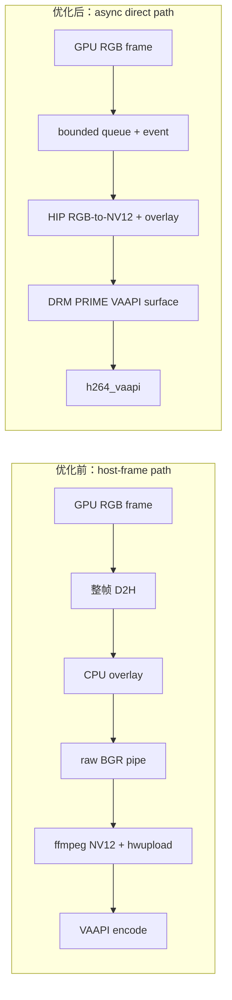
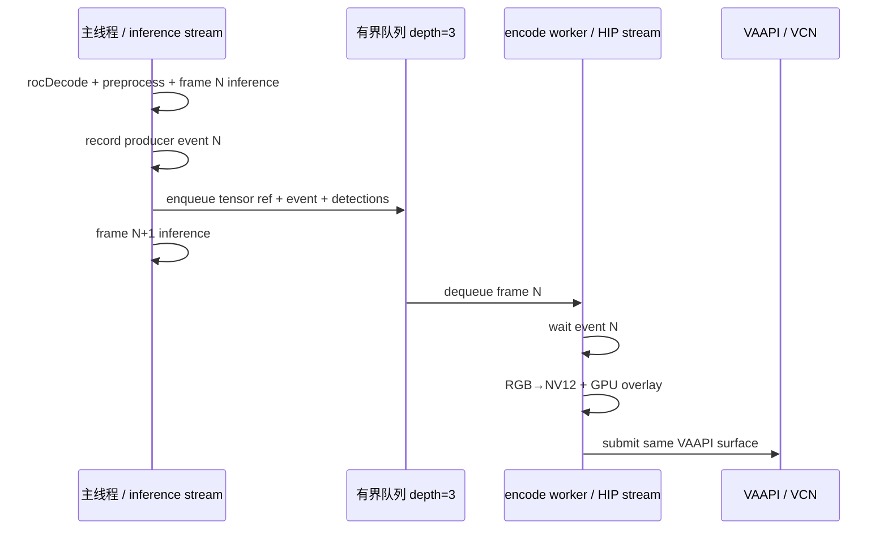

# 从 30 FPS 到 70+ FPS：Ultralytics YOLO26x Radeon 视频流水线加速实录

> 日期：2026-09-03<br>
> 平台：AMD Radeon PRO W7900D (`gfx1100`) / ROCm 7.2.1<br>
> 最终结果：主 YOLO 标注视频 pass 从约 30-37 FPS 提升到正式 **74.7 FPS**，完整帧 D2H 为 **0.00 ms/frame**

## 1. 先说结论

这次加速没有更换 YOLO26x，没有把模型所有权从 Ultralytics 移走，也没有通过降低输入分辨率、跳帧或删除检测框来换取数字。

真正的瓶颈位于推理之后：

```text
GPU RGB frame
  -> 整帧 D2H
  -> CPU OpenCV overlay
  -> 6.22 MB/frame raw BGR pipe
  -> ffmpeg format=nv12,hwupload
  -> VA-API
```

最终方案将它改成：

```text
GPU RGB frame
  -> bounded queue + producer event
  -> dedicated HIP stream
  -> RGB-to-NV12 + box/text/status overlay on GPU
  -> FFmpeg-owned DRM PRIME VAAPI surface
  -> h264_vaapi
```

核心收益来自两件事：

1. **消除整帧 GPU→CPU 下载和 raw BGR pipe**。
2. **把第 N 帧 GPU overlay/encode 与第 N+1 帧推理重叠**。



| 对比项 | 优化前 | 优化后 |
|---|---|---|
| 完整帧位置 | GPU → CPU → GPU | 始终留在 GPU |
| Overlay | CPU OpenCV | HIP kernel 直接写 NV12 |
| 编码输入 | 6.22 MB/frame raw BGR pipe | DRM PRIME VAAPI surface |
| 色彩转换 | ffmpeg CPU/`hwupload` 链 | HIP RGB-to-NV12 |
| 调度方式 | inference 与 encode 基本串行 | 独立 stream/thread 重叠 |
| 主线程 encode feed | 受 pipe/queue 边界影响 | 0.15 ms/frame |

正式 393 帧结果如下：

| 阶段 | FPS | Host load 1m | 说明 |
|---|---:|---:|---|
| raw BGR 编码边界 A/B | 31.08 | 高负载共享机 | `D2H + CPU overlay + raw pipe + hwupload` |
| 旧正式 host-frame workflow | 37.1 | 181.36 | 393 帧，旧输出路径 |
| 同步 direct prototype | 50.12 | 未与正式结果混算 | 去掉整帧 host 边界，但 encode 与推理仍串行 |
| 同步 production direct | 50.0 | 192.97 | 393 帧，刚好踩线 |
| 异步 direct 独立复跑 | 71.9 | 209.15 | 393 帧 |
| **异步 direct 正式 workflow** | **74.7** | **218.12** | **393 帧，当前发布结果** |

以旧正式结果 37.1 FPS 为基准，74.7 FPS 是约 **2.01 倍**；以 31.08 FPS 的 raw-pipe A/B 为基准，是约 **2.40 倍**。

这里的 74.7 FPS 指 **主 YOLO 标注视频 pass**。Qwen3-VL 场景分析和字幕渲染是后续独立 pass，仍保留 JPEG/HTTP、CPU 文字排版和 host-frame writer，不能把两者混写成“全链路 74.7 FPS”。

## 2. 固定测试身份，否则 FPS 没有可比性

性能排查开始前，先固定以下身份：

| 项目 | 固定值 |
|---|---|
| GPU | AMD Radeon PRO W7900D / `gfx1100` |
| 输入视频 | 1920×1080、25 FPS、393 帧、15.72 秒 |
| YOLO 输入 | `[1, 3, 640, 640]`, batch 1 |
| YOLO 输出 | `[1, 300, 6]` |
| ONNX SHA-256 | `88568299de91d4967f239a062c9f1619f695ebd05de73cd66b8f589591aaeb0a` |
| Ultralytics | 8.4.75，commit `34e213ca3ece4c18962f5bb922ec74da0c474d24` |
| ONNX Runtime | `onnxruntime-migraphx==1.24.2` |
| OpenCV | 5.1.0-dev HIP |
| MIGraphX | 2.15.0.dev，FP16 compile |
| Bridge SHA-256 | `c239bb1752f9d2724bf83d60418f18a6c78f8fa373fc591ed3237dd9e91496c1` |

历史 50.8 FPS 使用的是另一份 ONNX (`97d516...`) 和另一时刻的主机负载，因此只作为历史背景，不作为新旧 backend 的直接 A/B。

本次主机是严重共享环境，128 个逻辑 CPU，正式测试时 load average 一度达到 218。所有结果都记录 host load，避免把调度抖动误判成模型差异。

## 3. 第一步：证明模型推理不是 30 FPS 的根因

一开始最容易怀疑的是：Ultralytics 或 ONNX Runtime 是否偷偷把输入、输出搬回 CPU？

实际证据不是“日志里显示 GPU provider”，而是：

- ORT 输入绑定预分配 `torch.Tensor.data_ptr()`。
- ORT 输出绑定固定 `[1, 300, 6]` GPU buffer。
- 50 次 steady-state `MEASURE_YOLO` marker 内，rocprofv3 记录 **0 条 memory-copy operation**。
- 同一个官方 ONNX、同一个 GPU input 下，native MIGraphX 与 ORT 输出最大绝对差为 **0**。

同步 inference 数据：

| Backend | Mean latency |
|---|---:|
| native MIGraphX | 7.109 ms |
| Ultralytics / ORT MIGraphX I/O Binding | 7.374-7.800 ms |

ORT 比 native 多约 0.2-0.7 ms，但这无法解释完整视频从 60+ 掉到约 30 FPS。

同时把 ORT session 固定为：

```text
ORT_SEQUENTIAL
intra_op_num_threads = 1
inter_op_num_threads = 1
allow_spinning = 0
```

这一步主要降低高 CPU load 下的调度抖动，不是 2 倍加速的来源。

## 4. 第二步：逐层增加边界，找出真正的性能断崖

在同一 GPU、同一官方 ONNX、同一前后处理下做边界 A/B：

| 路径 | FPS |
|---|---:|
| rocDecode + preprocess + ORT inference + GPU NMS | 65.4 |
| 上述路径 + full-frame D2H + CPU overlay | 59.66 |
| 上述路径 + raw BGR → ffmpeg → VA-API | 31.08 |
| writer-only | 31.43-41.71 |

结论非常直接：

- GPU 检测路径可以达到 65 FPS 以上。
- 整帧 D2H 和 CPU overlay 有成本，但不是最大断崖。
- raw BGR 交给 ffmpeg，再 `hwupload` 回 VAAPI surface，使吞吐跌到约 31 FPS。

每个 1080p BGR frame 的大小是：

```text
1920 × 1080 × 3 = 6,220,800 bytes
```

旧路径每帧至少要处理一次 6.22 MB 整帧 D2H，以及一次 6.22 MB raw pipe 写入；ffmpeg 随后还要转换 NV12 并上传到 VAAPI surface。

## 5. 第三个小修复：先去掉无意义的 host-host copy

旧异步 writer 在主线程执行：

```python
np.ascontiguousarray(frame_bgr).tobytes()
```

这会额外分配并复制约 6.22 MB/frame。修复后，队列直接持有 NumPy frame，worker 使用：

```python
frame = np.ascontiguousarray(payload)
proc.stdin.write(memoryview(frame).cast("B"))
```

这一步值得做，但它不能消除 raw pipe、整帧 D2H 或 `hwupload`，因此没有把它包装成“关键 2 倍加速”。它只是清掉了一次确定无用的 host-host copy，并为后续定位减少噪声。

## 6. 第四步：实现真正的 HIP → DRM PRIME → VA-API direct path

Python OpenCV 在这个环境中没有可用的 GPU text/rectangle API；rocPyDecode 也没有暴露可直接传给 VAAPI encoder 的 decode surface ID/DRM descriptor。因此最终采用一个小型 C++/HIP bridge：

- 源码：[../../native/hip_vaapi_bridge.cpp](../../native/hip_vaapi_bridge.cpp)
- Python wrapper：[../../src/video_io.py](../../src/video_io.py)
- Production loop：[../../src/pipeline.py](../../src/pipeline.py)

### 6.1 Encoder surface 的创建

FFmpeg 创建 VAAPI hardware frame pool：

```text
format    = AV_PIX_FMT_VAAPI
sw_format = AV_PIX_FMT_NV12
modifier  = DRM_FORMAT_MOD_LINEAR
pool size = 16
```

这里使用 **FFmpeg-owned encoder surface**，不是直接把 rocDecode surface 传给 encoder。

### 6.2 将 VAAPI surface 映射到 HIP

每个新的 VA surface 执行：

1. `vaExportSurfaceHandle(... DRM_PRIME_2 ...)`
2. 获得 DRM PRIME/DMABUF fd、plane offset 和 pitch
3. `hipImportExternalMemory()`
4. `hipExternalMemoryGetMappedBuffer()`
5. 缓存 `VASurfaceID -> HIP mapping`

这样 HIP kernel 可以直接写入 VAAPI encoder 使用的 NV12 surface。

### 6.3 GPU 上完成 RGB → NV12

`rgb_to_nv12` kernel 执行：

- 每个像素生成 Y plane。
- 每个 2×2 RGB block 生成一组 UV。
- 直接遵循 VA surface 导出的 `offset/pitch`，而不是假设紧凑内存。

转换后的 NV12 不离开显存，也不再经过 ffmpeg raw-video stdin。

### 6.4 GPU 上画框、标签和状态文字

`draw_detections_nv12` kernel 在同一个 NV12 surface 上绘制：

- detection box
- class + confidence label
- FPS
- frame index
- detection count
- preprocess/detect latency

文字使用内置 5×7 glyph bitmap，在 GPU 上直接写 Y/UV。这样去掉 CPU OpenCV overlay 后，用户仍能看到完整检测标签和性能状态。

仍有一个小型 host boundary：GPU NMS 后的 survivor boxes/classes/scores 会复制到 CPU，用于构造 overlay metadata。它通常只是少量检测结果，不是 1920×1080 整帧。

因此准确描述应是：

> 主 YOLO pass 实现 **zero full-frame D2H**，不是“整个应用所有字节绝对零拷贝”。

### 6.5 同一个 surface 直接编码

HIP kernel 完成后同步 worker stream，再把原 `AVFrame` 提交给 `h264_vaapi`：

```text
HIP writes NV12 surface
        ↓
VAAPI surface stays resident
        ↓
avcodec_send_frame(h264_vaapi)
```

这一步消除了：

- `rgb_gpu.cpu().numpy()`
- CPU `cv2.rectangle` / `cv2.putText`
- raw BGR pipe
- ffmpeg `format=nv12,hwupload`

同步 direct prototype 达到 **50.12 FPS**，证明方向正确，但余量仍然很小。

## 7. 第五步：从 50 FPS 到 70+ FPS，关键是异步重叠

同步 direct path 中，主线程仍按顺序执行：

```text
frame N inference
  -> frame N RGB-to-NV12/overlay
  -> frame N VAAPI submit
  -> frame N+1 inference
```

正式同步运行在 host load 192.97 下只有 50.0 FPS。检测约 9.67 ms，direct encode 约 8.37 ms，两者基本串行，稍有抖动就跌破 50。

最终的 `GpuDirectVaapiWriter` 改用：

- queue depth 3
- producer HIP event
- dedicated worker thread
- dedicated HIP stream
- pybind `gil_scoped_release`
- 队列反压和 worker 异常传播



### 7.1 为什么 tensor 不会提前失效

队列 item 持有 `rgb_gpu` 的 Python 引用。worker 完成：

```text
wait producer event
  -> bridge.write(...)
  -> hipStreamSynchronize(worker stream)
  -> avcodec_send_frame(...)
```

之后才释放 queue item，因此 decoder tensor 不会在 GPU 读取完成前被回收。

### 7.2 为什么不会无限积压

队列深度固定为 3：

```text
GPU_DIRECT_ENCODE_QUEUE_DEPTH=3
```

worker 变慢时，producer 在 `_put()` 处产生反压，而不是无限占用显存。

### 7.3 为什么 worker latency 和端到端 FPS 不能相加

正式运行数据：

| 指标 | 数值 |
|---|---:|
| Preprocess | 0.59 ms/frame |
| Detection | 10.44 ms/frame |
| Direct encode feed | 0.15 ms/frame |
| GPU overlay + direct encode worker | 7.85 ms/frame |
| Frame D2H | 0.00 ms/frame |
| End-to-end vision FPS | 74.7 |

worker 的 7.85 ms 与下一帧 detection 重叠，因此不能用 `0.59 + 10.44 + 7.85` 推导 FPS。主线程实际只花 0.15 ms 入队；吞吐由重叠后的关键路径决定。

异步改造后：

- 独立复跑：71.9 FPS，host load 209.15
- 正式 workflow：74.7 FPS，host load 218.12

在更高 host load 下仍达到 70+，说明提升来自结构性重叠，不是一次偶然的低负载样本。

## 8. 一个容易漏掉的正确性问题：最后一帧

bridge 初版写入 30 帧时：

```text
encoded packets = 30
container samples = 30
decoded frames = 29
container duration = 1.16 s
```

最后一个 packet 的 PTS 存在，但 FFmpeg 4.4 没有得到显式 packet duration，MP4 track duration 停在最后一帧起点，demux 时末帧被丢弃。

修复位于 packet timestamp rescale 后：

```cpp
av_packet_rescale_ts(packet, encoder_->time_base, stream_->time_base);
packet->duration = av_rescale_q(1, encoder_->time_base, stream_->time_base);
```

修复后：

```text
duration = 1.20 s
packets = samples = decoded frames = 30
```

这也是为什么视频测试不能只看“文件生成成功”或只看 packet 数。

## 9. 最终验证不是只看 FPS

### 9.1 队列与媒体计数

正式 393 帧 vision pass：

```text
direct queue depth = 3
submitted = 393
encoded   = 393
packets   = 393
samples   = 393
decoded   = 393
duration  = 15.72 s
codec     = H.264 High / yuv420p
```

最终 Qwen 字幕视频也严格满足 393 packets/samples/decoded frames。

### 9.2 GPU overlay 像素审计

抽样 frame 0、100、200、300、392：

- 每帧显著变化像素：至少 35,314
- 左上状态区近白字形像素：至少 1,938
- 高色度 detection overlay 持续存在

这排除了“为了 FPS 实际没有画框”或“编码了空 surface”的可能。

### 9.3 Production test

[../../tests/test_gpu_overlay_encode.py](../../tests/test_gpu_overlay_encode.py) 同时检查：

- production async writer
- queue drain
- packet/sample/decoded frame 数
- 分辨率
- detection overlay 高色度像素
- 状态文字近白像素

### 9.4 正式 workflow gate

[../../scripts/pipeline_workflow.py](../../scripts/pipeline_workflow.py) 将以下条件作为硬门槛：

```text
encode == vaapi-direct
FPS >= 50
frame_d2h_ms == 0.0
submitted == encoded == source frames
packets == samples == decoded frames == source frames
codec == h264 High / yuv420p
```

manifest 还绑定模型、runtime、bridge 和 production source SHA，源码变化后不会静默复用旧视频。

## 10. 关于 rocprofv3 全循环 trace 的限制

有效的 inference-only 结论来自 50 次 `MEASURE_YOLO` marker，区间内为 0 条 memory-copy record。

加入 direct encoder 后，我还尝试对完整循环输出 CSV 和 JSON memory-copy trace。两次被测 pipeline 都正常完成，但 ROCm 7.2.1 的 rocprofv3 在结果导出阶段触发：

```text
ring_buffer: munmap failed: Invalid argument
ring_buffer.cpp: mmap failed with errno 22
```

CSV 为空，JSON 在字符串中间截断。因此没有拿损坏文件宣称“全循环 profiler 证明 0 copy”。

主 YOLO pass 的 zero-full-frame-D2H 结论来自以下组合证据：

- direct 分支源码不执行 `rgb_gpu.cpu()`
- runtime 指标为 0.00 ms/frame
- strict queue/frame accounting
- GPU overlay pixel audit
- inference marker trace

工具失败也应被记录，而不是从报告中删掉。

## 11. 用户如何复现

### 11.1 拉取发布镜像

```bash
docker pull \
  crpi-a7t9nblyxh55vyd2.cn-shanghai.personal.cr.aliyuncs.com/\
muzihao2/work:ultralytics-yolo26-workshop-full_2026_09_04
```

发布 digest：

```text
sha256:0a2c267fbde48bf9f66216d10a28bb284684ed5c16b4b0ad153621ed67a9ff6c
```

镜像已经包含：

- workshop source/notebooks/results
- YOLO26x PT/ONNX
- gfx1100 MIGraphX compiled cache
- patched Ultralytics + ORT MIGraphX
- compiled `hip_vaapi_bridge.so`
- compiled `vaapi-hip-encode-probe`

四个模型固定存放在 `/opt/ultralytics-yolo26/models`。pipeline 直接读取该不可变目录；启动脚本按 SHA 将同一模型集初始化到 named volume `ultralytics_yolo26_models`，供独立 llama.cpp 容器以 `/models:ro` 使用，全程不再下载模型。

### 11.2 启动 notebook

```bash
PIPELINE_IMAGE=crpi-a7t9nblyxh55vyd2.cn-shanghai.personal.cr.aliyuncs.com/\
muzihao2/work:ultralytics-yolo26-workshop-full_2026_09_04 \
PIPELINE_GPU=5 \
LLAMA_GPU=5 \
VAAPI_DEVICE=/dev/dri/renderD135 \
bash scripts/start_notebook_container.sh
```

脚本只给 pipeline 挂载 `/workspace/output`；模型直接来自镜像固定目录。独立 llama.cpp 只读挂载初始化后的 `/models` named volume。源码和四个模型都不再依赖宿主 bind mount。

### 11.3 强制运行 direct path

在容器内：

```bash
python3 src/pipeline.py \
  --input data/sidewalk.mp4 \
  --output output/direct.mp4 \
  --no-vlm \
  --video-decode rocdecode \
  --video-encode vaapi \
  --gpu-direct-encode on
```

`on` 表示 direct 条件不满足时硬失败，适合 benchmark 和验收；`auto` 允许不兼容场景回退；`off` 可复现旧 host-frame writer。

### 11.4 运行正式验证

```bash
bash scripts/test_notebook_image.sh
python3 tests/test_gpu_overlay_encode.py \
  --video data/sidewalk.mp4 \
  --output /tmp/direct-test.mp4 \
  --frames 30
python3 scripts/run_pipeline.py --validate-only
```

## 12. Direct path 的适用边界

当前自动选择 direct writer 需要同时满足：

```text
rocDecode active
GPU available
--no-vlm
no --display
VA-API requested
```

以下路径有意保留 host writer：

- CPU decode fallback
- GUI display
- 主循环内同步 VLM/CPU overlay 场景
- Qwen3-VL 场景分析与字幕渲染 pass

这不是功能缺失，而是把高吞吐 vision pass 与需要 CPU 排版/JPEG 的语义 pass 清楚分层。

## 13. 最重要的工程经验

### 经验 1：先找边界，不要先换模型 backend

这次 ORT inference 本来就在 7-8 ms，真正把吞吐压到 31 FPS 的是视频输出边界。只优化模型可能得到漂亮的 microbenchmark，却无法改善用户看到的完整视频 FPS。

### 经验 2：Provider 名称不等于 zero-copy

必须检查 pointer、I/O Binding、实际 copy trace 和源码中的同步边界。日志显示 `MIGraphXExecutionProvider` 只能证明选择了 provider，不能证明没有 host copy。

### 经验 3：硬件编码不代表输入路径在 GPU

旧路径最终使用 `h264_vaapi`，但输入仍是 host raw BGR，ffmpeg 还要 `hwupload`。只有 surface transport 也在 GPU，硬件编码的吞吐优势才能完整发挥。

### 经验 4：同步 direct path 只是第一步

消除 copy 让吞吐恢复到 50 FPS；独立 stream + queue overlap 才把它提升到 70+ FPS。优化“数据在哪里”之后，还要优化“阶段何时执行”。

### 经验 5：性能和正确性必须一起设门槛

如果只检查 FPS，可能漏掉最后一帧、空 overlay、静默 fallback 或旧产物复用。最终 gate 同时检查性能、数据驻留、queue drain、媒体计数、像素和 source identity。

## 14. 代码与证据索引

| 内容 | 路径 |
|---|---|
| Production loop | [../../src/pipeline.py](../../src/pipeline.py) |
| Async direct writer | [../../src/video_io.py](../../src/video_io.py) |
| HIP/VAAPI bridge | [../../native/hip_vaapi_bridge.cpp](../../native/hip_vaapi_bridge.cpp) |
| Native build | [../../scripts/build_native_bridge.sh](../../scripts/build_native_bridge.sh) |
| Production integration test | [../../tests/test_gpu_overlay_encode.py](../../tests/test_gpu_overlay_encode.py) |
| Workflow gate | [../../scripts/pipeline_workflow.py](../../scripts/pipeline_workflow.py) |
| 正式 manifest | [../../output/pipeline/manifest.json](../../output/pipeline/manifest.json) |
| 机器可读诊断 | [../../output/benchmarks/performance_diagnosis.json](../../output/benchmarks/performance_diagnosis.json) |
| 71.9 FPS 独立复跑日志 | [../../output/benchmarks/direct_encode_repeat_393.log](../../output/benchmarks/direct_encode_repeat_393.log) |
| 完整诊断报告 | [../performance_diagnosis_CN.md](../performance_diagnosis_CN.md) |

最终一句话总结：

> **30 → 50 FPS 来自消除整帧 D2H/raw pipe；50 → 70+ FPS 来自让 GPU overlay/VAAPI worker 与下一帧推理真正重叠。**
