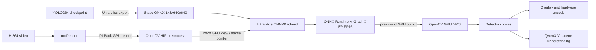

# Ultralytics YOLO26x on AMD Radeon Workshop 改造计划

> 工作目录：`/home/zihaomu/bigssd/notebook/ultralytics_yolo26`
>
> 计划状态：Phase 0-6 已落地并完成实机验证；性能优化仍可继续
>
> 核心决定：Ultralytics 负责 ONNX 模型加载、MIGraphX Execution Provider 选择、FP16 编译与推理；OpenCV 只负责视频流水线中的前处理、GPU 后处理和可视化相关工作。

## 1. Workshop 定位

### 1.1 面向对象

- 已熟悉 `YOLO(...).predict()`、训练、微调或导出的 Ultralytics 用户。
- 希望把单图 notebook 推理扩展为连续视频部署的计算机视觉工程师。
- 参加者只需浏览器，全部实验在预配置 Radeon Cloud 环境完成。

### 1.2 主叙事

Workshop 从 Ultralytics 用户熟悉的路径出发：

```text
YOLO26x checkpoint
    -> predict() 建立正确性基线
    -> export(format="onnx")
    -> YOLO("yolo26x.onnx") 选择 ONNX Runtime MIGraphX EP
    -> 接入持续视频流水线
    -> Qwen3-VL 场景理解
```

OpenCV HIP、rocDecode、GPU NMS 和硬件编码是帮助 Ultralytics 模型进入生产视频流的基础设施，不再是 workshop 的主角。

### 1.3 对外信息

- **Speaker:** Zihao Mu, Member of Technical Staff, Product Application Engineering, AMD
- **Audience:** Ultralytics users who train, fine-tune, export, or deploy YOLO models, and computer vision engineers moving from notebook inference to continuous video pipelines
- **Level:** Intermediate
- **Preparation:** A laptop with a modern browser; Radeon Cloud provides all compute and software

## 2. 已验证事实与必须修正的问题

### 2.1 参考分支

- 仓库：`zihaomu/ultralytics`
- 分支：`add-onnx-migraphx-backend`
- 固定 commit：`34e213ca3ece4c18962f5bb922ec74da0c474d24`
- 包版本：`8.4.75`
- 相对上游状态：3 commits ahead、825 commits behind
- 核心文件：`ultralytics/nn/backends/onnx.py`

该分支已经实现：

- ROCm 环境下优先选择 `MIGraphXExecutionProvider`。
- `migraphx_fp16_enable=1` provider 参数。
- `ULTRALYTICS_MIGRAPHX_CACHE_DIR` 编译缓存目录。
- provider、provider options 与 FP16 状态可观测。
- GPU provider 不可用时给出 CPU fallback 警告。

### 2.2 当前分支的零拷贝缺口

参考 commit **不能直接满足 GPU 常驻要求**：

- I/O Binding 只在 `CUDAExecutionProvider` 路径启用。
- MIGraphX EP 路径的输入执行 `im.cpu().numpy()`。
- `session.run()` 返回 NumPy 输出，后续还需重新创建 GPU tensor。

因此，仅执行以下安装并把自定义 detector 换成 `YOLO("*.onnx")`，只能证明 MIGraphX 在 GPU 上计算，不能证明端到端零拷贝：

```bash
pip install git+https://github.com/zihaomu/ultralytics.git@34e213ca3ece4c18962f5bb922ec74da0c474d24
```

项目必须先补齐并验证 MIGraphX EP 的 I/O Binding。CPU fallback 或 NumPy 往返必须作为测试失败，而不是降级成功。

### 2.3 镜像基线

基于用户指定镜像增量构建：

```text
crpi-a7t9nblyxh55vyd2.cn-shanghai.personal.cr.aliyuncs.com/
muzihao2/work:opencv_end2end_2026_08_12
```

已确认镜像包含：

| 组件 | 当前状态 |
|---|---|
| Python | 3.10.12 |
| PyTorch | 2.9.1 ROCm，HIP 7.2 |
| OpenCV | 5.1.0-dev HIP |
| MIGraphX Python | 2.15.0.dev |
| Ultralytics | 8.4.115 |
| ONNX Runtime | 未安装 |
| `onnxruntime-migraphx` | PyPI 可解析 `1.24.2` cp310 wheel |

构建时必须保护镜像已有的 ROCm PyTorch 和定制 OpenCV，不能让 `pip` 依赖解析将其替换为 PyPI CUDA/CPU wheel。

## 3. 目标架构与职责边界



### 3.1 Ultralytics 负责

- 从 checkpoint 演示 `predict()` 与 `export(format="onnx")`。
- 管理 ONNX 模型元数据、task 与 class names。
- 创建并持有 `ONNXBackend`/ORT session。
- 选择并强制验证 `MIGraphXExecutionProvider`。
- 启用 MIGraphX FP16 与目标 GPU 编译缓存。
- 持有预分配输入/输出绑定并执行模型。
- 暴露 provider、设备、缓存和 tensor 证据。

### 3.2 OpenCV 与视频基础设施负责

- rocDecode 输出 GPU frame。
- OpenCV HIP 完成 color conversion、letterbox、resize、normalize 和 layout 变换。
- OpenCV GPU NMS 消费 GPU 上的原始预测输出。
- 绘制、字幕合成和硬件编码。

### 3.3 不允许的职责混淆

- workshop 主路径不再直接调用 `migraphx.parse_onnx()` 或自定义 `program.run_async()`。
- OpenCV 不负责 ONNX 网络推理。
- 高层 `predict()` 用于基线与教学展示；持续视频热循环不能重复执行其 CPU 图像前处理或 CPU NMS。
- 不把 provider 名称、GPU utilization 或 FP16 日志当作零拷贝证据。
- 不把 `.mxr` 描述为可跨 GPU、ROCm 或 MIGraphX 版本复用的通用模型。

## 4. 零拷贝定义和验收边界

本 workshop 的主 YOLO/no-VLM zero-full-frame-D2H 范围是：

```text
rocDecode GPU frame
  -> OpenCV HIP preprocess
  -> Ultralytics/ORT MIGraphX inference
  -> OpenCV GPU NMS
  -> async HIP RGB-to-NV12 + box/text/status overlay
  -> DRM PRIME VAAPI encoder surface
  -> h264_vaapi
```

热路径中不允许完整 frame、`1x3x640x640` 输入或 `1x300x6` 输出经过 host memory。GPU NMS 后只允许紧凑 survivor metadata D2H；该 metadata 用于构造 GPU overlay 参数。

允许且必须明确标注的边界：

- notebook 展示单帧时的可视化下载。
- GPU NMS 后存活 boxes/classes/scores 的紧凑 D2H。
- 标准 Qwen3-VL JPEG baseline 的图像编码与 HTTP 传输。
- 字幕 pass 的 CPU 文字排版、扩展画布和 host-frame VA-API writer。
- 显式 `--gpu-direct-encode off` fallback 中的整帧 D2H、CPU overlay 和 `hwupload`。

主 YOLO pass 的完整帧不再经过 host；但不能把这一结论扩展为 Qwen3-VL 与字幕 pass 全链路零拷贝。direct bridge 使用 FFmpeg-owned encoder surface，并非 rocDecode surface passthrough。

## 5. 分阶段实施计划

### Phase 0：MIGraphX EP + I/O Binding 可行性门

这是后续开发的阻断项，先于 notebook 改写。

#### 任务

1. 从指定旧镜像启动一次性实验容器。
2. 固定安装：
   - `onnxruntime-migraphx==1.24.2`
   - fork commit `34e213ca3ece4c18962f5bb922ec74da0c474d24`
   - 分支所需的固定 `onnx` 版本
3. 安装 fork 时使用 constraints/`--no-deps`，保护 PyTorch 与 `/opt/opencv5`。
4. 在真实 W7900D/gfx1100 上断言：
   - `MIGraphXExecutionProvider` 存在且排序第一。
   - session 实际 provider 不是 CPU。
   - `migraphx_fp16_enable=1` 已进入 provider options。
5. 扩展 fork 的 `ONNXBackend`：
   - MIGraphX EP 对静态 shape 也启用 I/O Binding。
   - 输入直接绑定 `torch.Tensor.data_ptr()`。
   - 输出使用预分配 ROCm torch tensor，并绑定其稳定 pointer。
   - 热循环调用 `run_with_iobinding()`。
   - MIGraphX 路径禁止 `.cpu()`、`.numpy()` 和 `session.run()`。
6. 用 `[1,3,640,640] -> [1,300,6]` 做数值和指针 smoke test。

#### Gate A：通过条件

- 输入和输出均为 `torch.cuda` tensor，PyTorch 在 ROCm 上沿用 `cuda` device API。
- 连续 100 次推理复用相同的 input/output allocation。
- 绑定 pointer 与 tensor `data_ptr()` 一致。
- 拦截 `.cpu()`/`.numpy()` 后热循环仍可运行。
- 输出 finite、shape 正确，并与标准 Ultralytics ONNX 推理结果在设定容差内一致。
- provider 初始化、首次编译时间和 warm inference 时间分别记录。

#### Gate A：失败处理

如果 `onnxruntime-migraphx` wheel 不支持绑定外部 ROCm device pointer：

1. 不允许静默回到 CPU/NumPy 路径。
2. 先确认 ORT C/Python API 所需的 device type 和 allocator memory info。
3. 若 wheel 确实缺少能力，则在 Ultralytics fork 内新增 `MIGraphXNativeBackend`，复用现有 `argument_from_pointer` 方案；仍由 Ultralytics `AutoBackend` 选择并持有推理后端。
4. 只有 Route A（ORT MIGraphX I/O Binding）或 Route B（Ultralytics 原生 MIGraphX backend）通过相同 gate 后，才进入 Phase 1。

Route A 优先，因为它最接近现有参考分支；Route B 是证据触发的后备方案。

### Phase 1：镜像改造与版本锁定

#### `docker/Dockerfile`

- `FROM` 改为用户指定的 ACR 镜像。
- 安装固定 fork commit 和固定 ORT MIGraphX wheel。
- 将零拷贝补丁放在 fork 或项目 patch 中，并记录 patch SHA。
- 新增 OCI labels：base image digest、Ultralytics commit、ORT MIGraphX version、ROCm/PyTorch HIP version、OpenCV commit。
- 保留 JupyterLab、rocDecode、OpenCV HIP 和 llama.cpp 能力。
- 不在 notebook 启动时临时 `pip install`。

#### `docker/validate-image.py`

新增硬失败验证：

- 导入的是固定 commit 对应的 Ultralytics 包。
- `onnxruntime.get_available_providers()` 包含 MIGraphX EP。
- 真正创建 YOLO26x ONNX session，首 provider 必须是 MIGraphX。
- I/O Binding smoke test 输入/输出均留在 GPU。
- OpenCV `fromDevicePointer`、HIP resize、GPU NMS 与 rocDecode 仍可用。

#### 镜像缓存策略

- ORT/MIGraphX 编译缓存写到 `/workspace/models/ort-migraphx-cache/`。
- cache key 至少绑定 ONNX SHA-256、GPU arch/name、ORT version、MIGraphX/ROCm 和 PyTorch HIP version。
- 首次启动展示 cold compile 时间；后续启动展示 cache hit 和 warmup 时间。
- 不在无 GPU 的 Docker build 阶段生成目标相关缓存。

### Phase 2：模型与推理层迁移

#### `scripts/model_setup.py`

- 将“直接编译 `yolo26x_compiled.mxr`”改为“准备 checkpoint/ONNX + ORT MIGraphX cache”。
- Workshop 快路径使用校验过的官方 ONNX，确保云端课堂稳定。
- Step-by-step notebook 保留真实导出单元：

```python
from ultralytics import YOLO

checkpoint = YOLO("yolo26x.pt")
onnx_path = checkpoint.export(format="onnx", imgsz=640, batch=1, dynamic=False)
deployed = YOLO(onnx_path)
```

- 导出后验证输入输出契约、模型 metadata 和 SHA-256。
- 删除主路径对项目自生成 `.mxr` 文件的依赖；ORT cache 由 provider 管理。

#### `src/detector.py`

将 `MIGraphXDetector` 替换为 `UltralyticsONNXDetector`：

- 通过 Ultralytics `YOLO`/predictor/`ONNXBackend` 初始化一次 session。
- 暴露 `provider_info()`、`warmup()` 和 `infer_gpu(tensor)`。
- 输入必须是 contiguous BCHW FP32/FP16 ROCm tensor。
- 输出必须是预绑定的 ROCm tensor。
- 生产热循环不构造每帧 `Results` 对象。
- class names 和 metadata 来自 Ultralytics 模型。
- 原直接 MIGraphX runner 只可暂留为离线 A/B 参考，不能成为默认 fallback。

#### `src/preprocess.py`

- 保留 OpenCV HIP 前处理。
- 固定分配输出 buffer，避免逐帧 `torch.empty`。
- 记录 decode tensor、OpenCV non-owning view 和 Ultralytics input tensor 的 pointer、shape、stride、dtype 和 stream。
- 保持静态 `1x3x640x640`，优先命中 ORT I/O Binding 和 MIGraphX cache。

#### `src/postprocess.py`

- 直接消费 GPU output tensor。
- OpenCV GPU NMS 继续在 GPU 上执行。
- 只在绘制/序列化需要时下载紧凑 boxes、scores、class ids。
- 用标准 Ultralytics `predict()` 输出做 IoU、class 和 confidence 对齐测试。

#### `src/pipeline.py`

- 进程级创建一次 Ultralytics session、输入/输出 binding 和工作 buffer。
- 启动时完成 warmup，计时不包含首次编译。
- 每帧只更新 buffer 内容，不重建 session/binding。
- 日志名称改为 `Ultralytics ONNX + MIGraphX EP`。
- provider 不是 MIGraphX、出现 CPU fallback 或输出落在 CPU 时立即终止。

### Phase 3：Notebook 重构

#### 文件重命名

| 当前文件 | 目标文件 |
|---|---|
| `opencv_amd_end2end_step_by_step.ipynb` | `ultralytics_yolo26x_step_by_step.ipynb` |
| `opencv_amd_end2end.ipynb` | `ultralytics_yolo26x_end_to_end.ipynb` |

`scripts/build_notebooks.py` 作为唯一 notebook source of truth，生成后再执行并保存输出。

#### Step-by-step notebook 新章节

1. **From `predict()` to deployment**：用单图建立熟悉的 Ultralytics baseline。
2. **Export YOLO26x to ONNX**：展示真实 export API 和静态部署契约。
3. **Run ONNX with Ultralytics on Radeon**：确认 MIGraphX EP、FP16 与 cache。
4. **Decode continuous video on GPU**：rocDecode 产生 GPU frame。
5. **OpenCV HIP preprocessing**：letterbox/normalize/layout，不回 host。
6. **Ultralytics zero-copy inference**：展示 I/O Binding 和 pointer 证据。
7. **OpenCV GPU NMS**：输出与标准 `predict()` 对齐。
8. **Production loop**：buffer/session 常驻，展示分阶段 latency 和 FPS。
9. **Scene understanding**：Qwen3-VL 将 detection 扩展为时间段语义。
10. **Copy audit**：列出零拷贝热路径和仍存在的 host boundary。

#### End-to-end notebook 新章节

1. 环境、模型、provider 与 cache 状态。
2. checkpoint/ONNX 与 Ultralytics metadata。
3. 一次命令运行完整视频流水线。
4. 性能结果与设备常驻证据。
5. detection、scene timeline、SRT 和最终视频。
6. 可复现 manifest。

课堂默认使用已准备的 ONNX 和 warm cache，避免所有参加者同时 cold compile；讲师路径保留 export 和 cold compile 演示。

### Phase 4：性能整理与公平基准

#### 必须分开的三组结果

1. `YOLO26x.pt + predict()`：用户熟悉的正确性基线。
2. `YOLO26x.onnx + YOLO.predict()`：Ultralytics MIGraphX EP convenience path。
3. Production loop：rocDecode + OpenCV HIP + Ultralytics I/O Binding + GPU NMS + hardware encode。

不能把三种不同前后处理范围的 FPS 放在同一列而不解释。

#### 计时规则

- 单独报告 export、cold compile、cache load 和 warmup。
- 393 帧视频至少 1 次预热、3 次正式运行。
- 使用 HIP events 计量 GPU 阶段，wall clock 计量端到端阶段。
- 报告 P50/P95，而不只报告平均值。
- 报告 CPU utilization、GPU utilization、VRAM 和 host transfer audit。
- 固定 `imgsz=640`、batch 1、输入视频、confidence、IoU 和 NMS 参数。

#### 优化顺序

1. 静态 shape 和 MIGraphX cache。
2. 预分配 input/output tensor 与稳定 I/O Binding。
3. 避免每帧 Python/NumPy/`Results` 对象转换。
4. 复用 HIP stream，并显式验证同步边界。
5. 复用 OpenCV scratch buffers 与 GPU NMS workspace。
6. overlap decode/preprocess/inference 时再引入双缓冲；正确性优先。

#### 第一版性能门槛

- 历史直接 MIGraphX runner 基线：393 帧、50.8 FPS、检测 9.00 ms/frame。
- 已验证同输入 Ultralytics/ORT inference 为 7.374-7.800 ms；rocprof 稳态区间 memory-copy 记录为 0。GPU 视频热路径在不同主机负载下观测为 50.5-87.7 FPS。
- 历史 host overlay/raw-video workflow 在 1 分钟 load 181.36 时为 37.1 FPS；该数据保留为瓶颈诊断基线。
- GPU overlay + DRM PRIME direct encode 已完成：正式 393 帧 workflow 在 load 218.12 下为 74.7 FPS，独立复跑在 load 209.15 下为 71.9 FPS。
- 当前正式门槛为 `>=50 FPS`、`frame_d2h_ms == 0.0`、direct queue submitted/encoded 完全一致，以及 ffprobe packets/samples/decoded frames 全部等于 393。
- GPU overlay/encode worker 与下一帧 inference 异步重叠；必须分别报告主线程 feed 和后台 worker 时间，不得将阶段均值简单相加。

### Phase 5：Qwen3-VL 扩展

- 保留 Qwen3-VL Q8_0 场景理解作为 YOLO detection 之后的第二部分。
- YOLO boxes 作为 ROI/scene sampling 信号，不改变 Ultralytics 推理所有权。
- 标准 JPEG + llama.cpp HTTP 是可理解的 baseline。
- HIP IPC 路径只有在服务端也完成实测时才称为 GPU-resident transport。
- VLM latency 与 detector FPS 分开报告，避免把异步语义结果误认为逐帧同步推理。

### Phase 6：文档、产物与命名清理

#### 更新文件

- `README.md`、`README_CN.md`、`models/README.md`
- `docker/Dockerfile`、`docker/validate-image.py`
- `scripts/model_setup.py`、`scripts/validate_runtime.py`
- `scripts/pipeline_workflow.py`、`scripts/run_pipeline.py`
- `scripts/build_notebooks.py`
- `src/detector.py`、`src/preprocess.py`、`src/postprocess.py`、`src/pipeline.py`
- 两本重命名后的 notebook
- 新的 Ultralytics-first architecture 图

#### 清理项

- 删除 `output/scheme_b_model_test/` 临时目录。
- 旧 `output/pipeline/` 来自直接 MIGraphX runner，不能冒充新方案证据；完整重跑后再替换。
- manifest 新增 Ultralytics commit、ORT version、provider、provider options、ONNX SHA、cache identity 和 copy audit。
- 清除 notebook checkpoint 中旧 OpenCV-first 文案。
- 全局清除默认路径中的 `MIGraphXDetector`、`yolo26x_compiled.mxr` 和 bundled MXR 假设。

## 6. 测试矩阵

| 层级 | 验证内容 | 通过标准 |
|---|---|---|
| 安装 | fork/ORT/OpenCV/PyTorch 未互相覆盖 | 固定版本与路径全部匹配 |
| Provider | MIGraphX EP 可用且实际被选中 | provider 第一项为 MIGraphX，无 CPU fallback |
| I/O Binding | 外部 ROCm pointer 输入输出 | pointer 稳定，热循环无 `.cpu()`/NumPy |
| 数值 | fork backend 对比标准 `predict()` | shape/class/confidence/IoU 在容差内 |
| 前处理 | OpenCV HIP 对比 Ultralytics reference | letterbox 与 normalize 在容差内 |
| 后处理 | GPU NMS 对比 Ultralytics reference | 保留框集合在容差内一致 |
| 视频 | 393 帧完整运行 | 帧数、顺序、分辨率与编码正确 |
| 性能 | 3 次 warm run | FPS gate 通过，P50/P95 有记录 |
| VLM | 4 个 scene segment | timeline/SRT/video 完整且 backend 正确 |
| Notebook | clean kernel 从头执行 | 0 error，保存输出与 manifest 一致 |

## 7. 风险与处理原则

### 风险 1：fork 不是当前上游版本

固定 commit 能保证 workshop 可复现，但不能把它描述为已进入 Ultralytics 官方 release。对外应称为“Ultralytics API with the AMD MIGraphX workshop backend”。后续若要向上游提交，需把最小 patch rebase 到当时的 Ultralytics release 并重跑完整测试。

### 风险 2：ORT MIGraphX wheel 与 ROCm 7.2 ABI

PyPI wheel可下载不代表能在该镜像中运行。Phase 0 必须实际创建 provider、编译 YOLO26x 并执行 GPU I/O Binding，不能只做 import test。

### 风险 3：高层 `predict()` 重复前后处理

持续视频热循环必须复用 Ultralytics 的模型 backend，而不是逐帧把 OpenCV 结果再次交给高层 source loader，否则会产生重复 letterbox、CPU 转换和 NMS。

### 风险 4：错误的零拷贝宣传

每个阶段都需要 pointer/device/copy 证据。绘制、编码或 VLM transport 仍有 host boundary 时，应在图和 notebook 中直接标出。

## 8. 推荐执行顺序

- [x] 盘点现有副本、旧镜像和 fork 实现。
- [x] 确认参考 fork 的 MIGraphX EP 能力与现有 CPU I/O 缺口。
- [x] 完成 Phase 0 一次性容器实验和 Route A/Route B 决策。
- [x] 构建并验证固定依赖的新 workshop 镜像。
- [x] 替换 detector 与模型缓存逻辑。
- [x] 跑单帧数值对齐和 pointer/copy audit。
- [x] 跑 393 帧性能基准并优化。
- [x] 实现 GPU overlay、DRM PRIME VAAPI direct encode 与独立 HIP stream worker。
- [x] 修复 FFmpeg 4.4 packet duration 末帧问题，并固化 393/393 帧计数门槛。
- [x] 重写、重命名并执行两本 notebook。
- [x] 重跑 Qwen3-VL、最终视频与 manifest。
- [x] 完成中英文 README、课堂讲义与最终 dry run。

## 9. Definition of Done

只有同时满足以下条件才算改造完成：

1. 参加者从 Ultralytics `YOLO` API 开始，而不是从 OpenCV/MIGraphX 内部 API 开始。
2. ONNX inference session 由 Ultralytics backend 创建和持有。
3. W7900D 上实际使用 MIGraphX EP FP16，且 CPU fallback 会硬失败。
4. decode -> OpenCV preprocess -> Ultralytics inference -> GPU NMS 热路径无完整 tensor 的 host 往返。
5. 393 帧完整视频、Qwen3-VL timeline、SRT 和最终视频重新生成。
6. rocprof 证明 ORT 稳态推理无 memory copy；主 YOLO pass 完整帧 D2H 为 0，正式完整视频达到 74.7 FPS（host load 218.12）并通过 50 FPS 硬门槛。
7. direct queue 393/393 完整 drain；YOLO/final MP4 的 packet、sample、decoded frame 数全部为 393，GPU overlay 像素审计通过。
8. 两本 notebook 从 clean kernel 执行 0 error，保存输出与 schema 3 manifest 可复现。
9. 文档准确区分主 YOLO direct path、紧凑 metadata D2H、Qwen/字幕 host boundary 和 fallback，不把 fork 能力描述为未验证的上游官方能力。
