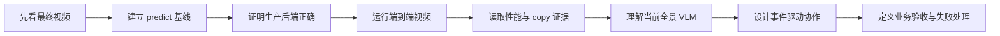

# Ultralytics YOLO26 End-to-End Workshop 参会者画像与实施方案

> 文档用途：讲师、助教和活动组织方的内部执行手册
>
> 制定日期：2026-09-08
>
> 适用项目：`ultralytics_yolo26`
>
> 隐私说明：本文只使用报名信息的聚合统计，不记录参会者姓名、邮箱、手机号或个人账号。原始报名表不得提交到 Git 仓库，也不得出现在 Notebook 输出、课堂截图或日志中。

## 1. 结论：技术主线不换，教学策略必须调整

当前 Workshop 的技术主线是成立的：

```text
YOLO.predict() 正确性基线
  -> 静态 ONNX
  -> Ultralytics + ORT MIGraphX
  -> GPU 常驻视频流水线
  -> GPU NMS / HIP-VAAPI 编码
  -> Qwen3-VL 场景理解
  -> 可复现 manifest
```

需要调整的不是核心技术，而是课程顺序、难度分层和成功标准。现有定位假设听众普遍是中级 Ultralytics/CV 工程师，但实际报名者同时包含学生、研究人员、工程师、技术经理、产品与公司决策者。若按底层实现逐层讲到底，初学者会过早掉队，非研发参会者也难以形成可带回工作的结论。

建议采用以下策略：

1. **先展示结果，再拆解系统。** 开场 3 分钟内播放完整 YOLO + VLM 成品，让所有人先知道终点是什么。
2. **共同主线只要求完成可见的端到端闭环。** 每组都要得到检测视频、VLM timeline 和 manifest，不要求每个人现场修改底层 C++/HIP。
3. **同一环节提供三类任务。** `CORE` 保证所有人跟上，`ENGINEER` 面向技术深挖，`DECISION` 面向产品和管理角色。
4. **Workshop 1 与 Workshop 2 递进，而不是重复。** 第一场讲“从 predict 到生产视频”；第二场讲“从检测结果到事件证据与业务判断”。
5. **把性能数字变成可验证证据。** 不背诵 FPS；让参会者看 provider、parity、copy audit、队列和 manifest。
6. **不把尚未发布的 tracking/event 功能包装成现成功能。** 当前正式镜像的 Qwen3-VL 是四秒全景分段分析；事件驱动方案必须通过单独发布门后才能作为第二场 hands-on 主路径。

## 2. 参会者画像

### 2.1 报名规模

| 指标 | 人数 | 占全部报名者 |
|---|---:|---:|
| 全部唯一报名者 | 29 | 100% |
| Workshop 1 | 28 | 96.6% |
| Workshop 2 | 18 | 62.1% |
| 两场都参加 | 17 | 58.6% |
| 仅参加 Workshop 1 | 11 | 37.9% |
| 仅参加 Workshop 2 | 1 | 3.4% |

这组数据非常适合递进式设计：Workshop 2 的 18 人中有 17 人参加 Workshop 1，只需为 1 位新加入者提供一段 10-15 分钟的桥接材料，无需把第二场重新讲成入门课。

### 2.2 角色分布

以下分类按报名者自填职位做互斥归类，只用于教学设计，不代表能力判断：

| 角色群体 | 人数 | 占比 | 课堂需求 |
|---|---:|---:|---|
| 学生、研究生、博士生、教师 | 12 | 41.4% | 清晰概念、可复现实验、从结果到原理的路径 |
| 开发、算法、CV/AI、数据、应用与技术经理 | 9 | 31.0% | API 边界、性能证据、故障模式、可迁移代码 |
| CEO/CTO、管理助理、法人、产品与业务运营 | 7 | 24.1% | 场景价值、系统边界、成本风险、验收指标 |
| 未填写明确职位 | 1 | 3.4% | 通过课前问卷决定分组和任务 |

关键判断：

- 约四成参会者处在学习或研究阶段，不能假设熟悉 ROCm、容器、ONNX Runtime 或视频编码。
- 约三成是可以深入讨论实现的工程角色，是每组的技术锚点，但不能让他们包办全部操作。
- 约四分之一更关心“能解决什么问题、如何验收、哪里会失败”，应给他们明确产出，而不是让他们旁听代码。
- 报名者来自中国内地、香港以及多个海外地区。Notebook 和代码保持英文；关键幻灯片采用中英双语；主讲建议使用英文，关键结论用简短中文复述，问答接受中英文。

### 2.3 由画像推导出的课程约束

1. 不做逐人独立实验，改为混合角色小组。
2. 不在课堂上安装 ROCm、下载大模型、构建镜像或 cold compile。
3. 每 15-20 分钟必须有一个可观察结果或小组决策。
4. 技术术语第一次出现时必须回答三个问题：它是什么、为什么需要、如何证明它真的工作。
5. 不把“跑通 Notebook”当作唯一成功标准；还要能解释一个性能证据和一个业务边界。

## 3. 学习成果

### 3.1 所有人离场时都应做到

1. 用一张图讲清楚视频从解码、检测、后处理、编码到 VLM 的数据流。
2. 区分 `YOLO.predict()` 正确性基线与 production loop 的职责。
3. 在 Notebook 中定位 MIGraphX provider、parity 结果、FPS 和 copy audit。
4. 运行或复用完整 workflow，并找到检测视频、VLM timeline、最终视频和 manifest。
5. 说出一个适合 YOLO 的确定性事实和一个适合 VLM 的语义判断。
6. 为自己的场景写出一个可测量的验收指标和一个失败条件。

### 3.2 工程角色的额外成果

1. 解释为什么生产循环不逐帧调用高层 `predict()`。
2. 识别静态 shape、I/O Binding、GPU NMS、异步编码和 cache 的作用。
3. 区分 detector FPS、端到端 FPS 和 VLM latency。
4. 用 manifest 和 parity test 判断“快但不正确”或 CPU fallback。
5. 描述把当前全景 VLM 升级为 tracking/event VLM 所需的模块边界。

### 3.3 产品、管理与业务角色的额外成果

1. 把一个模糊需求改写成“事件、证据、响应、KPI、失败升级”五项契约。
2. 判断某个需求应由规则/检测器、跟踪器、VLM 还是人工复核承担。
3. 理解离线文件、云端服务和本地摄像头部署在隐私、时延、可靠性上的差异。

## 4. 总体教学结构



### 4.1 三条并行任务线

每个实验页或讲义步骤都使用统一标签：

| 标签 | 适用对象 | 典型任务 |
|---|---|---|
| `CORE` | 全员 | 运行单元、观察输出、回答一个事实问题 |
| `ENGINEER` | 工程/研究深挖 | 改参数、检查 tensor/provider、解释性能证据 |
| `DECISION` | 产品/管理/业务 | 定义场景、KPI、风险和是否需要 VLM |

三条线不是高低等级。每组最后必须把三条线合并成一个完整答案。

### 4.2 推荐课堂叙事

不要按“软件栈组件目录”讲解。使用一个贯穿问题：

> 如何把熟悉的单图 `YOLO.predict()`，变成一个持续处理视频、能证明性能和正确性、还能解释场景的生产系统？

每一段只增加一个系统责任：

1. `predict()`：模型能否看对。
2. ONNX + MIGraphX：模型如何在 Radeon 上稳定执行。
3. resident buffers：为什么不能每帧重新组织整个调用链。
4. GPU NMS + direct encode：输出视频为何不是免费步骤。
5. manifest：如何证明结果来自声明的模型和后端。
6. VLM：检测事实如何扩展为时间段语义。
7. event contract：系统何时值得唤醒 VLM，以及 VLM 不能决定什么。

## 5. 分组与课堂角色

### 5.1 Workshop 1：7 组，每组 4 人

28 人正好分成 7 组。每组尽量包含不同背景：

- `Driver`：操作 Jupyter，但不能连续操作超过两个环节。
- `Verifier`：对照 gate，记录 provider、parity、FPS 和 artifact 状态。
- `Scenario Owner`：把技术结果映射为使用场景和 KPI。
- `Reporter`：整理一页结果，负责 60 秒汇报。

在中场休息后轮换 `Driver`，避免工程师从头操作到尾。

### 5.2 Workshop 2：6 组，每组 3 人

18 人分成 6 组：

- `Pipeline Engineer`：定义检测、跟踪和缓冲输入。
- `Event Designer`：定义事件规则与 VLM 问题。
- `Evaluator`：定义误报、漏报、延迟和人工升级标准。

### 5.3 分组原则

组织方在私人报名表中预分组，不在公开材料中出现个人联系方式。优先满足：

1. 每组至少一位有 Python/AI/CV 开发经验的成员。
2. 学生与产业角色混合。
3. 尽量避免同一公司或同一学校人员全部集中一组。
4. 每组至少一位可以使用英语完成技术阅读的成员。
5. Workshop 2 保留 Workshop 1 的部分组内关系，但交换至少一位成员，促进跨场景讨论。

## 6. Workshop 1 议程：From `predict()` to Production

> 建议时长：150 分钟，含 10 分钟休息
>
> 对应材料：`ultralytics_yolo26x_step_by_step.ipynb` 为主，`ultralytics_yolo26x_end_to_end.ipynb` 用于最终闭环

| 时间 | 环节 | 全员可见产出 | 分层任务 |
|---:|---|---|---|
| 0-8 min | 成品开场 | 播放 15.72 秒最终视频，指出检测与场景字幕的差别 | `DECISION` 写下一个希望系统回答的问题 |
| 8-15 min | 学习契约与快速投票 | 角色、Python/YOLO 熟悉度和目标分布 | 讲师据此调整解释速度，不现场重分大组 |
| 15-28 min | 架构地图 | 所有人能沿箭头讲出数据流 | `ENGINEER` 标出可能的 host boundary |
| 28-45 min | `YOLO.predict()` 基线 | 单图检测结果与类别/置信度 | `ENGINEER` 比较两个 confidence；`DECISION` 讨论错检代价 |
| 45-63 min | ONNX、MIGraphX 与 provider | provider、FP16、静态输入输出契约 | 每组回答“什么证据能排除 CPU fallback” |
| 63-78 min | Parity gate | `predict()` 与 production box 的 IoU/类别对齐 | `ENGINEER` 解释为何性能测试前先做 parity |
| 78-88 min | 休息与 Driver 轮换 | 助教处理落后组，所有组回到同一 checkpoint | 不新增内容 |
| 88-108 min | GPU-resident benchmark | detect latency、FPS、buffer/pointer 证据 | 找到一个优化点及其潜在正确性风险 |
| 108-125 min | 完整视频 workflow | YOLO 视频、最终视频、timeline、SRT | 优先复用已验证 artifact；每组只触发一次必要运行 |
| 125-137 min | Copy audit 与 direct encode | 能区分推理零拷贝和完整系统零拷贝 | 每组指出一个允许的 host boundary |
| 137-146 min | 小组挑战 | 一页 use-case card | 事件、证据、KPI、失败条件各一项 |
| 146-150 min | Exit ticket | 个人提交 3 个短答案 | “我能证明什么 / 最大瓶颈 / 下一步场景” |

### 6.1 Workshop 1 必做检查点

每组的 `Verifier` 使用以下表格，不以单元格变绿替代口头解释：

| Gate | 通过证据 | 一句话解释 |
|---|---|---|
| G1 Runtime | Radeon 可见，模型集完整 | 我们实际在哪个设备和版本上运行 |
| G2 Baseline | `predict()` 有合理检测 | 模型先看对，再谈优化 |
| G3 Provider | MIGraphX 为实际 provider | 不是仅安装或列出了 provider |
| G4 Parity | class/IoU gate 通过 | production path 没有换来错误结果 |
| G5 Performance | benchmark JSON 可读取 | FPS 的测量边界是什么 |
| G6 Artifacts | 两个视频、timeline、manifest 存在 | 每个产物由哪一阶段生成 |
| G7 Copy audit | 能指出允许和禁止的 host copy | “零拷贝”承诺的精确边界 |

### 6.2 Workshop 1 不讲或只放附录的内容

- ORT/MIGraphX wheel 构建过程。
- HIP/VA-API C++ bridge 的逐行实现。
- ROCm 安装和 Linux 权限配置。
- llama.cpp 编译参数全集。
- `.mxr` cache 内部格式。

这些内容对少数工程师有价值，但会破坏主线。将其放到课后链接和 15 分钟可选 office hour。

## 7. Workshop 2 议程：From Detections to Event Understanding

> 建议时长：150 分钟，含 10 分钟休息
>
> 前置：Workshop 1，或提前观看 12 分钟 bridge video 并阅读一页架构图

### 7.1 第二场的核心问题

> YOLO 每帧输出很多框，但业务真正关心的是“发生了什么、证据是什么、是否需要行动”。如何让 detector、tracker、规则和 VLM 各做自己擅长的事？

### 7.2 议程

| 时间 | 环节 | 产出 |
|---:|---|---|
| 0-12 min | Workshop 1 快速复盘与新参加者桥接 | 每组完成六块架构图排序 |
| 12-27 min | 诚实拆解当前 VLM | 区分当前四秒全景 caption、可选 ROI 请求与真正事件驱动 |
| 27-45 min | 跟踪与事件规则 | 为 line crossing、dwell 或 person-vehicle proximity 写确定性触发条件 |
| 45-62 min | Pre/post evidence buffer | 定义事件前、触发时、事件后的证据窗口及丢帧策略 |
| 62-78 min | 结构化 detector-to-VLM contract | 每组产出一份事件 JSON 和一个限定问题 |
| 78-88 min | 休息 | 助教校验 schema，避免后半场带错数据 |
| 88-107 min | Storyboard 与 VLM | 全景、关键 ROI、轨迹摘要和时间信息组合成可审计证据 |
| 107-122 min | 结果约束 | VLM 输出 `confirmed/uncertain/rejected`、依据和不确定性，不允许自由发挥替代规则 |
| 122-137 min | 评估与故障注入 | 遮挡、ID switch、误检、VLM 超时、队列积压五选一 |
| 137-146 min | 每组 60 秒设计评审 | 事件价值、技术路径、KPI、最大风险 |
| 146-150 min | Exit ticket | 写出一个不应交给 VLM 的决定及原因 |

### 7.3 推荐事件练习

优先选择现有 COCO 类别可以支撑、且无需额外训练的事件：

| 事件 | 确定性层 | VLM 层 | 关键指标 |
|---|---|---|---|
| 人员进入区域并停留 | person track + polygon + dwell time | 描述停留上下文，不决定是否越界 | 事件召回、误报/小时、触发延迟 |
| 人车近距离接近 | person/car track + distance trend | 判断场景是否存在可见风险因素 | 漏报率、提前量、ID switch 影响 |
| 物体疑似遗留 | object track 静止且 owner 远离 | 检查物体与周边场景关系 | 确认延迟、误报率、人工复核率 |
| 排队长度超过阈值 | person tracks + ROI count | 总结队列状态和可见原因 | 计数误差、持续时间、更新频率 |

不要使用当前 COCO 模型无法识别的 PPE、烟火或细粒度工业缺陷作为现场主练习，除非活动前已经准备并验证专用模型。

### 7.4 事件数据契约示例

```json
{
  "event_id": "evt-0007",
  "event_type": "person_vehicle_proximity",
  "start_s": 5.2,
  "trigger_s": 6.4,
  "end_s": 8.0,
  "tracks": [
    {"track_id": 7, "class": "person", "confidence": 0.91},
    {"track_id": 12, "class": "car", "confidence": 0.94}
  ],
  "evidence": {
    "full_scene": "event-0007-storyboard.jpg",
    "roi_images": ["event-0007-track-7.jpg", "event-0007-track-12.jpg"],
    "pre_frames": 12,
    "post_frames": 18
  },
  "question": "Do the visible trajectories support a near-miss review? State only visible evidence."
}
```

教学重点不是字段名称本身，而是让参会者理解：检测器提供对象事实，跟踪器提供时间连续性，规则引擎决定是否触发，VLM 只解释已选定的证据。

## 8. Workshop 2 的功能发布门

当前正式 release 已验证：

- YOLO26 视频检测、GPU NMS 和 direct encode。
- 四秒一个 segment、每段三张全景帧的 Qwen3-VL timeline。
- 可选的低频 top-K ROI VLM 请求路径。

当前正式 release **尚未实现**：

- 稳定 track ID 和轨迹生命周期。
- 事件状态机、去重和 cooldown。
- 事件前后帧 ring buffer。
- 全景 + ROI + structured metadata 的事件请求。
- VLM 结构化返回校验和事件级评估。

因此第二场采用双轨准备：

### Track A：稳定版，活动一定可交付

使用当前 release 的 scene timeline 和预先准备的结构化 detection/event 样例。参会者完成事件契约、storyboard 选择、prompt 约束和评估设计，不声称现场 pipeline 已经自动完成 tracking/event。

### Track B：增强版，通过门槛后启用

只有满足以下条件，才将事件驱动 pipeline 作为现场 hands-on：

1. tracking、event engine、buffer 和 VLM contract 已进入 `src/`，不是临时 Notebook cell。
2. 对应单元测试和 393 帧集成测试通过。
3. 新 pipeline 镜像、Notebook 和 release lock 已发布并固定 digest。
4. 连续三次 clean run 得到相同事件数量和合法 JSON。
5. VLM 超时、空响应和非法 JSON 都有可演示的降级行为。
6. T-7 天前完成 6 个并发小组环境的彩排。

未满足任一项时使用 Track A。不要在活动当天切换未经验证的新镜像。

## 9. 环境与资源编排

### 9.1 推荐资源

- 1 位主讲 + 2 位助教；最低配置为 1 位主讲 + 1 位助教。
- Workshop 1：7 个小组 workspace，每组 1 张 W7900D；第 8 张 GPU 留给讲师演示和故障恢复。
- Workshop 2：6 个小组 workspace；第 7 张 GPU 给讲师，第 8 张作为备用。
- 每个 workspace 使用独立 Jupyter URL、token、输出目录、容器名和端口。
- YOLO 和 Qwen 模型、MIGraphX cache、notebook 输出在开课前准备完成。

一张 48 GiB W7900D 可以容纳本项目的 pipeline 与 Qwen3-VL Q8 companion，但必须在 T-7 彩排中验证每组的实际显存、端口和容器隔离，不能只按单容器经验推断。

### 9.2 为什么按组而不是按人分 GPU

- 28 人逐人环境会显著增加登录、端口、模型 cache 和支持成本。
- 4 人小组仍可保证每人有明确角色。
- 留出一张备用 GPU 比把 8 张卡全部占满更能保证课堂节奏。
- Workshop 的目标是理解端到端系统和证据，不是考察键盘速度。

### 9.3 每组环境的开课前 gate

```text
[ ] Jupyter URL 可从会场网络访问
[ ] release lock 和两个 image digest 匹配
[ ] Radeon/MIGraphX provider gate 通过
[ ] 四个模型文件校验通过
[ ] 393 帧 YOLO 视频存在且可播放
[ ] Qwen health、models 和一次真实 completion 通过
[ ] 两本 Notebook 保存输出无 error
[ ] 独立 output 目录可写且剩余空间充足
[ ] Reset 脚本可在 5 分钟内恢复 workspace
```

### 9.4 课堂运行原则

1. 默认复用已验证产物，只有关键步骤现场重新执行。
2. 不让 7 个组同时 cold compile MIGraphX 或重新下载模型。
3. VLM 请求分两批启动，避免所有组同一秒进入长请求。
4. 每个耗时单元都提供预计时间、成功输出和跳过方法。
5. 讲师环境只用于投屏，不接受参会者临时实验。

## 10. 教学材料改造建议

### 10.1 Notebook

保留当前两本 Notebook 的生产事实和已执行输出，增加教学层而不是塞入更多底层代码：

1. 每章开头增加一句“本章回答的问题”。
2. 每个代码单元后增加一个 `Observe` 问题，而不是只打印日志。
3. 使用 `CORE`、`ENGINEER`、`DECISION` 标记任务。
4. 在 Step-by-step 最前面增加最终视频预览；在最后增加一页 group challenge。
5. 对所有耗时运行增加 `RUN/REUSE` 明确开关和预计时长。
6. 第二场单独生成 Notebook；不要把 tracking/event 内容继续堆入现有 Step-by-step。
7. Notebook 仍由 `scripts/build_notebooks.py` 生成，禁止现场维护与生成器不一致的手工版本。

### 10.2 一页式材料

活动前准备四张 A4 或网页卡片：

- `Architecture Map`：六块数据流和允许/禁止的 copy boundary。
- `Gate Card`：G1-G7 的通过条件。
- `Use-case Card`：事件、证据、响应、KPI、失败升级。
- `Recovery Card`：刷新 kernel、复用 artifact、切换备用 workspace 的顺序。

### 10.3 幻灯片

幻灯片控制在 25 页以内：

- 5 页：问题、成品、受众收益。
- 8 页：从 predict 到 production 的六个责任边界。
- 5 页：性能、copy audit 和 manifest 证据。
- 4 页：detector/tracker/event/VLM 协作。
- 3 页：场景、风险和课后路径。

避免在主 deck 中放安装命令墙、长日志截图或完整类图。

## 11. 互动设计

### 11.1 开场投票

用匿名二维码收集四个问题：

1. 是否独立使用过 Ultralytics？
2. 是否部署过实时视频？
3. 更关心模型、系统性能还是业务方案？
4. 今天最希望带走什么？

只展示聚合结果，不收集姓名和联系方式。

### 11.2 参数实验

每组只修改一个变量，例如 confidence threshold，并先写预测：

```text
我们的预测：阈值升高会让 ______ 减少，但可能让 ______ 增加。
观察结果：______。
这对业务 KPI 的影响：______。
```

这样学生有科学实验路径，工程师有参数含义，业务角色有指标连接。

### 11.3 故障卡

Workshop 2 每组随机得到一张故障卡：

- tracker 发生 ID switch。
- VLM 超时 10 秒。
- 同一事件一分钟内重复触发。
- 夜间画面导致 person confidence 降低。
- storyboard 缺少事件前帧。
- VLM 返回无法解析的自由文本。

小组必须回答：系统继续做什么、停止做什么、记录什么、何时交给人工。

## 12. 评价与成功标准

### 12.1 课堂完成标准

Workshop 1：

- 至少 6/7 组在 125 分钟前完成 G1-G6。
- 7/7 组能准确说明一个 copy boundary。
- 7/7 组提交一张 use-case card。
- 至少 80% 个人 exit ticket 能区分 detector FPS 与端到端 FPS。

Workshop 2：

- 6/6 组提交合法事件 contract。
- 至少 5/6 组能把确定性触发与 VLM 判断分开。
- 6/6 组给出一个可量化 KPI 和一个故障降级策略。
- 没有小组把安全关键动作完全交给未经校验的 VLM 自由文本。

### 12.2 活动质量指标

| 指标 | 目标 |
|---|---:|
| 环境首次登录成功率 | >= 95% |
| 单组环境恢复时间 | <= 5 min |
| 主讲连续讲授最长时间 | <= 15 min |
| 每位成员至少一次主动产出 | 100% |
| 核心路径按时完成的小组 | >= 85% |
| 活动后自评“能向同事解释该架构” | >= 80% |

不使用“大家是否满意”作为唯一反馈。活动后问卷应同时测量：最清楚的概念、仍不清楚的概念、计划采用的场景、阻碍落地的条件。

## 13. 时间不足时的压缩方案

| 实际时长 | 保留 | 删除或移到课后 |
|---:|---|---|
| 90 min | 成品、predict、provider/parity、完整 workflow、copy audit、exit ticket | 参数实验、底层 benchmark 解释、分组汇报 |
| 120 min | 90 分钟内容 + benchmark + use-case card | 深入故障卡、长 Q&A |
| 150 min | 本文标准议程 | 无 |
| 180 min | 标准议程 + 20 分钟 office hour + 10 分钟二次实验 | 无需增加新的技术主题 |

压缩时优先减少讲解和可选深挖，不删除端到端闭环、正确性证据或小组产出。

## 14. 活动前执行计划

### T-14 天

- 发出 5 分钟课前问卷：Python、YOLO、Docker、视频部署经验和学习目标。
- 明确电脑、浏览器、账号和网络要求。
- 确认主讲语言与双语材料形式。
- 根据自评和职位做初版混合分组。

### T-7 天

- 冻结正式 release digest 和 Notebook 内容。
- 以 7 个并发小组环境完成完整彩排。
- 决定 Workshop 2 使用 Track A 还是 Track B；此后不再新增核心功能。
- 验证会场网络能同时打开所有 Jupyter 和视频。

### T-3 天

- 给参会者发送各自 workspace 链接和分组编号，不发送共享管理员凭据。
- 预热 MIGraphX cache，执行 Qwen 真实 completion。
- 准备离线成品视频、关键截图、benchmark JSON 和 manifest 作为降级材料。

### T-1 天

- 恢复所有 workspace 到统一 snapshot。
- 检查磁盘、GPU 显存、容器、端口和浏览器访问。
- 助教按 Recovery Card 演练一次人为故障。
- 打印或发布分组角色卡和 gate card。

### T-30 分钟

- 启动 companion 服务并通过 health/models/completion。
- 打开讲师 Notebook 到第一个成品单元。
- 所有学员环境停在欢迎页，不提前占用 VLM 队列。
- 在备用 GPU 上保留一个已完成的干净 workspace。

## 15. 讲师与助教分工

| 角色 | 主要责任 |
|---|---|
| 主讲 | 控制叙事、时间、全班 checkpoint 和技术边界 |
| 技术助教 | GPU/container/Jupyter/VLM 恢复，不代替学员完成实验 |
| 学习助教 | 观察掉队组、推动角色轮换、支持中英问答和收集共性问题 |

只有一位助教时，技术故障优先由预置备用 workspace 解决，概念问题先记入 parking lot，在统一 checkpoint 回答，避免主讲被单组阻塞。

## 16. 讲师必须坚持的表达边界

1. 不把“provider 可见”说成“实际执行一定在 GPU”；展示真实 provider 和运行证据。
2. 不把推理热路径零 host copy 说成整条视频/VLM 链路完全零拷贝。
3. 不把历史 50.8 FPS 与当前不同模型、不同系统负载下的数字直接比较。
4. 不把异步 VLM latency 算进逐帧 detector FPS，也不称其为每帧实时理解。
5. 不把当前四秒 scene caption 说成由 YOLO box 驱动的事件推理。
6. 不把 W7900D 的 `.mxr` 或 native bridge 复制到 `gfx1151` 的 Ryzen AI Max+ 395 使用。
7. 不现场承诺未经测试的自定义摄像头、模型类别或安全关键自动决策。

这些边界不是削弱演示，而是让参会者看到一个生产系统如何建立可信度。

## 17. 最终建议

合格的 Workshop 不应以“讲完了多少 ROCm 和 YOLO 细节”衡量，而应以参会者能否带走一个完整心智模型、一个亲手验证的结果和一个可以继续工作的场景契约衡量。

对这批参会者，推荐最终结构是：

```text
Workshop 1（28 人）
  共同完成：predict -> production -> evidence -> final video
  分层收获：原理 / 工程证据 / 业务 KPI

Workshop 2（18 人，17 人已参加第一场）
  共同完成：detections -> tracks/events -> evidence -> constrained VLM
  分层收获：系统设计 / 失败处理 / 上线验收
```

技术深度依然保留，但从“所有人都听完整套底层细节”改为“所有人完成主线，合适的人在合适的层级深入”。这会比单纯增加代码或展示更高 FPS，更有可能让学生、工程师和决策者都获得可复用的成果。

## 18. 相关材料

- [Step-by-step Notebook](../ultralytics_yolo26x_step_by_step.ipynb)
- [End-to-end Notebook](../ultralytics_yolo26x_end_to_end.ipynb)
- [Workshop 改造计划](ultralytics_yolo26_workshop_改造计划.md)
- [发布与 CI 就绪修正计划](release_readiness_remediation_plan_CN.md)
- [Ryzen AI Max+ 395 本地摄像头部署方案](Ryzen_AI_MAX_395_本地摄像头实时部署方案.md)
